# Diagramas de Secuencia de Diseño (DSD) - Stock Proyect

## Índice

- **CU-01 - Iniciar sesión**: `iniciarSesion`
- **CU-02 - Gestionar usuario**: `altaUsuario`, `modificarUsuario`, `darBajaUsuario`
- **CU-03 - Gestionar categoría**: `altaCategoria`, `modificarCategoria`
- **CU-04 - Gestionar producto**: `altaProducto`, `modificarProducto`, `darBajaProducto`
- **CU-05 - Registrar ingreso de mercadería**: `registrarIngreso`, `confirmarIngreso`
- **CU-06 - Ajustar stock**: `seleccionarProducto`, `ajustarStock`
- **CU-07 - Registrar retiro de mercadería vencida**: `leerEtiqueta`, `registrarRetiro`
- **CU-08 - Consultar productos con stock bajo**: `consultarStockBajo`
- **CU-09 - Consultar vencimientos y stock vencido**: `consultarVencimientos`

---

## CU-01 - Iniciar sesión

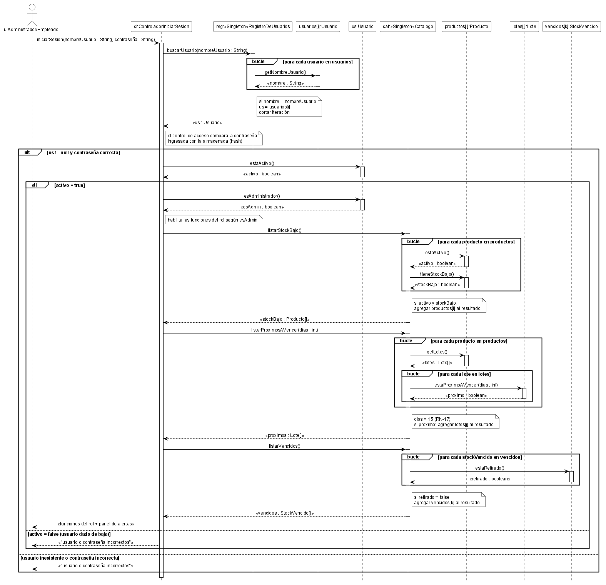

Código PlantUML

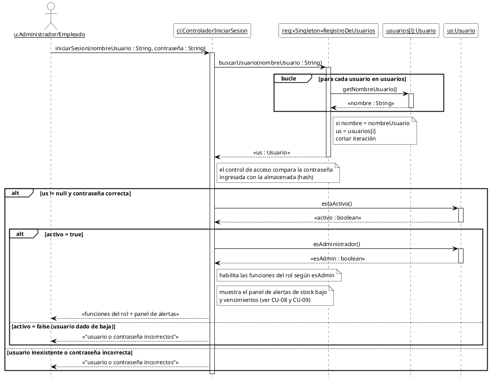
```plantuml
@startuml DSD_CU-01_iniciarSesion
' Diagrama de Secuencia de Diseño (DSD) - CU-01 Iniciar sesión - iniciarSesion
' Estilo de los ejemplos de la teoría (introducirArticulo / crearNuevaVenta).
hide footbox
skinparam shadowing false
skinparam defaultFontName Arial
skinparam defaultFontSize 12
skinparam sequenceMessageAlign center
skinparam ArrowColor black
skinparam ParticipantBackgroundColor white
skinparam ParticipantBorderColor black
skinparam CollectionsBackgroundColor white
skinparam CollectionsBorderColor black
skinparam ActorBackgroundColor white
skinparam ActorBorderColor black
skinparam LifeLineBorderColor black
skinparam LifeLineBackgroundColor white
skinparam SequenceGroupBackgroundColor white
skinparam SequenceGroupBorderColor black
skinparam SequenceGroupHeaderFontColor black
skinparam NoteBackgroundColor white
skinparam NoteBorderColor black

actor "<u>u:Administrador/Empleado</u>" as u
participant "<u>ci:ControladorIniciarSesion</u>" as ci
participant "<u>reg:«Singleton»RegistroDeUsuarios</u>" as reg
participant "<u>usuarios[i]:Usuario</u>" as ui
participant "<u>us:Usuario</u>" as us

u -> ci ++ : iniciarSesion(nombreUsuario : String, contraseña : String)
ci -> reg ++ : buscarUsuario(nombreUsuario : String)
group bucle [para cada usuario en usuarios]
  reg -> ui ++ : getNombreUsuario()
  ui --> reg -- : «nombre : String»
end
note right of reg
  si nombre = nombreUsuario
  us = usuarios[i]
  cortar iteración
end note
reg --> ci -- : «us : Usuario»
note right of ci : el control de acceso compara la contraseña\ningresada con la almacenada (hash)
alt us != null y contraseña correcta
  ci -> us ++ : estaActivo()
  us --> ci -- : «activo : boolean»
  alt activo = true
    ci -> us ++ : esAdministrador()
    us --> ci -- : «esAdmin : boolean»
    note right of ci : habilita las funciones del rol según esAdmin
    note right of ci : muestra el panel de alertas de stock bajo\ny vencimientos (ver CU-08 y CU-09)
    ci --> u : «funciones del rol + panel de alertas»
  else activo = false (usuario dado de baja)
    ci --> u : «"usuario o contraseña incorrectos"»
  end
else usuario inexistente o contraseña incorrecta
  ci --> u : «"usuario o contraseña incorrectos"»
end
deactivate ci

@enduml
```

---

## CU-02 - Gestionar usuario

### `altaUsuario`

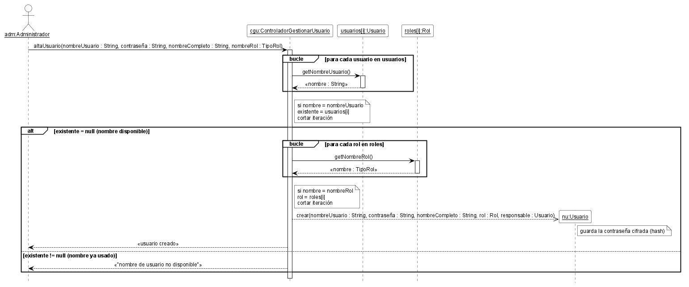

Código PlantUML

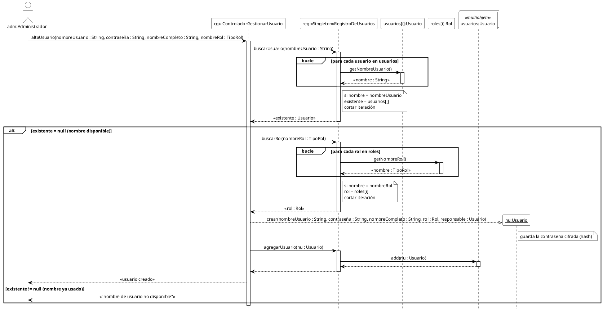
```plantuml
@startuml DSD_CU-02_altaUsuario
' Diagrama de Secuencia de Diseño (DSD) - CU-02 Gestionar usuario - altaUsuario
' Estilo de los ejemplos de la teoría (introducirArticulo / crearNuevaVenta).
hide footbox
skinparam shadowing false
skinparam defaultFontName Arial
skinparam defaultFontSize 12
skinparam sequenceMessageAlign center
skinparam ArrowColor black
skinparam ParticipantBackgroundColor white
skinparam ParticipantBorderColor black
skinparam CollectionsBackgroundColor white
skinparam CollectionsBorderColor black
skinparam ActorBackgroundColor white
skinparam ActorBorderColor black
skinparam LifeLineBorderColor black
skinparam LifeLineBackgroundColor white
skinparam SequenceGroupBackgroundColor white
skinparam SequenceGroupBorderColor black
skinparam SequenceGroupHeaderFontColor black
skinparam NoteBackgroundColor white
skinparam NoteBorderColor black

actor "<u>adm:Administrador</u>" as adm
participant "<u>cgu:ControladorGestionarUsuario</u>" as cgu
participant "<u>reg:«Singleton»RegistroDeUsuarios</u>" as reg
participant "<u>usuarios[i]:Usuario</u>" as ui
participant "<u>roles[i]:Rol</u>" as ri
collections "<u>usuarios:Usuario</u>" as mu <<multiobjeto>>

adm -> cgu ++ : altaUsuario(nombreUsuario : String, contraseña : String, nombreCompleto : String, nombreRol : TipoRol)
cgu -> reg ++ : buscarUsuario(nombreUsuario : String)
group bucle [para cada usuario en usuarios]
  reg -> ui ++ : getNombreUsuario()
  ui --> reg -- : «nombre : String»
end
note right of reg
  si nombre = nombreUsuario
  existente = usuarios[i]
  cortar iteración
end note
reg --> cgu -- : «existente : Usuario»
alt existente = null (nombre disponible)
  cgu -> reg ++ : buscarRol(nombreRol : TipoRol)
  group bucle [para cada rol en roles]
    reg -> ri ++ : getNombreRol()
    ri --> reg -- : «nombre : TipoRol»
  end
  note right of reg
    si nombre = nombreRol
    rol = roles[i]
    cortar iteración
  end note
  reg --> cgu -- : «rol : Rol»
  create participant "<u>nu:Usuario</u>" as nu
  cgu -->> nu : crear(nombreUsuario : String, contraseña : String, nombreCompleto : String, rol : Rol, responsable : Usuario)
  note right of nu : guarda la contraseña cifrada (hash)
  cgu -> reg ++ : agregarUsuario(nu : Usuario)
  reg -> mu ++ : add(nu : Usuario)
  mu --> reg --
  reg --> cgu --
  cgu --> adm : «usuario creado»
else existente != null (nombre ya usado)
  cgu --> adm : «"nombre de usuario no disponible"»
end
deactivate cgu

@enduml
```

### `modificarUsuario`

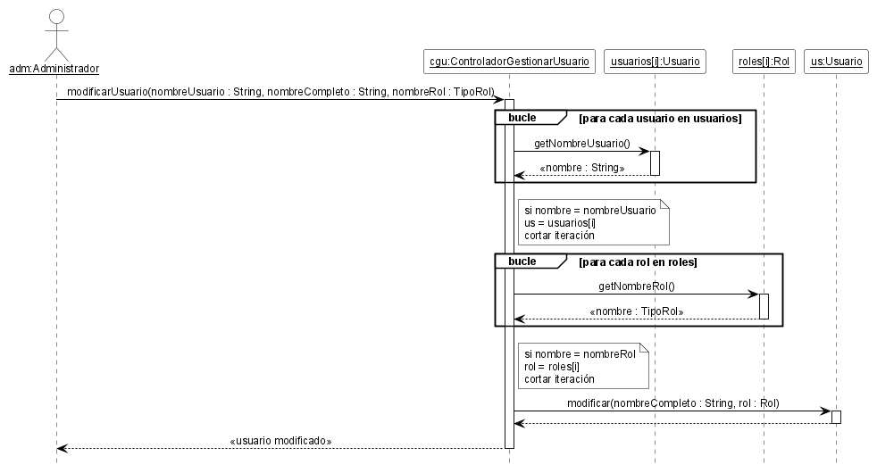

Código PlantUML

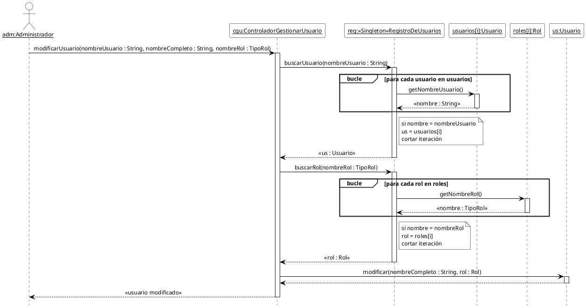
```plantuml
@startuml DSD_CU-02_modificarUsuario
' Diagrama de Secuencia de Diseño (DSD) - CU-02 Gestionar usuario - modificarUsuario
' Estilo de los ejemplos de la teoría (introducirArticulo / crearNuevaVenta).
hide footbox
skinparam shadowing false
skinparam defaultFontName Arial
skinparam defaultFontSize 12
skinparam sequenceMessageAlign center
skinparam ArrowColor black
skinparam ParticipantBackgroundColor white
skinparam ParticipantBorderColor black
skinparam CollectionsBackgroundColor white
skinparam CollectionsBorderColor black
skinparam ActorBackgroundColor white
skinparam ActorBorderColor black
skinparam LifeLineBorderColor black
skinparam LifeLineBackgroundColor white
skinparam SequenceGroupBackgroundColor white
skinparam SequenceGroupBorderColor black
skinparam SequenceGroupHeaderFontColor black
skinparam NoteBackgroundColor white
skinparam NoteBorderColor black

actor "<u>adm:Administrador</u>" as adm
participant "<u>cgu:ControladorGestionarUsuario</u>" as cgu
participant "<u>reg:«Singleton»RegistroDeUsuarios</u>" as reg
participant "<u>usuarios[i]:Usuario</u>" as ui
participant "<u>roles[i]:Rol</u>" as ri
participant "<u>us:Usuario</u>" as us

adm -> cgu ++ : modificarUsuario(nombreUsuario : String, nombreCompleto : String, nombreRol : TipoRol)
cgu -> reg ++ : buscarUsuario(nombreUsuario : String)
group bucle [para cada usuario en usuarios]
  reg -> ui ++ : getNombreUsuario()
  ui --> reg -- : «nombre : String»
end
note right of reg
  si nombre = nombreUsuario
  us = usuarios[i]
  cortar iteración
end note
reg --> cgu -- : «us : Usuario»
cgu -> reg ++ : buscarRol(nombreRol : TipoRol)
group bucle [para cada rol en roles]
  reg -> ri ++ : getNombreRol()
  ri --> reg -- : «nombre : TipoRol»
end
note right of reg
  si nombre = nombreRol
  rol = roles[i]
  cortar iteración
end note
reg --> cgu -- : «rol : Rol»
cgu -> us ++ : modificar(nombreCompleto : String, rol : Rol)
us --> cgu --
cgu --> adm -- : «usuario modificado»

@enduml
```

### `darBajaUsuario`

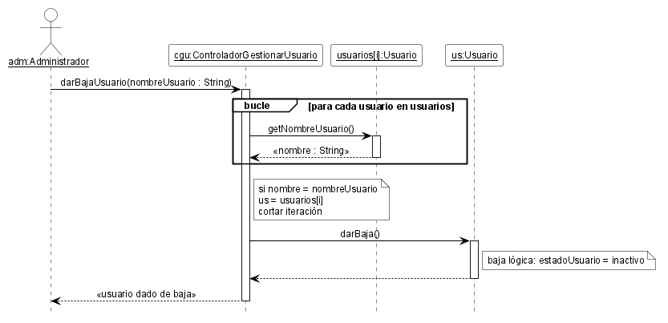

Código PlantUML

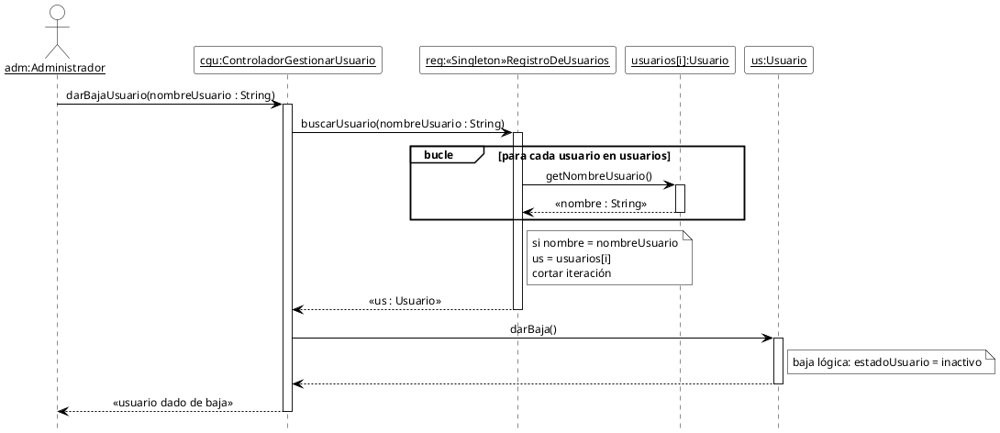
```plantuml
@startuml DSD_CU-02_darBajaUsuario
' Diagrama de Secuencia de Diseño (DSD) - CU-02 Gestionar usuario - darBajaUsuario
' Estilo de los ejemplos de la teoría (introducirArticulo / crearNuevaVenta).
hide footbox
skinparam shadowing false
skinparam defaultFontName Arial
skinparam defaultFontSize 12
skinparam sequenceMessageAlign center
skinparam ArrowColor black
skinparam ParticipantBackgroundColor white
skinparam ParticipantBorderColor black
skinparam CollectionsBackgroundColor white
skinparam CollectionsBorderColor black
skinparam ActorBackgroundColor white
skinparam ActorBorderColor black
skinparam LifeLineBorderColor black
skinparam LifeLineBackgroundColor white
skinparam SequenceGroupBackgroundColor white
skinparam SequenceGroupBorderColor black
skinparam SequenceGroupHeaderFontColor black
skinparam NoteBackgroundColor white
skinparam NoteBorderColor black

actor "<u>adm:Administrador</u>" as adm
participant "<u>cgu:ControladorGestionarUsuario</u>" as cgu
participant "<u>reg:«Singleton»RegistroDeUsuarios</u>" as reg
participant "<u>usuarios[i]:Usuario</u>" as ui
participant "<u>us:Usuario</u>" as us

adm -> cgu ++ : darBajaUsuario(nombreUsuario : String)
cgu -> reg ++ : buscarUsuario(nombreUsuario : String)
group bucle [para cada usuario en usuarios]
  reg -> ui ++ : getNombreUsuario()
  ui --> reg -- : «nombre : String»
end
note right of reg
  si nombre = nombreUsuario
  us = usuarios[i]
  cortar iteración
end note
reg --> cgu -- : «us : Usuario»
cgu -> us ++ : darBaja()
note right of us : baja lógica: estadoUsuario = inactivo
us --> cgu --
cgu --> adm -- : «usuario dado de baja»

@enduml
```

---

## CU-03 - Gestionar categoría

### `altaCategoria`

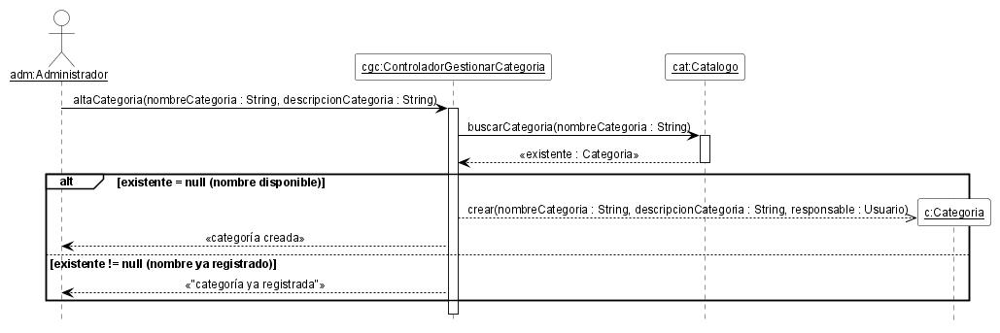

Código PlantUML

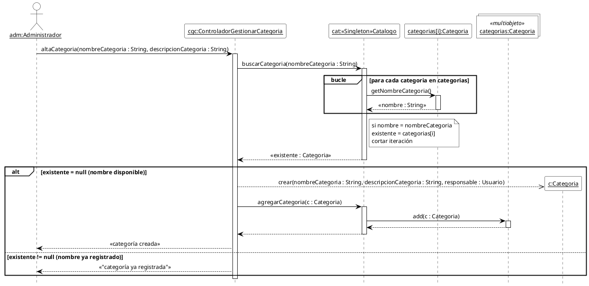
```plantuml
@startuml DSD_CU-03_altaCategoria
' Diagrama de Secuencia de Diseño (DSD) - CU-03 Gestionar categoría - altaCategoria
' Estilo de los ejemplos de la teoría (introducirArticulo / crearNuevaVenta).
hide footbox
skinparam shadowing false
skinparam defaultFontName Arial
skinparam defaultFontSize 12
skinparam sequenceMessageAlign center
skinparam ArrowColor black
skinparam ParticipantBackgroundColor white
skinparam ParticipantBorderColor black
skinparam CollectionsBackgroundColor white
skinparam CollectionsBorderColor black
skinparam ActorBackgroundColor white
skinparam ActorBorderColor black
skinparam LifeLineBorderColor black
skinparam LifeLineBackgroundColor white
skinparam SequenceGroupBackgroundColor white
skinparam SequenceGroupBorderColor black
skinparam SequenceGroupHeaderFontColor black
skinparam NoteBackgroundColor white
skinparam NoteBorderColor black

actor "<u>adm:Administrador</u>" as adm
participant "<u>cgc:ControladorGestionarCategoria</u>" as cgc
participant "<u>cat:«Singleton»Catalogo</u>" as cat
participant "<u>categorias[i]:Categoria</u>" as ci
collections "<u>categorias:Categoria</u>" as mc <<multiobjeto>>

adm -> cgc ++ : altaCategoria(nombreCategoria : String, descripcionCategoria : String)
cgc -> cat ++ : buscarCategoria(nombreCategoria : String)
group bucle [para cada categoria en categorias]
  cat -> ci ++ : getNombreCategoria()
  ci --> cat -- : «nombre : String»
end
note right of cat
  si nombre = nombreCategoria
  existente = categorias[i]
  cortar iteración
end note
cat --> cgc -- : «existente : Categoria»
alt existente = null (nombre disponible)
  create participant "<u>c:Categoria</u>" as c
  cgc -->> c : crear(nombreCategoria : String, descripcionCategoria : String, responsable : Usuario)
  cgc -> cat ++ : agregarCategoria(c : Categoria)
  cat -> mc ++ : add(c : Categoria)
  mc --> cat --
  cat --> cgc --
  cgc --> adm : «categoría creada»
else existente != null (nombre ya registrado)
  cgc --> adm : «"categoría ya registrada"»
end
deactivate cgc

@enduml
```

### `modificarCategoria`

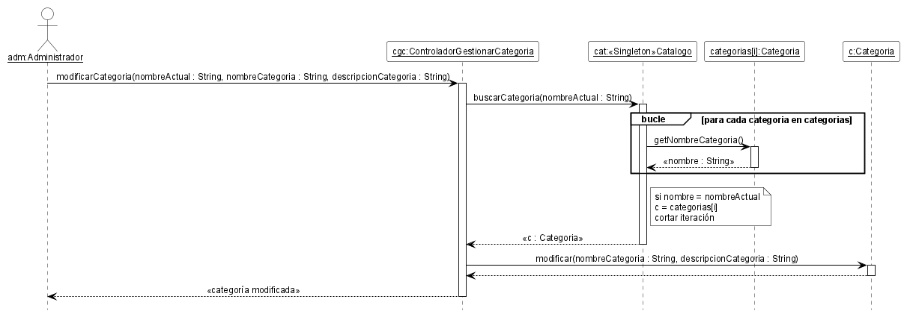

Código PlantUML

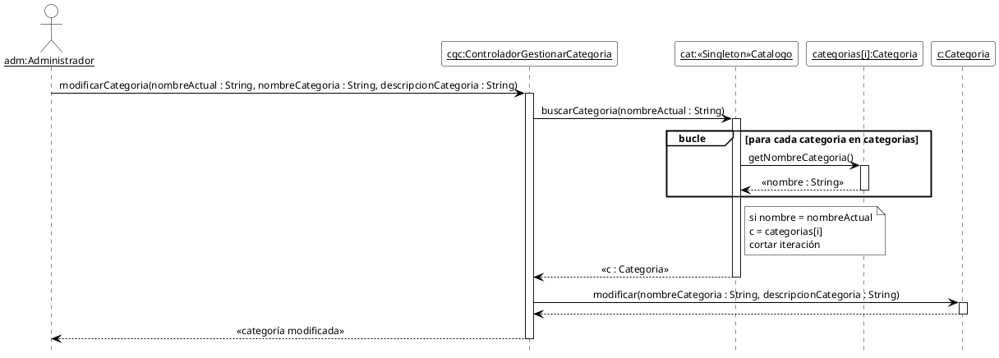
```plantuml
@startuml DSD_CU-03_modificarCategoria
' Diagrama de Secuencia de Diseño (DSD) - CU-03 Gestionar categoría - modificarCategoria
' Estilo de los ejemplos de la teoría (introducirArticulo / crearNuevaVenta).
hide footbox
skinparam shadowing false
skinparam defaultFontName Arial
skinparam defaultFontSize 12
skinparam sequenceMessageAlign center
skinparam ArrowColor black
skinparam ParticipantBackgroundColor white
skinparam ParticipantBorderColor black
skinparam CollectionsBackgroundColor white
skinparam CollectionsBorderColor black
skinparam ActorBackgroundColor white
skinparam ActorBorderColor black
skinparam LifeLineBorderColor black
skinparam LifeLineBackgroundColor white
skinparam SequenceGroupBackgroundColor white
skinparam SequenceGroupBorderColor black
skinparam SequenceGroupHeaderFontColor black
skinparam NoteBackgroundColor white
skinparam NoteBorderColor black

actor "<u>adm:Administrador</u>" as adm
participant "<u>cgc:ControladorGestionarCategoria</u>" as cgc
participant "<u>cat:«Singleton»Catalogo</u>" as cat
participant "<u>categorias[i]:Categoria</u>" as ci
participant "<u>c:Categoria</u>" as c

adm -> cgc ++ : modificarCategoria(nombreActual : String, nombreCategoria : String, descripcionCategoria : String)
cgc -> cat ++ : buscarCategoria(nombreActual : String)
group bucle [para cada categoria en categorias]
  cat -> ci ++ : getNombreCategoria()
  ci --> cat -- : «nombre : String»
end
note right of cat
  si nombre = nombreActual
  c = categorias[i]
  cortar iteración
end note
cat --> cgc -- : «c : Categoria»
cgc -> c ++ : modificar(nombreCategoria : String, descripcionCategoria : String)
c --> cgc --
cgc --> adm -- : «categoría modificada»

@enduml
```

---

## CU-04 - Gestionar producto

### `altaProducto`

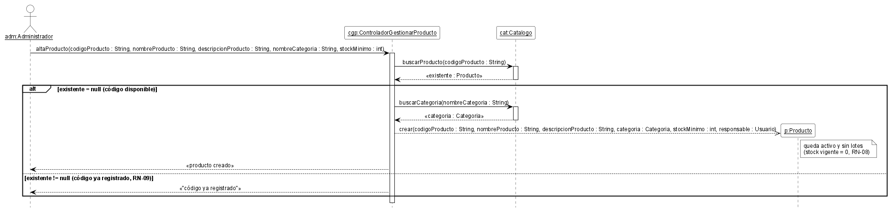

Código PlantUML

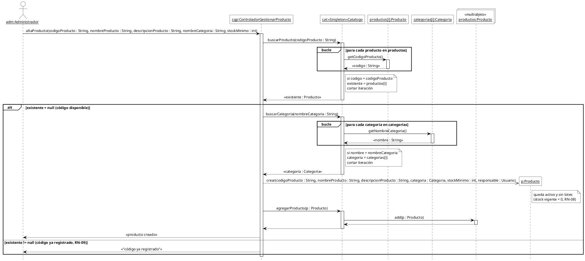
```plantuml
@startuml DSD_CU-04_altaProducto
' Diagrama de Secuencia de Diseño (DSD) - CU-04 Gestionar producto - altaProducto
' Estilo de los ejemplos de la teoría (introducirArticulo / crearNuevaVenta).
hide footbox
skinparam shadowing false
skinparam defaultFontName Arial
skinparam defaultFontSize 12
skinparam sequenceMessageAlign center
skinparam ArrowColor black
skinparam ParticipantBackgroundColor white
skinparam ParticipantBorderColor black
skinparam CollectionsBackgroundColor white
skinparam CollectionsBorderColor black
skinparam ActorBackgroundColor white
skinparam ActorBorderColor black
skinparam LifeLineBorderColor black
skinparam LifeLineBackgroundColor white
skinparam SequenceGroupBackgroundColor white
skinparam SequenceGroupBorderColor black
skinparam SequenceGroupHeaderFontColor black
skinparam NoteBackgroundColor white
skinparam NoteBorderColor black

actor "<u>adm:Administrador</u>" as adm
participant "<u>cgp:ControladorGestionarProducto</u>" as cgp
participant "<u>cat:«Singleton»Catalogo</u>" as cat
participant "<u>productos[i]:Producto</u>" as pi
participant "<u>categorias[i]:Categoria</u>" as ci
collections "<u>productos:Producto</u>" as mp <<multiobjeto>>

adm -> cgp ++ : altaProducto(codigoProducto : String, nombreProducto : String, descripcionProducto : String, nombreCategoria : String, stockMinimo : int)
cgp -> cat ++ : buscarProducto(codigoProducto : String)
group bucle [para cada producto en productos]
  cat -> pi ++ : getCodigoProducto()
  pi --> cat -- : «codigo : String»
end
note right of cat
  si codigo = codigoProducto
  existente = productos[i]
  cortar iteración
end note
cat --> cgp -- : «existente : Producto»
alt existente = null (código disponible)
  cgp -> cat ++ : buscarCategoria(nombreCategoria : String)
  group bucle [para cada categoria en categorias]
    cat -> ci ++ : getNombreCategoria()
    ci --> cat -- : «nombre : String»
  end
  note right of cat
    si nombre = nombreCategoria
    categoria = categorias[i]
    cortar iteración
  end note
  cat --> cgp -- : «categoria : Categoria»
  create participant "<u>p:Producto</u>" as p
  cgp -->> p : crear(codigoProducto : String, nombreProducto : String, descripcionProducto : String, categoria : Categoria, stockMinimo : int, responsable : Usuario)
  note right of p : queda activo y sin lotes\n(stock vigente = 0, RN-08)
  cgp -> cat ++ : agregarProducto(p : Producto)
  cat -> mp ++ : add(p : Producto)
  mp --> cat --
  cat --> cgp --
  cgp --> adm : «producto creado»
else existente != null (código ya registrado, RN-09)
  cgp --> adm : «"código ya registrado"»
end
deactivate cgp

@enduml
```

### `modificarProducto`

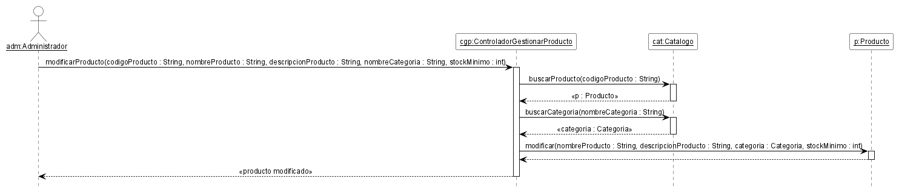

Código PlantUML

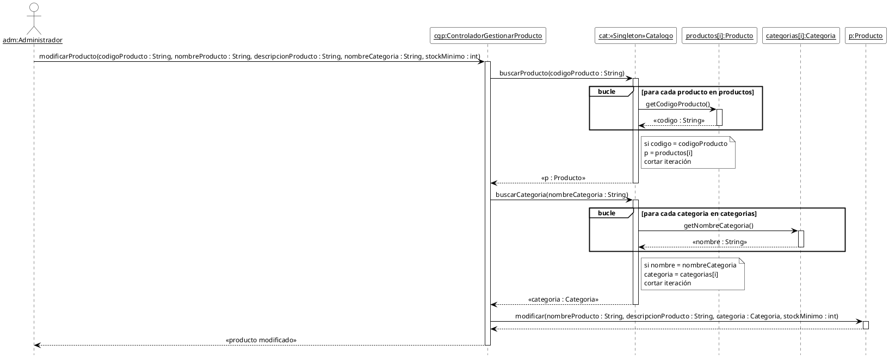
```plantuml
@startuml DSD_CU-04_modificarProducto
' Diagrama de Secuencia de Diseño (DSD) - CU-04 Gestionar producto - modificarProducto
' Estilo de los ejemplos de la teoría (introducirArticulo / crearNuevaVenta).
hide footbox
skinparam shadowing false
skinparam defaultFontName Arial
skinparam defaultFontSize 12
skinparam sequenceMessageAlign center
skinparam ArrowColor black
skinparam ParticipantBackgroundColor white
skinparam ParticipantBorderColor black
skinparam CollectionsBackgroundColor white
skinparam CollectionsBorderColor black
skinparam ActorBackgroundColor white
skinparam ActorBorderColor black
skinparam LifeLineBorderColor black
skinparam LifeLineBackgroundColor white
skinparam SequenceGroupBackgroundColor white
skinparam SequenceGroupBorderColor black
skinparam SequenceGroupHeaderFontColor black
skinparam NoteBackgroundColor white
skinparam NoteBorderColor black

actor "<u>adm:Administrador</u>" as adm
participant "<u>cgp:ControladorGestionarProducto</u>" as cgp
participant "<u>cat:«Singleton»Catalogo</u>" as cat
participant "<u>productos[i]:Producto</u>" as pi
participant "<u>categorias[i]:Categoria</u>" as ci
participant "<u>p:Producto</u>" as p

adm -> cgp ++ : modificarProducto(codigoProducto : String, nombreProducto : String, descripcionProducto : String, nombreCategoria : String, stockMinimo : int)
cgp -> cat ++ : buscarProducto(codigoProducto : String)
group bucle [para cada producto en productos]
  cat -> pi ++ : getCodigoProducto()
  pi --> cat -- : «codigo : String»
end
note right of cat
  si codigo = codigoProducto
  p = productos[i]
  cortar iteración
end note
cat --> cgp -- : «p : Producto»
cgp -> cat ++ : buscarCategoria(nombreCategoria : String)
group bucle [para cada categoria en categorias]
  cat -> ci ++ : getNombreCategoria()
  ci --> cat -- : «nombre : String»
end
note right of cat
  si nombre = nombreCategoria
  categoria = categorias[i]
  cortar iteración
end note
cat --> cgp -- : «categoria : Categoria»
cgp -> p ++ : modificar(nombreProducto : String, descripcionProducto : String, categoria : Categoria, stockMinimo : int)
p --> cgp --
cgp --> adm -- : «producto modificado»

@enduml
```

### `darBajaProducto`

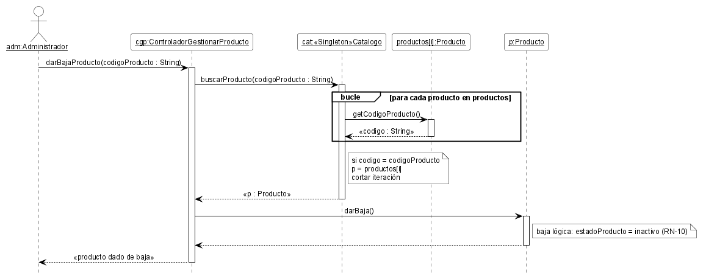

Código PlantUML

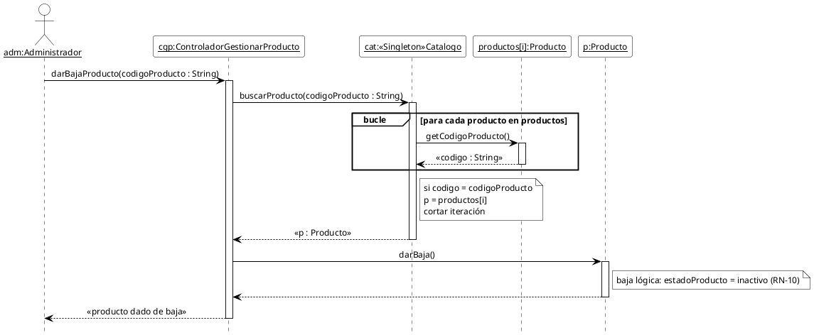
```plantuml
@startuml DSD_CU-04_darBajaProducto
' Diagrama de Secuencia de Diseño (DSD) - CU-04 Gestionar producto - darBajaProducto
' Estilo de los ejemplos de la teoría (introducirArticulo / crearNuevaVenta).
hide footbox
skinparam shadowing false
skinparam defaultFontName Arial
skinparam defaultFontSize 12
skinparam sequenceMessageAlign center
skinparam ArrowColor black
skinparam ParticipantBackgroundColor white
skinparam ParticipantBorderColor black
skinparam CollectionsBackgroundColor white
skinparam CollectionsBorderColor black
skinparam ActorBackgroundColor white
skinparam ActorBorderColor black
skinparam LifeLineBorderColor black
skinparam LifeLineBackgroundColor white
skinparam SequenceGroupBackgroundColor white
skinparam SequenceGroupBorderColor black
skinparam SequenceGroupHeaderFontColor black
skinparam NoteBackgroundColor white
skinparam NoteBorderColor black

actor "<u>adm:Administrador</u>" as adm
participant "<u>cgp:ControladorGestionarProducto</u>" as cgp
participant "<u>cat:«Singleton»Catalogo</u>" as cat
participant "<u>productos[i]:Producto</u>" as pi
participant "<u>p:Producto</u>" as p

adm -> cgp ++ : darBajaProducto(codigoProducto : String)
cgp -> cat ++ : buscarProducto(codigoProducto : String)
group bucle [para cada producto en productos]
  cat -> pi ++ : getCodigoProducto()
  pi --> cat -- : «codigo : String»
end
note right of cat
  si codigo = codigoProducto
  p = productos[i]
  cortar iteración
end note
cat --> cgp -- : «p : Producto»
cgp -> p ++ : darBaja()
note right of p : baja lógica: estadoProducto = inactivo (RN-10)
p --> cgp --
cgp --> adm -- : «producto dado de baja»

@enduml
```

---

## CU-05 - Registrar ingreso de mercadería

### `registrarIngreso`

El usuario hace dos operaciones: primero carga los datos y el sistema le muestra qué va a pasar (lote nuevo o existente, y si la mercadería ya está vencida); después confirma con `confirmarIngreso`. Si quiere corregir el número de lote (3.b del CU), vuelve a enviar `registrarIngreso`.

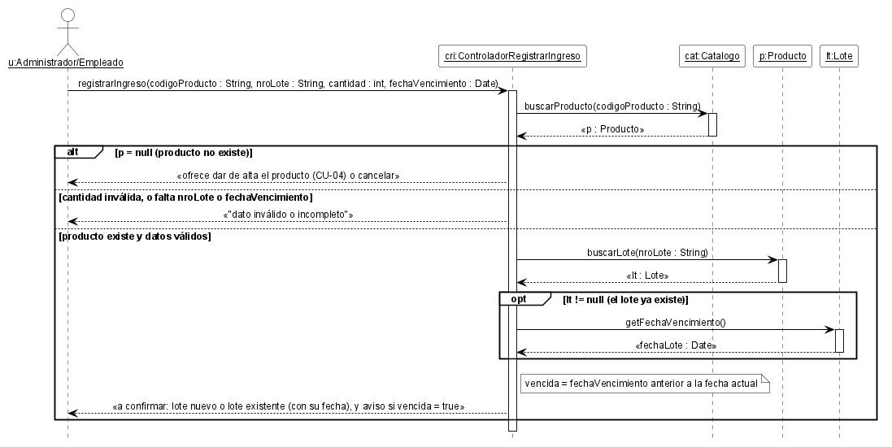

Código PlantUML

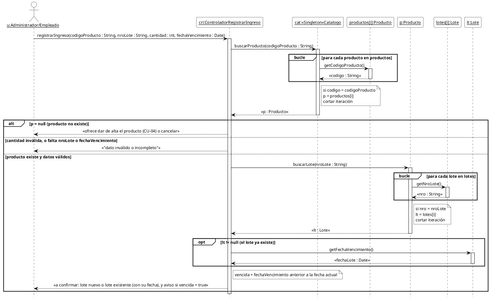
```plantuml
@startuml DSD_CU-05_registrarIngreso
' Diagrama de Secuencia de Diseño (DSD) - CU-05 Registrar ingreso de mercadería - registrarIngreso
' Estilo de los ejemplos de la teoría (introducirArticulo / crearNuevaVenta).
hide footbox
skinparam shadowing false
skinparam defaultFontName Arial
skinparam defaultFontSize 12
skinparam sequenceMessageAlign center
skinparam ArrowColor black
skinparam ParticipantBackgroundColor white
skinparam ParticipantBorderColor black
skinparam CollectionsBackgroundColor white
skinparam CollectionsBorderColor black
skinparam ActorBackgroundColor white
skinparam ActorBorderColor black
skinparam LifeLineBorderColor black
skinparam LifeLineBackgroundColor white
skinparam SequenceGroupBackgroundColor white
skinparam SequenceGroupBorderColor black
skinparam SequenceGroupHeaderFontColor black
skinparam NoteBackgroundColor white
skinparam NoteBorderColor black

actor "<u>u:Administrador/Empleado</u>" as u
participant "<u>cri:ControladorRegistrarIngreso</u>" as cri
participant "<u>cat:«Singleton»Catalogo</u>" as cat
participant "<u>productos[i]:Producto</u>" as pi
participant "<u>p:Producto</u>" as p
participant "<u>lotes[i]:Lote</u>" as li
participant "<u>lt:Lote</u>" as lt

u -> cri ++ : registrarIngreso(codigoProducto : String, nroLote : String, cantidad : int, fechaVencimiento : Date)
cri -> cat ++ : buscarProducto(codigoProducto : String)
group bucle [para cada producto en productos]
  cat -> pi ++ : getCodigoProducto()
  pi --> cat -- : «codigo : String»
end
note right of cat
  si codigo = codigoProducto
  p = productos[i]
  cortar iteración
end note
cat --> cri -- : «p : Producto»
alt p = null (producto no existe)
  cri --> u : «ofrece dar de alta el producto (CU-04) o cancelar»
else cantidad inválida, o falta nroLote o fechaVencimiento
  cri --> u : «"dato inválido o incompleto"»
else producto existe y datos válidos
  cri -> p ++ : buscarLote(nroLote : String)
  group bucle [para cada lote en lotes]
    p -> li ++ : getNroLote()
    li --> p -- : «nro : String»
  end
  note right of p
    si nro = nroLote
    lt = lotes[i]
    cortar iteración
  end note
  p --> cri -- : «lt : Lote»
  opt lt != null (el lote ya existe)
    cri -> lt ++ : getFechaVencimiento()
    lt --> cri -- : «fechaLote : Date»
  end
  note right of cri : vencida = fechaVencimiento anterior a la fecha actual
  cri --> u : «a confirmar: lote nuevo o lote existente (con su fecha), y aviso si vencida = true»
end
deactivate cri

@enduml
```

### `confirmarIngreso`

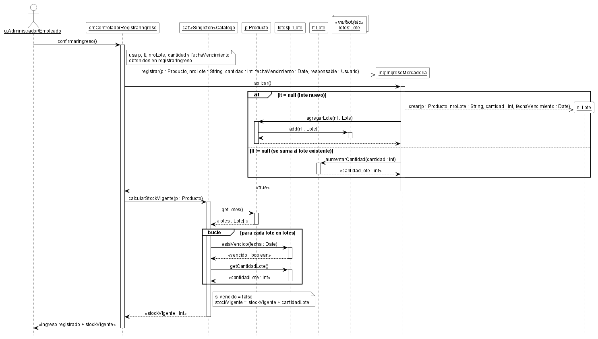

Código PlantUML

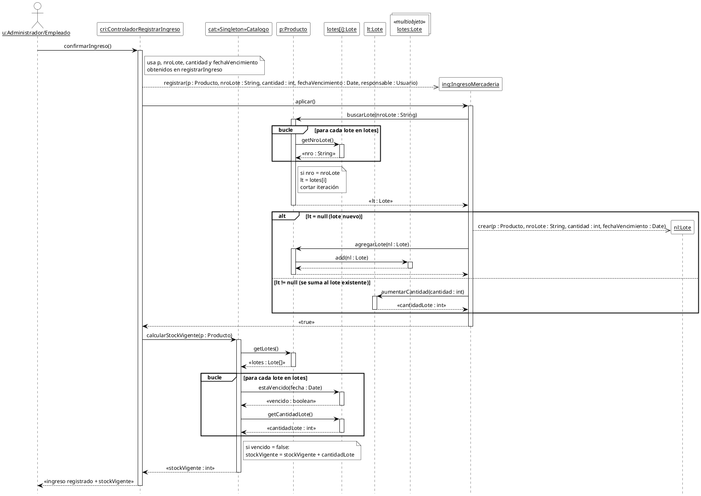
```plantuml
@startuml DSD_CU-05_confirmarIngreso
' Diagrama de Secuencia de Diseño (DSD) - CU-05 Registrar ingreso de mercadería - confirmarIngreso
' Estilo de los ejemplos de la teoría (introducirArticulo / crearNuevaVenta).
hide footbox
skinparam shadowing false
skinparam defaultFontName Arial
skinparam defaultFontSize 12
skinparam sequenceMessageAlign center
skinparam ArrowColor black
skinparam ParticipantBackgroundColor white
skinparam ParticipantBorderColor black
skinparam CollectionsBackgroundColor white
skinparam CollectionsBorderColor black
skinparam ActorBackgroundColor white
skinparam ActorBorderColor black
skinparam LifeLineBorderColor black
skinparam LifeLineBackgroundColor white
skinparam SequenceGroupBackgroundColor white
skinparam SequenceGroupBorderColor black
skinparam SequenceGroupHeaderFontColor black
skinparam NoteBackgroundColor white
skinparam NoteBorderColor black

actor "<u>u:Administrador/Empleado</u>" as u
participant "<u>cri:ControladorRegistrarIngreso</u>" as cri
participant "<u>cat:«Singleton»Catalogo</u>" as cat
participant "<u>p:Producto</u>" as p
participant "<u>lotes[i]:Lote</u>" as li
participant "<u>lt:Lote</u>" as lt
collections "<u>lotes:Lote</u>" as ml <<multiobjeto>>

u -> cri ++ : confirmarIngreso()
note right of cri : usa p, nroLote, cantidad y fechaVencimiento\nobtenidos en registrarIngreso
create participant "<u>ing:IngresoMercaderia</u>" as ing
cri -->> ing : registrar(p : Producto, nroLote : String, cantidad : int, fechaVencimiento : Date, responsable : Usuario)
cri -> ing ++ : aplicar()
ing -> p ++ : buscarLote(nroLote : String)
group bucle [para cada lote en lotes]
  p -> li ++ : getNroLote()
  li --> p -- : «nro : String»
end
note right of p
  si nro = nroLote
  lt = lotes[i]
  cortar iteración
end note
p --> ing -- : «lt : Lote»
alt lt = null (lote nuevo)
  create participant "<u>nl:Lote</u>" as nl
  ing -->> nl : crear(p : Producto, nroLote : String, cantidad : int, fechaVencimiento : Date)
  ing -> p ++ : agregarLote(nl : Lote)
  p -> ml ++ : add(nl : Lote)
  ml --> p --
  p --> ing --
else lt != null (se suma al lote existente)
  ing -> lt ++ : aumentarCantidad(cantidad : int)
  lt --> ing -- : «cantidadLote : int»
end
ing --> cri -- : «true»
cri -> cat ++ : calcularStockVigente(p : Producto)
cat -> p ++ : getLotes()
p --> cat -- : «lotes : Lote[]»
group bucle [para cada lote en lotes]
  cat -> li ++ : estaVencido(fecha : Date)
  li --> cat -- : «vencido : boolean»
  cat -> li ++ : getCantidadLote()
  li --> cat -- : «cantidadLote : int»
end
note right of cat : si vencido = false:\nstockVigente = stockVigente + cantidadLote
cat --> cri -- : «stockVigente : int»
cri --> u -- : «ingreso registrado + stockVigente»

@enduml
```

> El movimiento queda asentado con el usuario y la fecha (RN-07): `registrar(...)` recibe al `responsable`.

---

## CU-06 - Ajustar stock

### `seleccionarProducto`

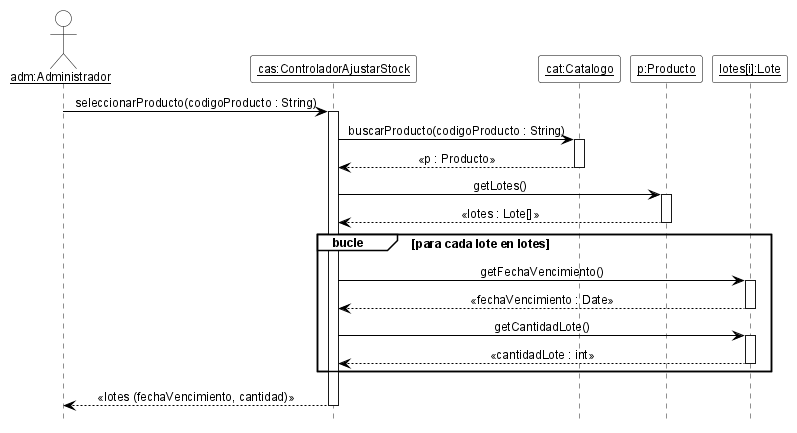

Código PlantUML

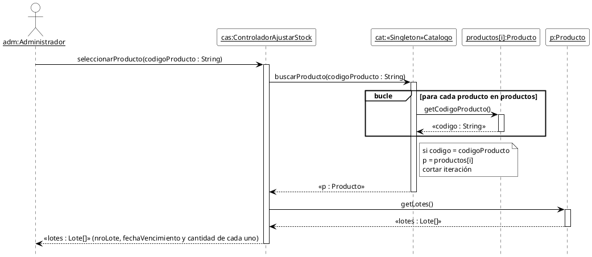
```plantuml
@startuml DSD_CU-06_seleccionarProducto
' Diagrama de Secuencia de Diseño (DSD) - CU-06 Ajustar stock - seleccionarProducto
' Estilo de los ejemplos de la teoría (introducirArticulo / crearNuevaVenta).
hide footbox
skinparam shadowing false
skinparam defaultFontName Arial
skinparam defaultFontSize 12
skinparam sequenceMessageAlign center
skinparam ArrowColor black
skinparam ParticipantBackgroundColor white
skinparam ParticipantBorderColor black
skinparam CollectionsBackgroundColor white
skinparam CollectionsBorderColor black
skinparam ActorBackgroundColor white
skinparam ActorBorderColor black
skinparam LifeLineBorderColor black
skinparam LifeLineBackgroundColor white
skinparam SequenceGroupBackgroundColor white
skinparam SequenceGroupBorderColor black
skinparam SequenceGroupHeaderFontColor black
skinparam NoteBackgroundColor white
skinparam NoteBorderColor black

actor "<u>adm:Administrador</u>" as adm
participant "<u>cas:ControladorAjustarStock</u>" as cas
participant "<u>cat:«Singleton»Catalogo</u>" as cat
participant "<u>productos[i]:Producto</u>" as pi
participant "<u>p:Producto</u>" as p

adm -> cas ++ : seleccionarProducto(codigoProducto : String)
cas -> cat ++ : buscarProducto(codigoProducto : String)
group bucle [para cada producto en productos]
  cat -> pi ++ : getCodigoProducto()
  pi --> cat -- : «codigo : String»
end
note right of cat
  si codigo = codigoProducto
  p = productos[i]
  cortar iteración
end note
cat --> cas -- : «p : Producto»
cas -> p ++ : getLotes()
p --> cas -- : «lotes : Lote[]»
cas --> adm -- : «lotes : Lote[]» (nroLote, fechaVencimiento y cantidad de cada uno)

@enduml
```

### `ajustarStock`

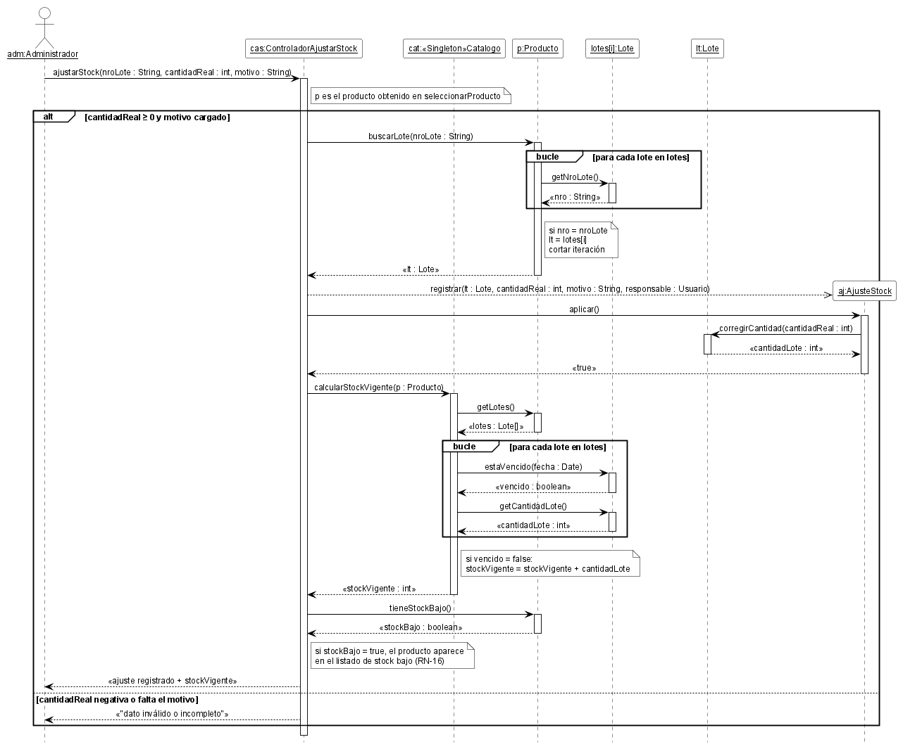

Código PlantUML

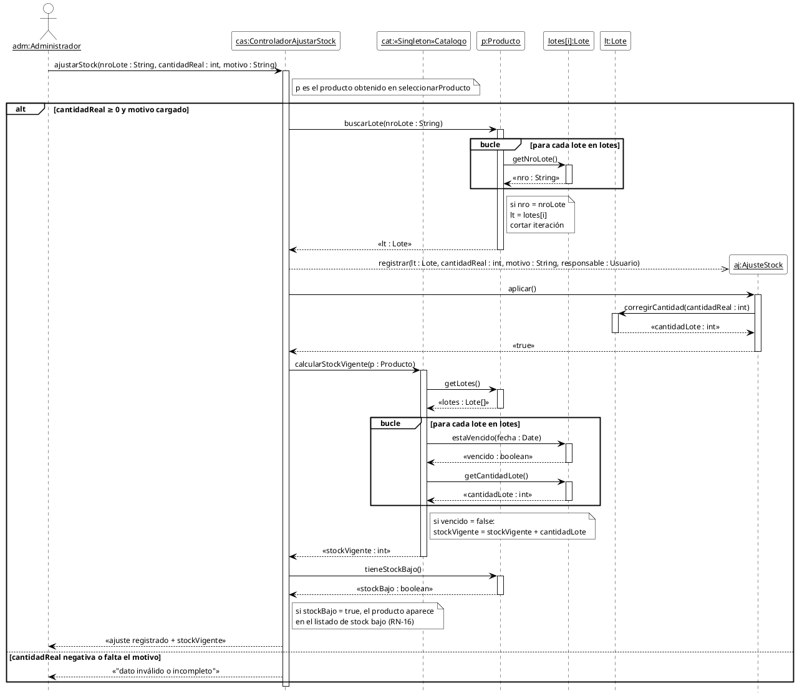
```plantuml
@startuml DSD_CU-06_ajustarStock
' Diagrama de Secuencia de Diseño (DSD) - CU-06 Ajustar stock - ajustarStock
' Estilo de los ejemplos de la teoría (introducirArticulo / crearNuevaVenta).
hide footbox
skinparam shadowing false
skinparam defaultFontName Arial
skinparam defaultFontSize 12
skinparam sequenceMessageAlign center
skinparam ArrowColor black
skinparam ParticipantBackgroundColor white
skinparam ParticipantBorderColor black
skinparam CollectionsBackgroundColor white
skinparam CollectionsBorderColor black
skinparam ActorBackgroundColor white
skinparam ActorBorderColor black
skinparam LifeLineBorderColor black
skinparam LifeLineBackgroundColor white
skinparam SequenceGroupBackgroundColor white
skinparam SequenceGroupBorderColor black
skinparam SequenceGroupHeaderFontColor black
skinparam NoteBackgroundColor white
skinparam NoteBorderColor black

actor "<u>adm:Administrador</u>" as adm
participant "<u>cas:ControladorAjustarStock</u>" as cas
participant "<u>cat:«Singleton»Catalogo</u>" as cat
participant "<u>p:Producto</u>" as p
participant "<u>lotes[i]:Lote</u>" as li
participant "<u>lt:Lote</u>" as lt

adm -> cas ++ : ajustarStock(nroLote : String, cantidadReal : int, motivo : String)
note right of cas : p es el producto obtenido en seleccionarProducto
alt cantidadReal ≥ 0 y motivo cargado
  cas -> p ++ : buscarLote(nroLote : String)
  group bucle [para cada lote en lotes]
    p -> li ++ : getNroLote()
    li --> p -- : «nro : String»
  end
  note right of p
    si nro = nroLote
    lt = lotes[i]
    cortar iteración
  end note
  p --> cas -- : «lt : Lote»
  create participant "<u>aj:AjusteStock</u>" as aj
  cas -->> aj : registrar(lt : Lote, cantidadReal : int, motivo : String, responsable : Usuario)
  cas -> aj ++ : aplicar()
  aj -> lt ++ : corregirCantidad(cantidadReal : int)
  lt --> aj -- : «cantidadLote : int»
  aj --> cas -- : «true»
  cas -> cat ++ : calcularStockVigente(p : Producto)
  cat -> p ++ : getLotes()
  p --> cat -- : «lotes : Lote[]»
  group bucle [para cada lote en lotes]
    cat -> li ++ : estaVencido(fecha : Date)
    li --> cat -- : «vencido : boolean»
    cat -> li ++ : getCantidadLote()
    li --> cat -- : «cantidadLote : int»
  end
  note right of cat : si vencido = false:\nstockVigente = stockVigente + cantidadLote
  cat --> cas -- : «stockVigente : int»
  cas -> p ++ : tieneStockBajo()
  p --> cas -- : «stockBajo : boolean»
  note right of cas : si stockBajo = true, el producto aparece\nen el listado de stock bajo (RN-16)
  cas --> adm : «ajuste registrado + stockVigente»
else cantidadReal negativa o falta el motivo
  cas --> adm : «"dato inválido o incompleto"»
end
deactivate cas

@enduml
```

---

## CU-07 - Registrar retiro de mercadería vencida

### `leerEtiqueta`

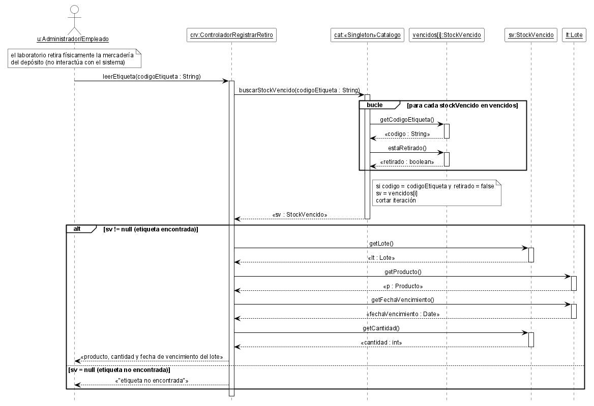

Código PlantUML

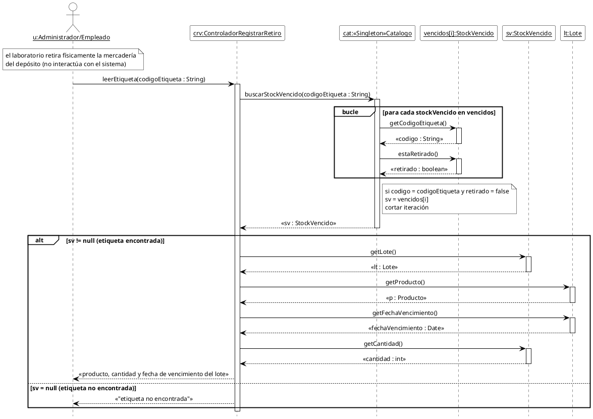
```plantuml
@startuml DSD_CU-07_leerEtiqueta
' Diagrama de Secuencia de Diseño (DSD) - CU-07 Registrar retiro de mercadería vencida - leerEtiqueta
' Estilo de los ejemplos de la teoría (introducirArticulo / crearNuevaVenta).
hide footbox
skinparam shadowing false
skinparam defaultFontName Arial
skinparam defaultFontSize 12
skinparam sequenceMessageAlign center
skinparam ArrowColor black
skinparam ParticipantBackgroundColor white
skinparam ParticipantBorderColor black
skinparam CollectionsBackgroundColor white
skinparam CollectionsBorderColor black
skinparam ActorBackgroundColor white
skinparam ActorBorderColor black
skinparam LifeLineBorderColor black
skinparam LifeLineBackgroundColor white
skinparam SequenceGroupBackgroundColor white
skinparam SequenceGroupBorderColor black
skinparam SequenceGroupHeaderFontColor black
skinparam NoteBackgroundColor white
skinparam NoteBorderColor black

actor "<u>u:Administrador/Empleado</u>" as u
participant "<u>crv:ControladorRegistrarRetiro</u>" as crv
participant "<u>cat:«Singleton»Catalogo</u>" as cat
participant "<u>vencidos[i]:StockVencido</u>" as vi
participant "<u>sv:StockVencido</u>" as sv
participant "<u>lt:Lote</u>" as lt

note over u : el laboratorio retira físicamente la mercadería\ndel depósito (no interactúa con el sistema)
u -> crv ++ : leerEtiqueta(codigoEtiqueta : String)
crv -> cat ++ : buscarStockVencido(codigoEtiqueta : String)
group bucle [para cada stockVencido en vencidos]
  cat -> vi ++ : getCodigoEtiqueta()
  vi --> cat -- : «codigo : String»
  cat -> vi ++ : estaRetirado()
  vi --> cat -- : «retirado : boolean»
end
note right of cat
  si codigo = codigoEtiqueta y retirado = false
  sv = vencidos[i]
  cortar iteración
end note
cat --> crv -- : «sv : StockVencido»
alt sv != null (etiqueta encontrada)
  crv -> sv ++ : getLote()
  sv --> crv -- : «lt : Lote»
  crv -> lt ++ : getProducto()
  lt --> crv -- : «p : Producto»
  crv -> lt ++ : getFechaVencimiento()
  lt --> crv -- : «fechaVencimiento : Date»
  crv -> sv ++ : getCantidad()
  sv --> crv -- : «cantidad : int»
  crv --> u : «producto, cantidad y fecha de vencimiento del lote»
else sv = null (etiqueta no encontrada)
  crv --> u : «"etiqueta no encontrada"»
end
deactivate crv

@enduml
```

### `registrarRetiro`

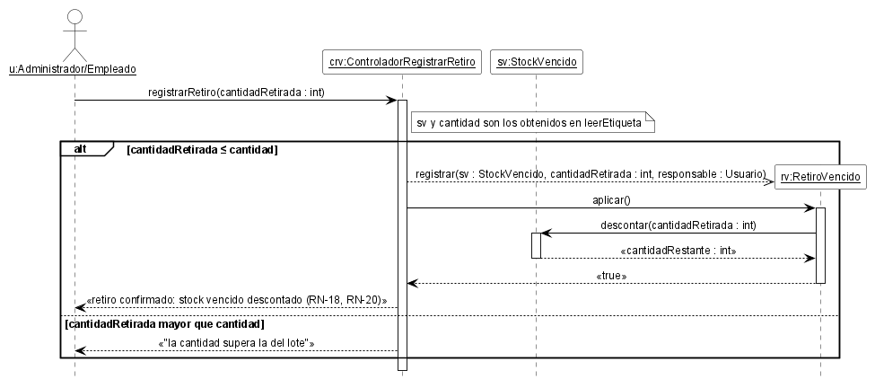

Código PlantUML

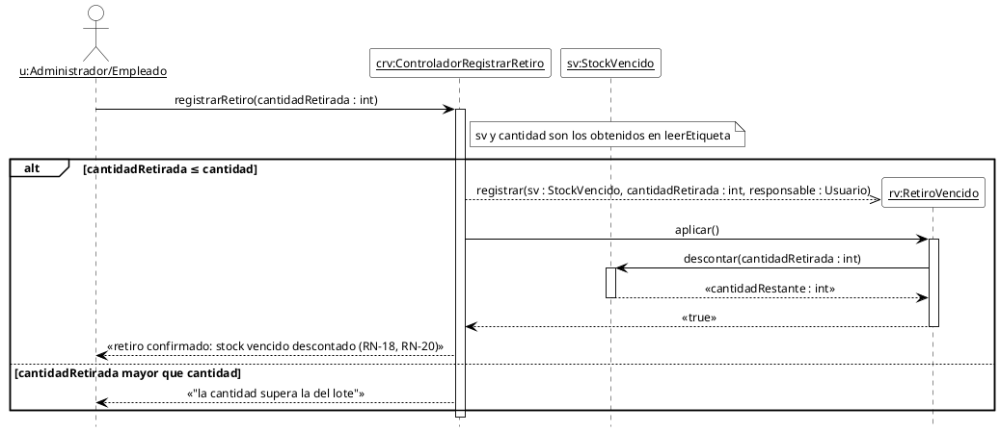
```plantuml
@startuml DSD_CU-07_registrarRetiro
' Diagrama de Secuencia de Diseño (DSD) - CU-07 Registrar retiro de mercadería vencida - registrarRetiro
' Estilo de los ejemplos de la teoría (introducirArticulo / crearNuevaVenta).
hide footbox
skinparam shadowing false
skinparam defaultFontName Arial
skinparam defaultFontSize 12
skinparam sequenceMessageAlign center
skinparam ArrowColor black
skinparam ParticipantBackgroundColor white
skinparam ParticipantBorderColor black
skinparam CollectionsBackgroundColor white
skinparam CollectionsBorderColor black
skinparam ActorBackgroundColor white
skinparam ActorBorderColor black
skinparam LifeLineBorderColor black
skinparam LifeLineBackgroundColor white
skinparam SequenceGroupBackgroundColor white
skinparam SequenceGroupBorderColor black
skinparam SequenceGroupHeaderFontColor black
skinparam NoteBackgroundColor white
skinparam NoteBorderColor black

actor "<u>u:Administrador/Empleado</u>" as u
participant "<u>crv:ControladorRegistrarRetiro</u>" as crv
participant "<u>sv:StockVencido</u>" as sv

u -> crv ++ : registrarRetiro(cantidadRetirada : int)
note right of crv : sv y cantidad son los obtenidos en leerEtiqueta
alt cantidadRetirada ≤ cantidad
  create participant "<u>rv:RetiroVencido</u>" as rv
  crv -->> rv : registrar(sv : StockVencido, cantidadRetirada : int, responsable : Usuario)
  crv -> rv ++ : aplicar()
  rv -> sv ++ : descontar(cantidadRetirada : int)
  sv --> rv -- : «cantidadRestante : int»
  rv --> crv -- : «true»
  crv --> u : «retiro confirmado: stock vencido descontado (RN-18, RN-20)»
else cantidadRetirada mayor que cantidad
  crv --> u : «"la cantidad supera la del lote"»
end
deactivate crv

@enduml
```

> Si el usuario cancela antes de confirmar (5.b del CU), no se envía `registrarRetiro` y no hay cambios.

---

## CU-08 - Consultar productos con stock bajo

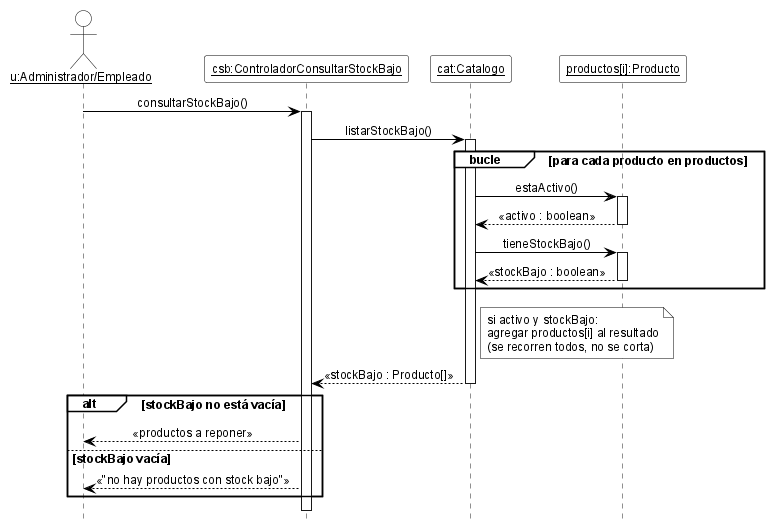

Código PlantUML

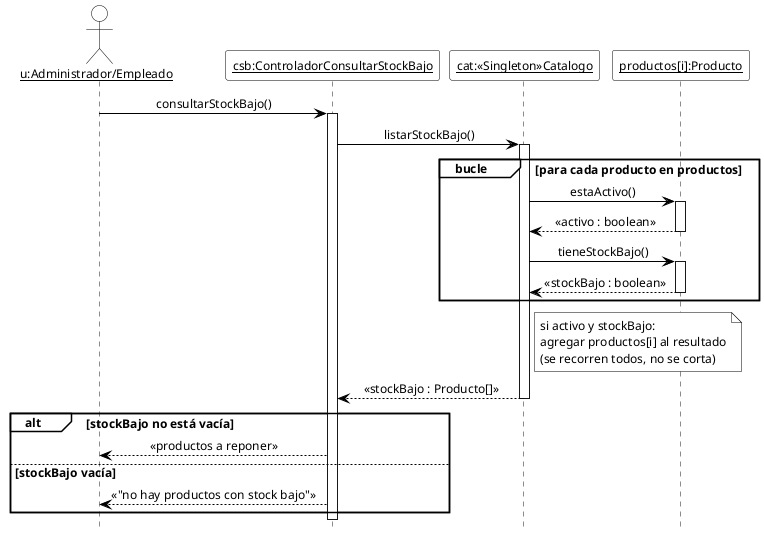
```plantuml
@startuml DSD_CU-08_consultarStockBajo
' Diagrama de Secuencia de Diseño (DSD) - CU-08 Consultar productos con stock bajo - consultarStockBajo
' Estilo de los ejemplos de la teoría (introducirArticulo / crearNuevaVenta).
hide footbox
skinparam shadowing false
skinparam defaultFontName Arial
skinparam defaultFontSize 12
skinparam sequenceMessageAlign center
skinparam ArrowColor black
skinparam ParticipantBackgroundColor white
skinparam ParticipantBorderColor black
skinparam CollectionsBackgroundColor white
skinparam CollectionsBorderColor black
skinparam ActorBackgroundColor white
skinparam ActorBorderColor black
skinparam LifeLineBorderColor black
skinparam LifeLineBackgroundColor white
skinparam SequenceGroupBackgroundColor white
skinparam SequenceGroupBorderColor black
skinparam SequenceGroupHeaderFontColor black
skinparam NoteBackgroundColor white
skinparam NoteBorderColor black

actor "<u>u:Administrador/Empleado</u>" as u
participant "<u>csb:ControladorConsultarStockBajo</u>" as csb
participant "<u>cat:«Singleton»Catalogo</u>" as cat
participant "<u>productos[i]:Producto</u>" as pi

u -> csb ++ : consultarStockBajo()
csb -> cat ++ : listarStockBajo()
group bucle [para cada producto en productos]
  cat -> pi ++ : estaActivo()
  pi --> cat -- : «activo : boolean»
  cat -> pi ++ : tieneStockBajo()
  pi --> cat -- : «stockBajo : boolean»
end
note right of cat
  si activo y stockBajo:
  agregar productos[i] al resultado
  (se recorren todos, no se corta)
end note
cat --> csb -- : «stockBajo : Producto[]»
alt stockBajo no está vacía
  csb --> u : «productos a reponer»
else stockBajo vacía
  csb --> u : «"no hay productos con stock bajo"»
end
deactivate csb

@enduml
```

---

## CU-09 - Consultar vencimientos y stock vencido

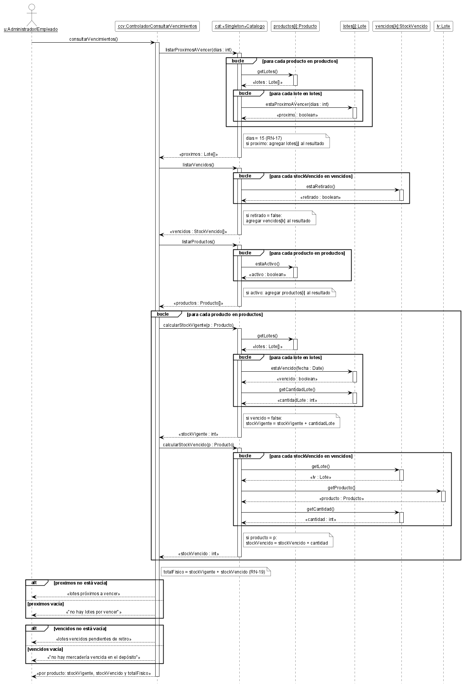

Código PlantUML

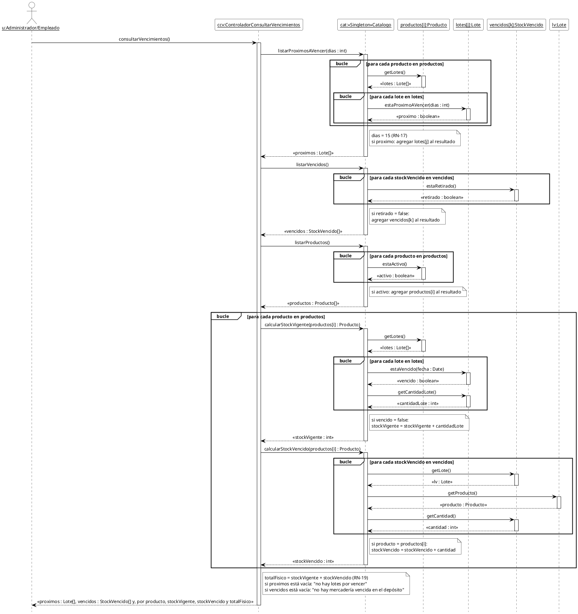
```plantuml
@startuml DSD_CU-09_consultarVencimientos
' Diagrama de Secuencia de Diseño (DSD) - CU-09 Consultar vencimientos y stock vencido - consultarVencimientos
' Estilo de los ejemplos de la teoría (introducirArticulo / crearNuevaVenta).
hide footbox
skinparam shadowing false
skinparam defaultFontName Arial
skinparam defaultFontSize 12
skinparam sequenceMessageAlign center
skinparam ArrowColor black
skinparam ParticipantBackgroundColor white
skinparam ParticipantBorderColor black
skinparam CollectionsBackgroundColor white
skinparam CollectionsBorderColor black
skinparam ActorBackgroundColor white
skinparam ActorBorderColor black
skinparam LifeLineBorderColor black
skinparam LifeLineBackgroundColor white
skinparam SequenceGroupBackgroundColor white
skinparam SequenceGroupBorderColor black
skinparam SequenceGroupHeaderFontColor black
skinparam NoteBackgroundColor white
skinparam NoteBorderColor black

actor "<u>u:Administrador/Empleado</u>" as u
participant "<u>ccv:ControladorConsultarVencimientos</u>" as ccv
participant "<u>cat:«Singleton»Catalogo</u>" as cat
participant "<u>productos[i]:Producto</u>" as pi
participant "<u>lotes[j]:Lote</u>" as li
participant "<u>vencidos[k]:StockVencido</u>" as vi
participant "<u>lv:Lote</u>" as lv

u -> ccv ++ : consultarVencimientos()
ccv -> cat ++ : listarProximosAVencer(dias : int)
group bucle [para cada producto en productos]
  cat -> pi ++ : getLotes()
  pi --> cat -- : «lotes : Lote[]»
  group bucle [para cada lote en lotes]
    cat -> li ++ : estaProximoAVencer(dias : int)
    li --> cat -- : «proximo : boolean»
  end
end
note right of cat : dias = 15 (RN-17)\nsi proximo: agregar lotes[j] al resultado
cat --> ccv -- : «proximos : Lote[]»
ccv -> cat ++ : listarVencidos()
group bucle [para cada stockVencido en vencidos]
  cat -> vi ++ : estaRetirado()
  vi --> cat -- : «retirado : boolean»
end
note right of cat : si retirado = false:\nagregar vencidos[k] al resultado
cat --> ccv -- : «vencidos : StockVencido[]»
ccv -> cat ++ : listarProductos()
group bucle [para cada producto en productos]
  cat -> pi ++ : estaActivo()
  pi --> cat -- : «activo : boolean»
end
note right of cat : si activo: agregar productos[i] al resultado
cat --> ccv -- : «productos : Producto[]»
group bucle [para cada producto en productos]
  ccv -> cat ++ : calcularStockVigente(productos[i] : Producto)
  cat -> pi ++ : getLotes()
  pi --> cat -- : «lotes : Lote[]»
  group bucle [para cada lote en lotes]
    cat -> li ++ : estaVencido(fecha : Date)
    li --> cat -- : «vencido : boolean»
    cat -> li ++ : getCantidadLote()
    li --> cat -- : «cantidadLote : int»
  end
  note right of cat : si vencido = false:\nstockVigente = stockVigente + cantidadLote
  cat --> ccv -- : «stockVigente : int»
  ccv -> cat ++ : calcularStockVencido(productos[i] : Producto)
  group bucle [para cada stockVencido en vencidos]
    cat -> vi ++ : getLote()
    vi --> cat -- : «lv : Lote»
    cat -> lv ++ : getProducto()
    lv --> cat -- : «producto : Producto»
    cat -> vi ++ : getCantidad()
    vi --> cat -- : «cantidad : int»
  end
  note right of cat : si producto = productos[i]:\nstockVencido = stockVencido + cantidad
  cat --> ccv -- : «stockVencido : int»
end
note right of ccv
  totalFisico = stockVigente + stockVencido (RN-19)
  si proximos está vacía: "no hay lotes por vencer"
  si vencidos está vacía: "no hay mercadería vencida en el depósito"
end note
ccv --> u -- : «proximos : Lote[], vencidos : StockVencido[] y, por producto, stockVigente, stockVencido y totalFisico»

@enduml
```

