# Diagramas de Secuencia de Diseño (DSD) - Stock Proyect

## Índice

- **CU-01 - Iniciar sesión**: `iniciarSesion`
- **CU-02 - Gestionar usuario**: `altaUsuario`, `modificarUsuario`, `darBajaUsuario`
- **CU-03 - Gestionar categoría**: `altaCategoria`, `modificarCategoria`
- **CU-04 - Gestionar producto**: `altaProducto`, `modificarProducto`, `darBajaProducto`
- **CU-05 - Registrar ingreso de mercadería**: `registrarIngreso`, `confirmarIngreso`
- **CU-06 - Ajustar stock**: `seleccionarProducto`, `ajustarStock`
- **CU-07 - Registrar retiro de mercadería vencida**: `consultarProducto`, `registrarRetiro`
- **CU-08 - Consultar productos con stock bajo**: `consultarStockBajo`
- **CU-09 - Consultar vencimientos y stock vencido**: `consultarProximosAVencer`, `consultarStock`

---

## CU-01 - Iniciar sesión

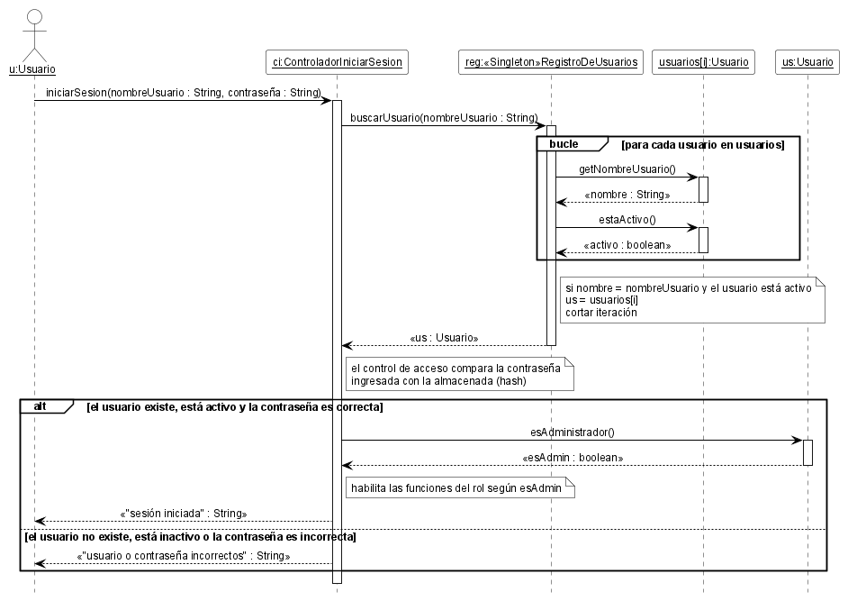

Código PlantUML

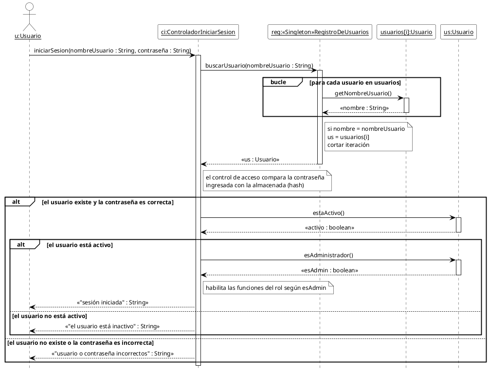
```plantuml
@startuml DSD_CU-01_iniciarSesion
' Diagrama de Secuencia de Diseño (DSD) - CU-01 Iniciar sesión - iniciarSesion
' Estilo de los ejemplos de la teoría (introducirArticulo / crearNuevaVenta).
hide footbox
skinparam shadowing false
skinparam defaultFontName Arial
skinparam defaultFontSize 12
skinparam sequenceMessageAlign center
skinparam ArrowColor black
skinparam ParticipantBackgroundColor white
skinparam ParticipantBorderColor black
skinparam CollectionsBackgroundColor white
skinparam CollectionsBorderColor black
skinparam ActorBackgroundColor white
skinparam ActorBorderColor black
skinparam LifeLineBorderColor black
skinparam LifeLineBackgroundColor white
skinparam SequenceGroupBackgroundColor white
skinparam SequenceGroupBorderColor black
skinparam SequenceGroupHeaderFontColor black
skinparam NoteBackgroundColor white
skinparam NoteBorderColor black

actor "<u>u:Usuario</u>" as u
participant "<u>ci:ControladorIniciarSesion</u>" as ci
participant "<u>reg:«Singleton»RegistroDeUsuarios</u>" as reg
participant "<u>usuarios[i]:Usuario</u>" as ui
participant "<u>us:Usuario</u>" as us

u -> ci ++ : iniciarSesion(nombreUsuario : String, contraseña : String)
ci -> reg ++ : buscarUsuario(nombreUsuario : String)
group bucle [para cada usuario en usuarios]
  reg -> ui ++ : getNombreUsuario()
  ui --> reg -- : «nombre : String»
end
note right of reg
  si nombre = nombreUsuario
  us = usuarios[i]
  cortar iteración
end note
reg --> ci -- : «us : Usuario»
note right of ci : el control de acceso compara la contraseña\ningresada con la almacenada (hash)
alt el usuario existe y la contraseña es correcta
  ci -> us ++ : estaActivo()
  us --> ci -- : «activo : boolean»
  alt el usuario está activo
    ci -> us ++ : esAdministrador()
    us --> ci -- : «esAdmin : boolean»
    note right of ci : habilita las funciones del rol según esAdmin
    ci --> u : «"sesión iniciada" : String»
  else el usuario no está activo
    ci --> u : «"el usuario está inactivo" : String»
  end
else el usuario no existe o la contraseña es incorrecta
  ci --> u : «"usuario o contraseña incorrectos" : String»
end
deactivate ci

@enduml
```

---

## CU-02 - Gestionar usuario

### `altaUsuario`

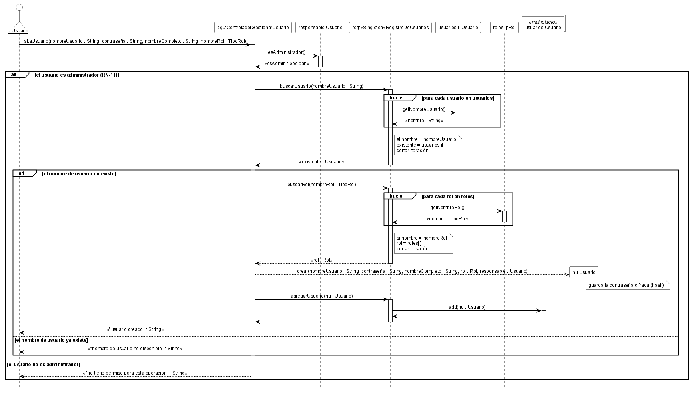

Código PlantUML

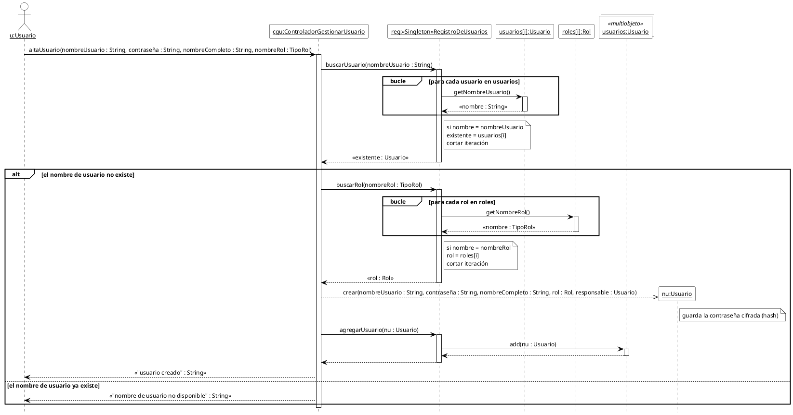
```plantuml
@startuml DSD_CU-02_altaUsuario
' Diagrama de Secuencia de Diseño (DSD) - CU-02 Gestionar usuario - altaUsuario
' Estilo de los ejemplos de la teoría (introducirArticulo / crearNuevaVenta).
hide footbox
skinparam shadowing false
skinparam defaultFontName Arial
skinparam defaultFontSize 12
skinparam sequenceMessageAlign center
skinparam ArrowColor black
skinparam ParticipantBackgroundColor white
skinparam ParticipantBorderColor black
skinparam CollectionsBackgroundColor white
skinparam CollectionsBorderColor black
skinparam ActorBackgroundColor white
skinparam ActorBorderColor black
skinparam LifeLineBorderColor black
skinparam LifeLineBackgroundColor white
skinparam SequenceGroupBackgroundColor white
skinparam SequenceGroupBorderColor black
skinparam SequenceGroupHeaderFontColor black
skinparam NoteBackgroundColor white
skinparam NoteBorderColor black

actor "<u>u:Usuario</u>" as u
participant "<u>cgu:ControladorGestionarUsuario</u>" as cgu
participant "<u>reg:«Singleton»RegistroDeUsuarios</u>" as reg
participant "<u>usuarios[i]:Usuario</u>" as ui
participant "<u>roles[i]:Rol</u>" as ri
collections "<u>usuarios:Usuario</u>" as mu <<multiobjeto>>

u -> cgu ++ : altaUsuario(nombreUsuario : String, contraseña : String, nombreCompleto : String, nombreRol : TipoRol)
cgu -> reg ++ : buscarUsuario(nombreUsuario : String)
group bucle [para cada usuario en usuarios]
  reg -> ui ++ : getNombreUsuario()
  ui --> reg -- : «nombre : String»
end
note right of reg
  si nombre = nombreUsuario
  existente = usuarios[i]
  cortar iteración
end note
reg --> cgu -- : «existente : Usuario»
alt el nombre de usuario no existe
  cgu -> reg ++ : buscarRol(nombreRol : TipoRol)
  group bucle [para cada rol en roles]
    reg -> ri ++ : getNombreRol()
    ri --> reg -- : «nombre : TipoRol»
  end
  note right of reg
    si nombre = nombreRol
    rol = roles[i]
    cortar iteración
  end note
  reg --> cgu -- : «rol : Rol»
  create participant "<u>nu:Usuario</u>" as nu
  cgu -->> nu : crear(nombreUsuario : String, contraseña : String, nombreCompleto : String, rol : Rol, responsable : Usuario)
  note right of nu : guarda la contraseña cifrada (hash)
  cgu -> reg ++ : agregarUsuario(nu : Usuario)
  reg -> mu ++ : add(nu : Usuario)
  mu --> reg --
  reg --> cgu --
  cgu --> u : «"usuario creado" : String»
else el nombre de usuario ya existe
  cgu --> u : «"nombre de usuario no disponible" : String»
end
deactivate cgu

@enduml
```

### `modificarUsuario`

Código PlantUML

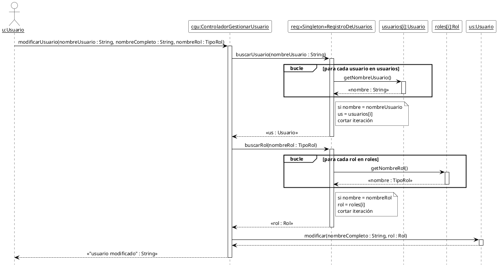
```plantuml
@startuml DSD_CU-02_modificarUsuario
' Diagrama de Secuencia de Diseño (DSD) - CU-02 Gestionar usuario - modificarUsuario
' Estilo de los ejemplos de la teoría (introducirArticulo / crearNuevaVenta).
hide footbox
skinparam shadowing false
skinparam defaultFontName Arial
skinparam defaultFontSize 12
skinparam sequenceMessageAlign center
skinparam ArrowColor black
skinparam ParticipantBackgroundColor white
skinparam ParticipantBorderColor black
skinparam CollectionsBackgroundColor white
skinparam CollectionsBorderColor black
skinparam ActorBackgroundColor white
skinparam ActorBorderColor black
skinparam LifeLineBorderColor black
skinparam LifeLineBackgroundColor white
skinparam SequenceGroupBackgroundColor white
skinparam SequenceGroupBorderColor black
skinparam SequenceGroupHeaderFontColor black
skinparam NoteBackgroundColor white
skinparam NoteBorderColor black

actor "<u>u:Usuario</u>" as u
participant "<u>cgu:ControladorGestionarUsuario</u>" as cgu
participant "<u>reg:«Singleton»RegistroDeUsuarios</u>" as reg
participant "<u>usuarios[i]:Usuario</u>" as ui
participant "<u>roles[i]:Rol</u>" as ri
participant "<u>us:Usuario</u>" as us

u -> cgu ++ : modificarUsuario(nombreUsuario : String, nombreCompleto : String, nombreRol : TipoRol)
cgu -> reg ++ : buscarUsuario(nombreUsuario : String)
group bucle [para cada usuario en usuarios]
  reg -> ui ++ : getNombreUsuario()
  ui --> reg -- : «nombre : String»
end
note right of reg
  si nombre = nombreUsuario
  us = usuarios[i]
  cortar iteración
end note
reg --> cgu -- : «us : Usuario»
cgu -> reg ++ : buscarRol(nombreRol : TipoRol)
group bucle [para cada rol en roles]
  reg -> ri ++ : getNombreRol()
  ri --> reg -- : «nombre : TipoRol»
end
note right of reg
  si nombre = nombreRol
  rol = roles[i]
  cortar iteración
end note
reg --> cgu -- : «rol : Rol»
cgu -> us ++ : modificar(nombreCompleto : String, rol : Rol)
us --> cgu --
cgu --> u -- : «"usuario modificado" : String»

@enduml
```

### `darBajaUsuario`

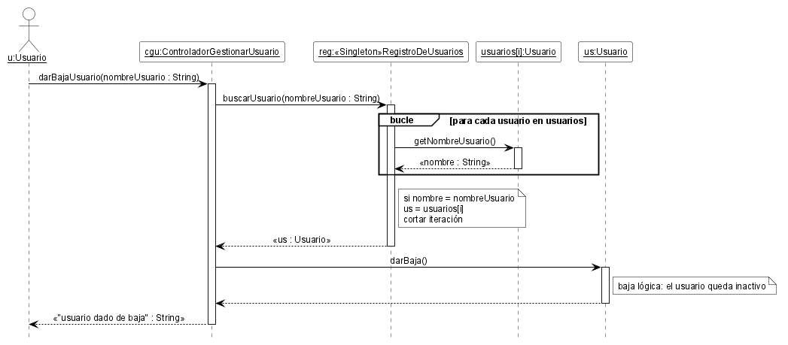

Código PlantUML

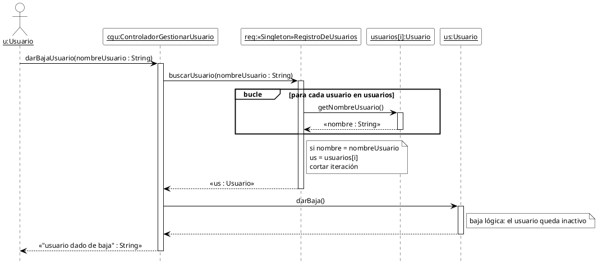
```plantuml
@startuml DSD_CU-02_darBajaUsuario
' Diagrama de Secuencia de Diseño (DSD) - CU-02 Gestionar usuario - darBajaUsuario
' Estilo de los ejemplos de la teoría (introducirArticulo / crearNuevaVenta).
hide footbox
skinparam shadowing false
skinparam defaultFontName Arial
skinparam defaultFontSize 12
skinparam sequenceMessageAlign center
skinparam ArrowColor black
skinparam ParticipantBackgroundColor white
skinparam ParticipantBorderColor black
skinparam CollectionsBackgroundColor white
skinparam CollectionsBorderColor black
skinparam ActorBackgroundColor white
skinparam ActorBorderColor black
skinparam LifeLineBorderColor black
skinparam LifeLineBackgroundColor white
skinparam SequenceGroupBackgroundColor white
skinparam SequenceGroupBorderColor black
skinparam SequenceGroupHeaderFontColor black
skinparam NoteBackgroundColor white
skinparam NoteBorderColor black

actor "<u>u:Usuario</u>" as u
participant "<u>cgu:ControladorGestionarUsuario</u>" as cgu
participant "<u>reg:«Singleton»RegistroDeUsuarios</u>" as reg
participant "<u>usuarios[i]:Usuario</u>" as ui
participant "<u>us:Usuario</u>" as us

u -> cgu ++ : darBajaUsuario(nombreUsuario : String)
cgu -> reg ++ : buscarUsuario(nombreUsuario : String)
group bucle [para cada usuario en usuarios]
  reg -> ui ++ : getNombreUsuario()
  ui --> reg -- : «nombre : String»
end
note right of reg
  si nombre = nombreUsuario
  us = usuarios[i]
  cortar iteración
end note
reg --> cgu -- : «us : Usuario»
cgu -> us ++ : darBaja()
note right of us : baja lógica: el usuario queda inactivo
us --> cgu --
cgu --> u -- : «"usuario dado de baja" : String»

@enduml
```

---

## CU-03 - Gestionar categoría

### `altaCategoria`

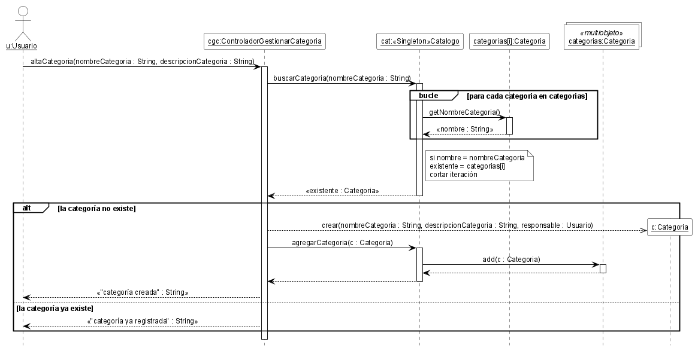

Código PlantUML

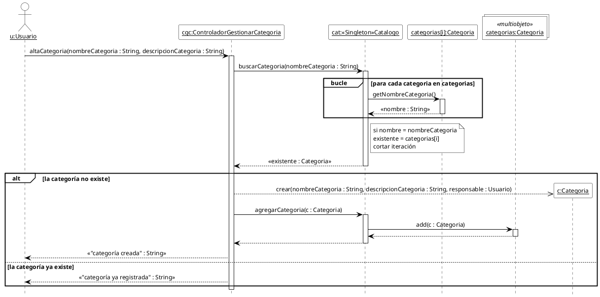
```plantuml
@startuml DSD_CU-03_altaCategoria
' Diagrama de Secuencia de Diseño (DSD) - CU-03 Gestionar categoría - altaCategoria
' Estilo de los ejemplos de la teoría (introducirArticulo / crearNuevaVenta).
hide footbox
skinparam shadowing false
skinparam defaultFontName Arial
skinparam defaultFontSize 12
skinparam sequenceMessageAlign center
skinparam ArrowColor black
skinparam ParticipantBackgroundColor white
skinparam ParticipantBorderColor black
skinparam CollectionsBackgroundColor white
skinparam CollectionsBorderColor black
skinparam ActorBackgroundColor white
skinparam ActorBorderColor black
skinparam LifeLineBorderColor black
skinparam LifeLineBackgroundColor white
skinparam SequenceGroupBackgroundColor white
skinparam SequenceGroupBorderColor black
skinparam SequenceGroupHeaderFontColor black
skinparam NoteBackgroundColor white
skinparam NoteBorderColor black

actor "<u>u:Usuario</u>" as u
participant "<u>cgc:ControladorGestionarCategoria</u>" as cgc
participant "<u>cat:«Singleton»Catalogo</u>" as cat
participant "<u>categorias[i]:Categoria</u>" as ki
collections "<u>categorias:Categoria</u>" as mc <<multiobjeto>>

u -> cgc ++ : altaCategoria(nombreCategoria : String, descripcionCategoria : String)
cgc -> cat ++ : buscarCategoria(nombreCategoria : String)
group bucle [para cada categoria en categorias]
  cat -> ki ++ : getNombreCategoria()
  ki --> cat -- : «nombre : String»
end
note right of cat
  si nombre = nombreCategoria
  existente = categorias[i]
  cortar iteración
end note
cat --> cgc -- : «existente : Categoria»
alt la categoría no existe
  create participant "<u>c:Categoria</u>" as c
  cgc -->> c : crear(nombreCategoria : String, descripcionCategoria : String, responsable : Usuario)
  cgc -> cat ++ : agregarCategoria(c : Categoria)
  cat -> mc ++ : add(c : Categoria)
  mc --> cat --
  cat --> cgc --
  cgc --> u : «"categoría creada" : String»
else la categoría ya existe
  cgc --> u : «"categoría ya registrada" : String»
end
deactivate cgc

@enduml
```

### `modificarCategoria`

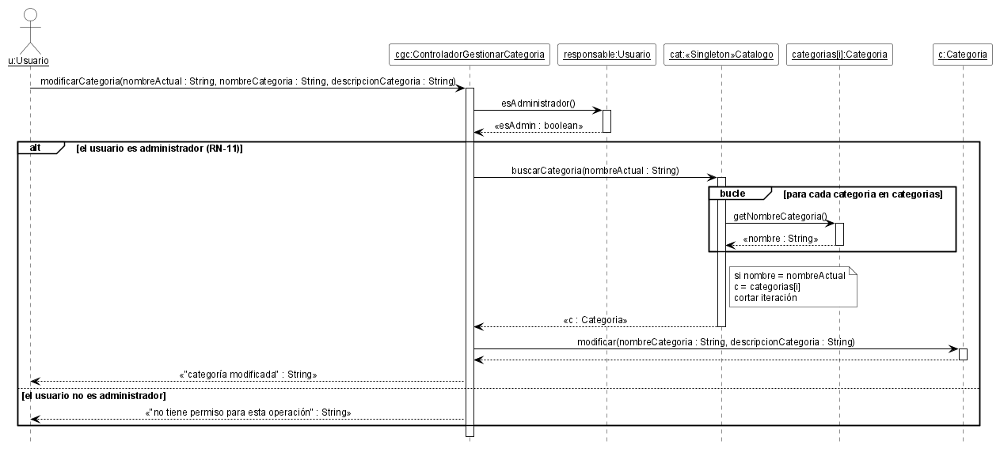

Código PlantUML

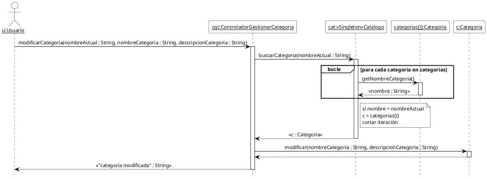
```plantuml
@startuml DSD_CU-03_modificarCategoria
' Diagrama de Secuencia de Diseño (DSD) - CU-03 Gestionar categoría - modificarCategoria
' Estilo de los ejemplos de la teoría (introducirArticulo / crearNuevaVenta).
hide footbox
skinparam shadowing false
skinparam defaultFontName Arial
skinparam defaultFontSize 12
skinparam sequenceMessageAlign center
skinparam ArrowColor black
skinparam ParticipantBackgroundColor white
skinparam ParticipantBorderColor black
skinparam CollectionsBackgroundColor white
skinparam CollectionsBorderColor black
skinparam ActorBackgroundColor white
skinparam ActorBorderColor black
skinparam LifeLineBorderColor black
skinparam LifeLineBackgroundColor white
skinparam SequenceGroupBackgroundColor white
skinparam SequenceGroupBorderColor black
skinparam SequenceGroupHeaderFontColor black
skinparam NoteBackgroundColor white
skinparam NoteBorderColor black

actor "<u>u:Usuario</u>" as u
participant "<u>cgc:ControladorGestionarCategoria</u>" as cgc
participant "<u>cat:«Singleton»Catalogo</u>" as cat
participant "<u>categorias[i]:Categoria</u>" as ki
participant "<u>c:Categoria</u>" as c

u -> cgc ++ : modificarCategoria(nombreActual : String, nombreCategoria : String, descripcionCategoria : String)
cgc -> cat ++ : buscarCategoria(nombreActual : String)
group bucle [para cada categoria en categorias]
  cat -> ki ++ : getNombreCategoria()
  ki --> cat -- : «nombre : String»
end
note right of cat
  si nombre = nombreActual
  c = categorias[i]
  cortar iteración
end note
cat --> cgc -- : «c : Categoria»
cgc -> c ++ : modificar(nombreCategoria : String, descripcionCategoria : String)
c --> cgc --
cgc --> u -- : «"categoría modificada" : String»

@enduml
```

---

## CU-04 - Gestionar producto

### `altaProducto`

Código PlantUML

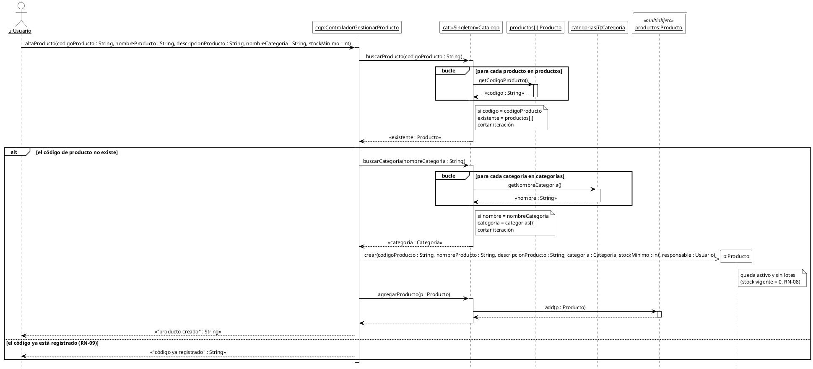
```plantuml
@startuml DSD_CU-04_altaProducto
' Diagrama de Secuencia de Diseño (DSD) - CU-04 Gestionar producto - altaProducto
' Estilo de los ejemplos de la teoría (introducirArticulo / crearNuevaVenta).
hide footbox
skinparam shadowing false
skinparam defaultFontName Arial
skinparam defaultFontSize 12
skinparam sequenceMessageAlign center
skinparam ArrowColor black
skinparam ParticipantBackgroundColor white
skinparam ParticipantBorderColor black
skinparam CollectionsBackgroundColor white
skinparam CollectionsBorderColor black
skinparam ActorBackgroundColor white
skinparam ActorBorderColor black
skinparam LifeLineBorderColor black
skinparam LifeLineBackgroundColor white
skinparam SequenceGroupBackgroundColor white
skinparam SequenceGroupBorderColor black
skinparam SequenceGroupHeaderFontColor black
skinparam NoteBackgroundColor white
skinparam NoteBorderColor black

actor "<u>u:Usuario</u>" as u
participant "<u>cgp:ControladorGestionarProducto</u>" as cgp
participant "<u>cat:«Singleton»Catalogo</u>" as cat
participant "<u>productos[i]:Producto</u>" as pi
participant "<u>categorias[i]:Categoria</u>" as ki
collections "<u>productos:Producto</u>" as mp <<multiobjeto>>

u -> cgp ++ : altaProducto(codigoProducto : String, nombreProducto : String, descripcionProducto : String, nombreCategoria : String, stockMinimo : int)
cgp -> cat ++ : buscarProducto(codigoProducto : String)
group bucle [para cada producto en productos]
  cat -> pi ++ : getCodigoProducto()
  pi --> cat -- : «codigo : String»
end
note right of cat
  si codigo = codigoProducto
  existente = productos[i]
  cortar iteración
end note
cat --> cgp -- : «existente : Producto»
alt el código de producto no existe
  cgp -> cat ++ : buscarCategoria(nombreCategoria : String)
  group bucle [para cada categoria en categorias]
    cat -> ki ++ : getNombreCategoria()
    ki --> cat -- : «nombre : String»
  end
  note right of cat
    si nombre = nombreCategoria
    categoria = categorias[i]
    cortar iteración
  end note
  cat --> cgp -- : «categoria : Categoria»
  create participant "<u>p:Producto</u>" as p
  cgp -->> p : crear(codigoProducto : String, nombreProducto : String, descripcionProducto : String, categoria : Categoria, stockMinimo : int, responsable : Usuario)
  note right of p : queda activo y sin lotes\n(stock vigente = 0, RN-08)
  cgp -> cat ++ : agregarProducto(p : Producto)
  cat -> mp ++ : add(p : Producto)
  mp --> cat --
  cat --> cgp --
  cgp --> u : «"producto creado" : String»
else el código ya está registrado (RN-09)
  cgp --> u : «"código ya registrado" : String»
end
deactivate cgp

@enduml
```

### `modificarProducto`

Código PlantUML

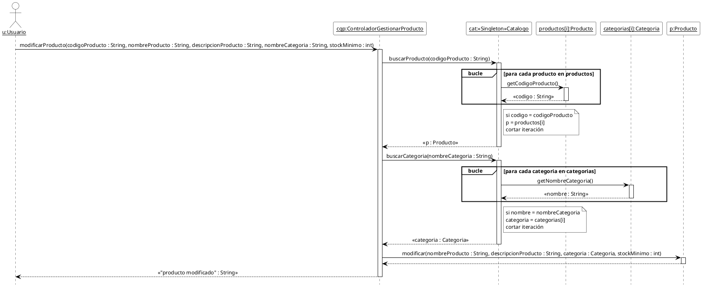
```plantuml
@startuml DSD_CU-04_modificarProducto
' Diagrama de Secuencia de Diseño (DSD) - CU-04 Gestionar producto - modificarProducto
' Estilo de los ejemplos de la teoría (introducirArticulo / crearNuevaVenta).
hide footbox
skinparam shadowing false
skinparam defaultFontName Arial
skinparam defaultFontSize 12
skinparam sequenceMessageAlign center
skinparam ArrowColor black
skinparam ParticipantBackgroundColor white
skinparam ParticipantBorderColor black
skinparam CollectionsBackgroundColor white
skinparam CollectionsBorderColor black
skinparam ActorBackgroundColor white
skinparam ActorBorderColor black
skinparam LifeLineBorderColor black
skinparam LifeLineBackgroundColor white
skinparam SequenceGroupBackgroundColor white
skinparam SequenceGroupBorderColor black
skinparam SequenceGroupHeaderFontColor black
skinparam NoteBackgroundColor white
skinparam NoteBorderColor black

actor "<u>u:Usuario</u>" as u
participant "<u>cgp:ControladorGestionarProducto</u>" as cgp
participant "<u>cat:«Singleton»Catalogo</u>" as cat
participant "<u>productos[i]:Producto</u>" as pi
participant "<u>categorias[i]:Categoria</u>" as ki
participant "<u>p:Producto</u>" as p

u -> cgp ++ : modificarProducto(codigoProducto : String, nombreProducto : String, descripcionProducto : String, nombreCategoria : String, stockMinimo : int)
cgp -> cat ++ : buscarProducto(codigoProducto : String)
group bucle [para cada producto en productos]
  cat -> pi ++ : getCodigoProducto()
  pi --> cat -- : «codigo : String»
end
note right of cat
  si codigo = codigoProducto
  p = productos[i]
  cortar iteración
end note
cat --> cgp -- : «p : Producto»
cgp -> cat ++ : buscarCategoria(nombreCategoria : String)
group bucle [para cada categoria en categorias]
  cat -> ki ++ : getNombreCategoria()
  ki --> cat -- : «nombre : String»
end
note right of cat
  si nombre = nombreCategoria
  categoria = categorias[i]
  cortar iteración
end note
cat --> cgp -- : «categoria : Categoria»
cgp -> p ++ : modificar(nombreProducto : String, descripcionProducto : String, categoria : Categoria, stockMinimo : int)
p --> cgp --
cgp --> u -- : «"producto modificado" : String»

@enduml
```

### `darBajaProducto`

Código PlantUML

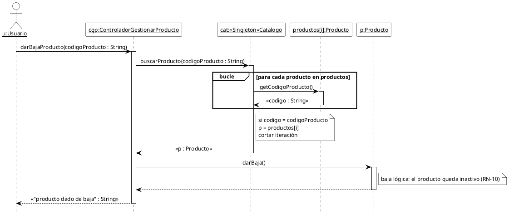
```plantuml
@startuml DSD_CU-04_darBajaProducto
' Diagrama de Secuencia de Diseño (DSD) - CU-04 Gestionar producto - darBajaProducto
' Estilo de los ejemplos de la teoría (introducirArticulo / crearNuevaVenta).
hide footbox
skinparam shadowing false
skinparam defaultFontName Arial
skinparam defaultFontSize 12
skinparam sequenceMessageAlign center
skinparam ArrowColor black
skinparam ParticipantBackgroundColor white
skinparam ParticipantBorderColor black
skinparam CollectionsBackgroundColor white
skinparam CollectionsBorderColor black
skinparam ActorBackgroundColor white
skinparam ActorBorderColor black
skinparam LifeLineBorderColor black
skinparam LifeLineBackgroundColor white
skinparam SequenceGroupBackgroundColor white
skinparam SequenceGroupBorderColor black
skinparam SequenceGroupHeaderFontColor black
skinparam NoteBackgroundColor white
skinparam NoteBorderColor black

actor "<u>u:Usuario</u>" as u
participant "<u>cgp:ControladorGestionarProducto</u>" as cgp
participant "<u>cat:«Singleton»Catalogo</u>" as cat
participant "<u>productos[i]:Producto</u>" as pi
participant "<u>p:Producto</u>" as p

u -> cgp ++ : darBajaProducto(codigoProducto : String)
cgp -> cat ++ : buscarProducto(codigoProducto : String)
group bucle [para cada producto en productos]
  cat -> pi ++ : getCodigoProducto()
  pi --> cat -- : «codigo : String»
end
note right of cat
  si codigo = codigoProducto
  p = productos[i]
  cortar iteración
end note
cat --> cgp -- : «p : Producto»
cgp -> p ++ : darBaja()
note right of p : baja lógica: el producto queda inactivo (RN-10)
p --> cgp --
cgp --> u -- : «"producto dado de baja" : String»

@enduml
```

---

## CU-05 - Registrar ingreso de mercadería

### `registrarIngreso`

El usuario hace dos operaciones: primero carga los datos y el sistema le responde con un texto que dice si es un lote nuevo o existente y si la mercadería ya está vencida; después confirma con `confirmarIngreso`. Si quiere corregir el número de lote (3.b del CU), vuelve a enviar `registrarIngreso`.

Código PlantUML

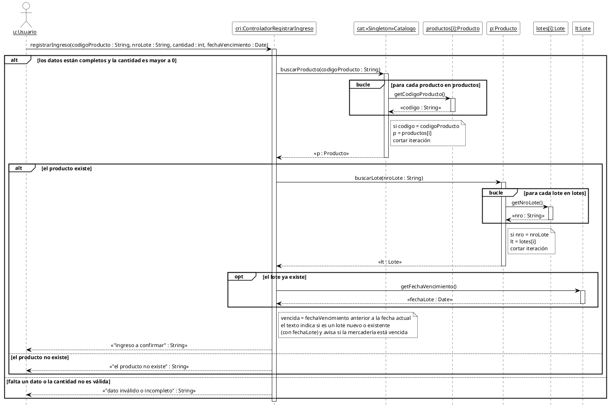
```plantuml
@startuml DSD_CU-05_registrarIngreso
' Diagrama de Secuencia de Diseño (DSD) - CU-05 Registrar ingreso de mercadería - registrarIngreso
' Estilo de los ejemplos de la teoría (introducirArticulo / crearNuevaVenta).
hide footbox
skinparam shadowing false
skinparam defaultFontName Arial
skinparam defaultFontSize 12
skinparam sequenceMessageAlign center
skinparam ArrowColor black
skinparam ParticipantBackgroundColor white
skinparam ParticipantBorderColor black
skinparam CollectionsBackgroundColor white
skinparam CollectionsBorderColor black
skinparam ActorBackgroundColor white
skinparam ActorBorderColor black
skinparam LifeLineBorderColor black
skinparam LifeLineBackgroundColor white
skinparam SequenceGroupBackgroundColor white
skinparam SequenceGroupBorderColor black
skinparam SequenceGroupHeaderFontColor black
skinparam NoteBackgroundColor white
skinparam NoteBorderColor black

actor "<u>u:Usuario</u>" as u
participant "<u>cri:ControladorRegistrarIngreso</u>" as cri
participant "<u>cat:«Singleton»Catalogo</u>" as cat
participant "<u>productos[i]:Producto</u>" as pi
participant "<u>p:Producto</u>" as p
participant "<u>lotes[i]:Lote</u>" as li
participant "<u>lt:Lote</u>" as lt

u -> cri ++ : registrarIngreso(codigoProducto : String, nroLote : String, cantidad : int, fechaVencimiento : Date)
alt los datos están completos y la cantidad es mayor a 0
  cri -> cat ++ : buscarProducto(codigoProducto : String)
  group bucle [para cada producto en productos]
    cat -> pi ++ : getCodigoProducto()
    pi --> cat -- : «codigo : String»
  end
  note right of cat
    si codigo = codigoProducto
    p = productos[i]
    cortar iteración
  end note
  cat --> cri -- : «p : Producto»
  alt el producto existe
    cri -> p ++ : buscarLote(nroLote : String)
    group bucle [para cada lote en lotes]
      p -> li ++ : getNroLote()
      li --> p -- : «nro : String»
    end
    note right of p
      si nro = nroLote
      lt = lotes[i]
      cortar iteración
    end note
    p --> cri -- : «lt : Lote»
    opt el lote ya existe
      cri -> lt ++ : getFechaVencimiento()
      lt --> cri -- : «fechaLote : Date»
    end
    note right of cri
      vencida = fechaVencimiento anterior a la fecha actual
      el texto indica si es un lote nuevo o existente
      (con fechaLote) y avisa si la mercadería está vencida
    end note
    cri --> u : «"ingreso a confirmar" : String»
  else el producto no existe
    cri --> u : «"el producto no existe" : String»
  end
else falta un dato o la cantidad no es válida
  cri --> u : «"dato inválido o incompleto" : String»
end
deactivate cri

@enduml
```

### `confirmarIngreso`

Código PlantUML

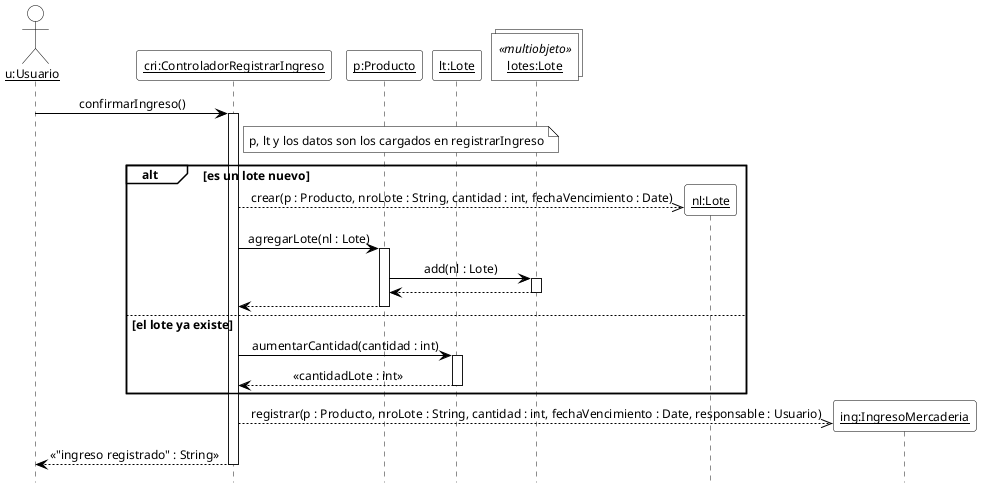
```plantuml
@startuml DSD_CU-05_confirmarIngreso
' Diagrama de Secuencia de Diseño (DSD) - CU-05 Registrar ingreso de mercadería - confirmarIngreso
' Estilo de los ejemplos de la teoría (introducirArticulo / crearNuevaVenta).
hide footbox
skinparam shadowing false
skinparam defaultFontName Arial
skinparam defaultFontSize 12
skinparam sequenceMessageAlign center
skinparam ArrowColor black
skinparam ParticipantBackgroundColor white
skinparam ParticipantBorderColor black
skinparam CollectionsBackgroundColor white
skinparam CollectionsBorderColor black
skinparam ActorBackgroundColor white
skinparam ActorBorderColor black
skinparam LifeLineBorderColor black
skinparam LifeLineBackgroundColor white
skinparam SequenceGroupBackgroundColor white
skinparam SequenceGroupBorderColor black
skinparam SequenceGroupHeaderFontColor black
skinparam NoteBackgroundColor white
skinparam NoteBorderColor black

actor "<u>u:Usuario</u>" as u
participant "<u>cri:ControladorRegistrarIngreso</u>" as cri
participant "<u>p:Producto</u>" as p
participant "<u>lt:Lote</u>" as lt
collections "<u>lotes:Lote</u>" as ml <<multiobjeto>>

u -> cri ++ : confirmarIngreso()
note right of cri : p, lt y los datos son los cargados en registrarIngreso
alt es un lote nuevo
  create participant "<u>nl:Lote</u>" as nl
  cri -->> nl : crear(p : Producto, nroLote : String, cantidad : int, fechaVencimiento : Date)
  cri -> p ++ : agregarLote(nl : Lote)
  p -> ml ++ : add(nl : Lote)
  ml --> p --
  p --> cri --
else el lote ya existe
  cri -> lt ++ : aumentarCantidad(cantidad : int)
  lt --> cri -- : «cantidadLote : int»
end
create participant "<u>ing:IngresoMercaderia</u>" as ing
cri -->> ing : registrar(p : Producto, nroLote : String, cantidad : int, fechaVencimiento : Date, responsable : Usuario)
cri --> u -- : «"ingreso registrado" : String»

@enduml
```

> El movimiento queda asentado con el usuario y la fecha (RN-07): `registrar(...)` recibe al `responsable`.

---

## CU-06 - Ajustar stock

### `seleccionarProducto`

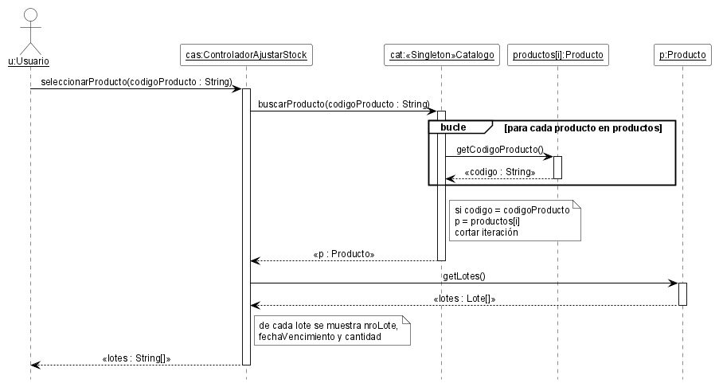

Código PlantUML

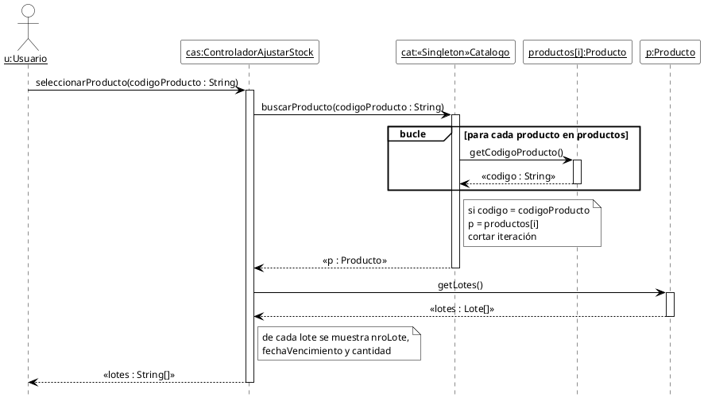
```plantuml
@startuml DSD_CU-06_seleccionarProducto
' Diagrama de Secuencia de Diseño (DSD) - CU-06 Ajustar stock - seleccionarProducto
' Estilo de los ejemplos de la teoría (introducirArticulo / crearNuevaVenta).
hide footbox
skinparam shadowing false
skinparam defaultFontName Arial
skinparam defaultFontSize 12
skinparam sequenceMessageAlign center
skinparam ArrowColor black
skinparam ParticipantBackgroundColor white
skinparam ParticipantBorderColor black
skinparam CollectionsBackgroundColor white
skinparam CollectionsBorderColor black
skinparam ActorBackgroundColor white
skinparam ActorBorderColor black
skinparam LifeLineBorderColor black
skinparam LifeLineBackgroundColor white
skinparam SequenceGroupBackgroundColor white
skinparam SequenceGroupBorderColor black
skinparam SequenceGroupHeaderFontColor black
skinparam NoteBackgroundColor white
skinparam NoteBorderColor black

actor "<u>u:Usuario</u>" as u
participant "<u>cas:ControladorAjustarStock</u>" as cas
participant "<u>cat:«Singleton»Catalogo</u>" as cat
participant "<u>productos[i]:Producto</u>" as pi
participant "<u>p:Producto</u>" as p

u -> cas ++ : seleccionarProducto(codigoProducto : String)
cas -> cat ++ : buscarProducto(codigoProducto : String)
group bucle [para cada producto en productos]
  cat -> pi ++ : getCodigoProducto()
  pi --> cat -- : «codigo : String»
end
note right of cat
  si codigo = codigoProducto
  p = productos[i]
  cortar iteración
end note
cat --> cas -- : «p : Producto»
cas -> p ++ : getLotes()
p --> cas -- : «lotes : Lote[]»
note right of cas : de cada lote se muestra nroLote,\nfechaVencimiento y cantidad
cas --> u -- : «lotes : String[]»

@enduml
```

### `ajustarStock`

Código PlantUML

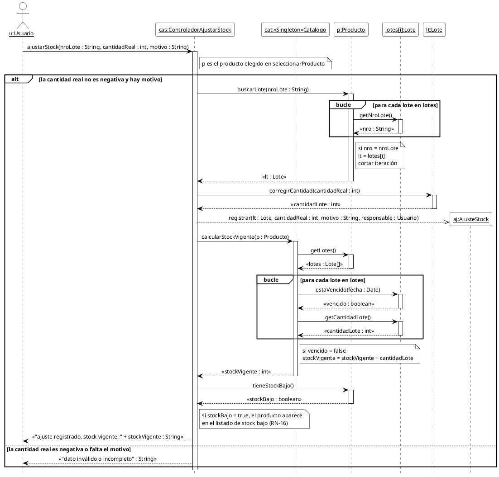
```plantuml
@startuml DSD_CU-06_ajustarStock
' Diagrama de Secuencia de Diseño (DSD) - CU-06 Ajustar stock - ajustarStock
' Estilo de los ejemplos de la teoría (introducirArticulo / crearNuevaVenta).
hide footbox
skinparam shadowing false
skinparam defaultFontName Arial
skinparam defaultFontSize 12
skinparam sequenceMessageAlign center
skinparam ArrowColor black
skinparam ParticipantBackgroundColor white
skinparam ParticipantBorderColor black
skinparam CollectionsBackgroundColor white
skinparam CollectionsBorderColor black
skinparam ActorBackgroundColor white
skinparam ActorBorderColor black
skinparam LifeLineBorderColor black
skinparam LifeLineBackgroundColor white
skinparam SequenceGroupBackgroundColor white
skinparam SequenceGroupBorderColor black
skinparam SequenceGroupHeaderFontColor black
skinparam NoteBackgroundColor white
skinparam NoteBorderColor black

actor "<u>u:Usuario</u>" as u
participant "<u>cas:ControladorAjustarStock</u>" as cas
participant "<u>cat:«Singleton»Catalogo</u>" as cat
participant "<u>p:Producto</u>" as p
participant "<u>lotes[i]:Lote</u>" as li
participant "<u>lt:Lote</u>" as lt

u -> cas ++ : ajustarStock(nroLote : String, cantidadReal : int, motivo : String)
note right of cas : p es el producto elegido en seleccionarProducto
alt la cantidad real no es negativa y hay motivo
  cas -> p ++ : buscarLote(nroLote : String)
  group bucle [para cada lote en lotes]
    p -> li ++ : getNroLote()
    li --> p -- : «nro : String»
  end
  note right of p
    si nro = nroLote
    lt = lotes[i]
    cortar iteración
  end note
  p --> cas -- : «lt : Lote»
  cas -> lt ++ : corregirCantidad(cantidadReal : int)
  lt --> cas -- : «cantidadLote : int»
  create participant "<u>aj:AjusteStock</u>" as aj
  cas -->> aj : registrar(lt : Lote, cantidadReal : int, motivo : String, responsable : Usuario)
  cas -> cat ++ : calcularStockVigente(p : Producto)
  cat -> p ++ : getLotes()
  p --> cat -- : «lotes : Lote[]»
  group bucle [para cada lote en lotes]
    cat -> li ++ : estaVencido(fecha : Date)
    li --> cat -- : «vencido : boolean»
    cat -> li ++ : getCantidadLote()
    li --> cat -- : «cantidadLote : int»
  end
  note right of cat
    si vencido = false
    stockVigente = stockVigente + cantidadLote
  end note
  cat --> cas -- : «stockVigente : int»
  cas -> p ++ : tieneStockBajo()
  p --> cas -- : «stockBajo : boolean»
  note right of cas : si stockBajo = true, el producto aparece\nen el listado de stock bajo (RN-16)
  cas --> u : «"ajuste registrado, stock vigente: " + stockVigente : String»
else la cantidad real es negativa o falta el motivo
  cas --> u : «"dato inválido o incompleto" : String»
end
deactivate cas

@enduml
```

---

## CU-07 - Registrar retiro de mercadería vencida

### `consultarProducto`

Código PlantUML

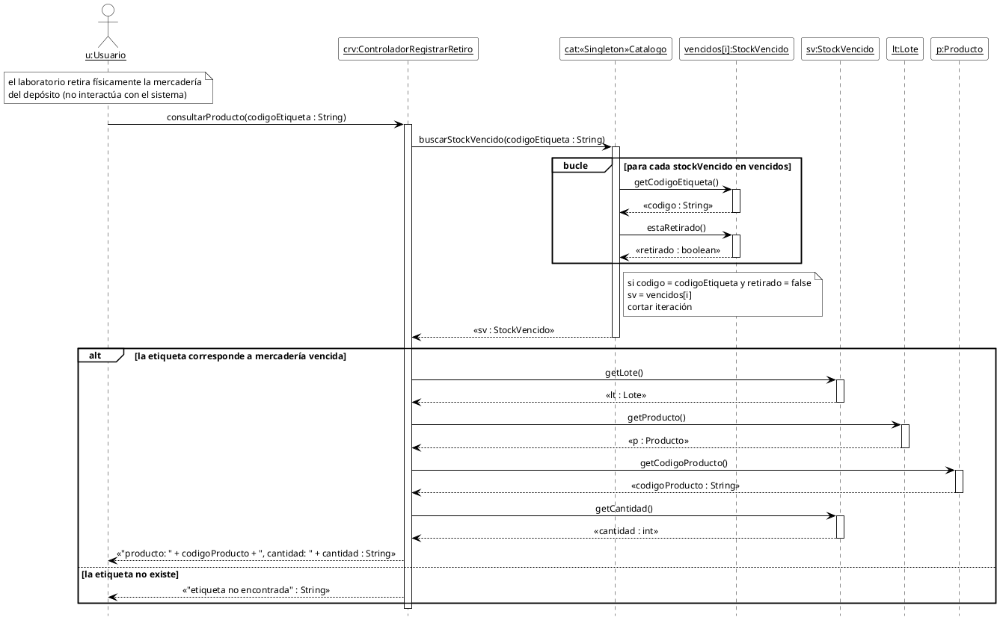
```plantuml
@startuml DSD_CU-07_consultarProducto
' Diagrama de Secuencia de Diseño (DSD) - CU-07 Registrar retiro de mercadería vencida - consultarProducto
' Estilo de los ejemplos de la teoría (introducirArticulo / crearNuevaVenta).
hide footbox
skinparam shadowing false
skinparam defaultFontName Arial
skinparam defaultFontSize 12
skinparam sequenceMessageAlign center
skinparam ArrowColor black
skinparam ParticipantBackgroundColor white
skinparam ParticipantBorderColor black
skinparam CollectionsBackgroundColor white
skinparam CollectionsBorderColor black
skinparam ActorBackgroundColor white
skinparam ActorBorderColor black
skinparam LifeLineBorderColor black
skinparam LifeLineBackgroundColor white
skinparam SequenceGroupBackgroundColor white
skinparam SequenceGroupBorderColor black
skinparam SequenceGroupHeaderFontColor black
skinparam NoteBackgroundColor white
skinparam NoteBorderColor black

actor "<u>u:Usuario</u>" as u
participant "<u>crv:ControladorRegistrarRetiro</u>" as crv
participant "<u>cat:«Singleton»Catalogo</u>" as cat
participant "<u>vencidos[i]:StockVencido</u>" as vi
participant "<u>sv:StockVencido</u>" as sv
participant "<u>lt:Lote</u>" as lt
participant "<u>p:Producto</u>" as p

note over u : el laboratorio retira físicamente la mercadería\ndel depósito (no interactúa con el sistema)
u -> crv ++ : consultarProducto(codigoEtiqueta : String)
crv -> cat ++ : buscarStockVencido(codigoEtiqueta : String)
group bucle [para cada stockVencido en vencidos]
  cat -> vi ++ : getCodigoEtiqueta()
  vi --> cat -- : «codigo : String»
  cat -> vi ++ : estaRetirado()
  vi --> cat -- : «retirado : boolean»
end
note right of cat
  si codigo = codigoEtiqueta y retirado = false
  sv = vencidos[i]
  cortar iteración
end note
cat --> crv -- : «sv : StockVencido»
alt la etiqueta corresponde a mercadería vencida
  crv -> sv ++ : getLote()
  sv --> crv -- : «lt : Lote»
  crv -> lt ++ : getProducto()
  lt --> crv -- : «p : Producto»
  crv -> p ++ : getCodigoProducto()
  p --> crv -- : «codigoProducto : String»
  crv -> sv ++ : getCantidad()
  sv --> crv -- : «cantidad : int»
  crv --> u : «"producto: " + codigoProducto + ", cantidad: " + cantidad : String»
else la etiqueta no existe
  crv --> u : «"etiqueta no encontrada" : String»
end
deactivate crv

@enduml
```

### `registrarRetiro`

Código PlantUML

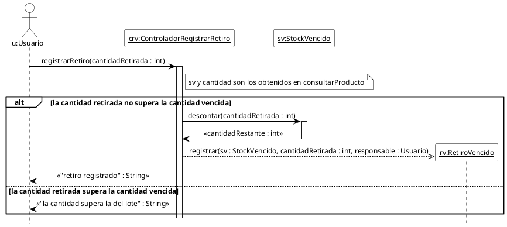
```plantuml
@startuml DSD_CU-07_registrarRetiro
' Diagrama de Secuencia de Diseño (DSD) - CU-07 Registrar retiro de mercadería vencida - registrarRetiro
' Estilo de los ejemplos de la teoría (introducirArticulo / crearNuevaVenta).
hide footbox
skinparam shadowing false
skinparam defaultFontName Arial
skinparam defaultFontSize 12
skinparam sequenceMessageAlign center
skinparam ArrowColor black
skinparam ParticipantBackgroundColor white
skinparam ParticipantBorderColor black
skinparam CollectionsBackgroundColor white
skinparam CollectionsBorderColor black
skinparam ActorBackgroundColor white
skinparam ActorBorderColor black
skinparam LifeLineBorderColor black
skinparam LifeLineBackgroundColor white
skinparam SequenceGroupBackgroundColor white
skinparam SequenceGroupBorderColor black
skinparam SequenceGroupHeaderFontColor black
skinparam NoteBackgroundColor white
skinparam NoteBorderColor black

actor "<u>u:Usuario</u>" as u
participant "<u>crv:ControladorRegistrarRetiro</u>" as crv
participant "<u>sv:StockVencido</u>" as sv

u -> crv ++ : registrarRetiro(cantidadRetirada : int)
note right of crv : sv y cantidad son los obtenidos en consultarProducto
alt la cantidad retirada no supera la cantidad vencida
  crv -> sv ++ : descontar(cantidadRetirada : int)
  sv --> crv -- : «cantidadRestante : int»
  create participant "<u>rv:RetiroVencido</u>" as rv
  crv -->> rv : registrar(sv : StockVencido, cantidadRetirada : int, responsable : Usuario)
  crv --> u : «"retiro registrado" : String»
else la cantidad retirada supera la cantidad vencida
  crv --> u : «"la cantidad supera la del lote" : String»
end
deactivate crv

@enduml
```

> Si el usuario cancela antes de confirmar (5.b del CU), no se envía `registrarRetiro` y no hay cambios.

---

## CU-08 - Consultar productos con stock bajo

Código PlantUML

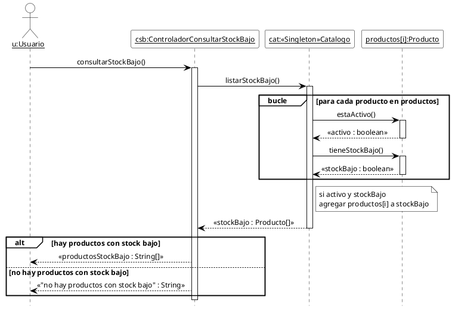
```plantuml
@startuml DSD_CU-08_consultarStockBajo
' Diagrama de Secuencia de Diseño (DSD) - CU-08 Consultar productos con stock bajo - consultarStockBajo
' Estilo de los ejemplos de la teoría (introducirArticulo / crearNuevaVenta).
hide footbox
skinparam shadowing false
skinparam defaultFontName Arial
skinparam defaultFontSize 12
skinparam sequenceMessageAlign center
skinparam ArrowColor black
skinparam ParticipantBackgroundColor white
skinparam ParticipantBorderColor black
skinparam CollectionsBackgroundColor white
skinparam CollectionsBorderColor black
skinparam ActorBackgroundColor white
skinparam ActorBorderColor black
skinparam LifeLineBorderColor black
skinparam LifeLineBackgroundColor white
skinparam SequenceGroupBackgroundColor white
skinparam SequenceGroupBorderColor black
skinparam SequenceGroupHeaderFontColor black
skinparam NoteBackgroundColor white
skinparam NoteBorderColor black

actor "<u>u:Usuario</u>" as u
participant "<u>csb:ControladorConsultarStockBajo</u>" as csb
participant "<u>cat:«Singleton»Catalogo</u>" as cat
participant "<u>productos[i]:Producto</u>" as pi

u -> csb ++ : consultarStockBajo()
csb -> cat ++ : listarStockBajo()
group bucle [para cada producto en productos]
  cat -> pi ++ : estaActivo()
  pi --> cat -- : «activo : boolean»
  cat -> pi ++ : tieneStockBajo()
  pi --> cat -- : «stockBajo : boolean»
end
note right of cat
  si activo y stockBajo
  agregar productos[i] a stockBajo
end note
cat --> csb -- : «stockBajo : Producto[]»
alt hay productos con stock bajo
  csb --> u : «productosStockBajo : String[]»
else no hay productos con stock bajo
  csb --> u : «"no hay productos con stock bajo" : String»
end
deactivate csb

@enduml
```

---

## CU-09 - Consultar vencimientos y stock vencido

### `consultarProximosAVencer`

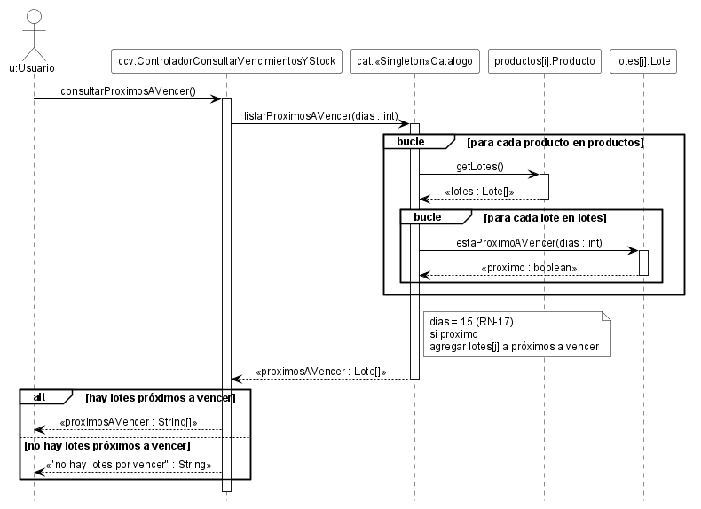

Código PlantUML

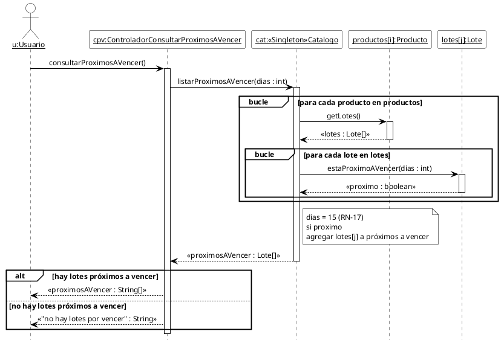
```plantuml
@startuml DSD_CU-09_consultarProximosAVencer
' Diagrama de Secuencia de Diseño (DSD) - CU-09 Consultar vencimientos y stock vencido - consultarProximosAVencer
' Estilo de los ejemplos de la teoría (introducirArticulo / crearNuevaVenta).
hide footbox
skinparam shadowing false
skinparam defaultFontName Arial
skinparam defaultFontSize 12
skinparam sequenceMessageAlign center
skinparam ArrowColor black
skinparam ParticipantBackgroundColor white
skinparam ParticipantBorderColor black
skinparam CollectionsBackgroundColor white
skinparam CollectionsBorderColor black
skinparam ActorBackgroundColor white
skinparam ActorBorderColor black
skinparam LifeLineBorderColor black
skinparam LifeLineBackgroundColor white
skinparam SequenceGroupBackgroundColor white
skinparam SequenceGroupBorderColor black
skinparam SequenceGroupHeaderFontColor black
skinparam NoteBackgroundColor white
skinparam NoteBorderColor black

actor "<u>u:Usuario</u>" as u
participant "<u>cpv:ControladorConsultarProximosAVencer</u>" as cpv
participant "<u>cat:«Singleton»Catalogo</u>" as cat
participant "<u>productos[i]:Producto</u>" as pi
participant "<u>lotes[j]:Lote</u>" as li

u -> cpv ++ : consultarProximosAVencer()
cpv -> cat ++ : listarProximosAVencer(dias : int)
group bucle [para cada producto en productos]
  cat -> pi ++ : getLotes()
  pi --> cat -- : «lotes : Lote[]»
  group bucle [para cada lote en lotes]
    cat -> li ++ : estaProximoAVencer(dias : int)
    li --> cat -- : «proximo : boolean»
  end
end
note right of cat
  dias = 15 (RN-17)
  si proximo
  agregar lotes[j] a próximos a vencer
end note
cat --> cpv -- : «proximosAVencer : Lote[]»
alt hay lotes próximos a vencer
  cpv --> u : «proximosAVencer : String[]»
else no hay lotes próximos a vencer
  cpv --> u : «"no hay lotes por vencer" : String»
end
deactivate cpv

@enduml
```

### `consultarStock`

Código PlantUML

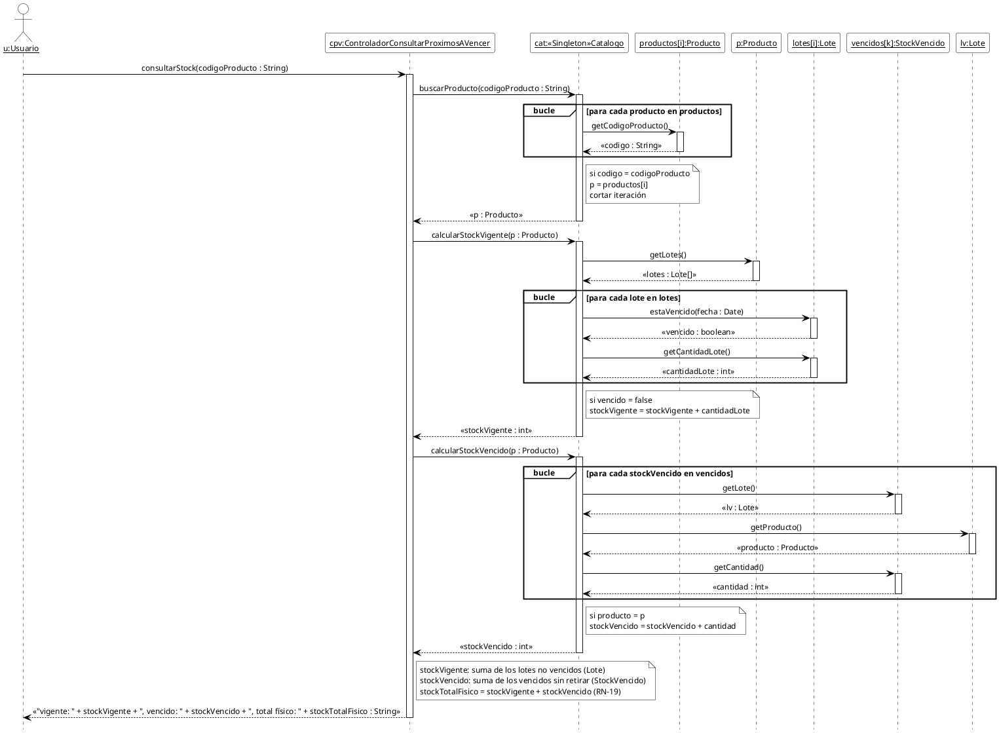
```plantuml
@startuml DSD_CU-09_consultarStock
' Diagrama de Secuencia de Diseño (DSD) - CU-09 Consultar vencimientos y stock vencido - consultarStock
' Estilo de los ejemplos de la teoría (introducirArticulo / crearNuevaVenta).
hide footbox
skinparam shadowing false
skinparam defaultFontName Arial
skinparam defaultFontSize 12
skinparam sequenceMessageAlign center
skinparam ArrowColor black
skinparam ParticipantBackgroundColor white
skinparam ParticipantBorderColor black
skinparam CollectionsBackgroundColor white
skinparam CollectionsBorderColor black
skinparam ActorBackgroundColor white
skinparam ActorBorderColor black
skinparam LifeLineBorderColor black
skinparam LifeLineBackgroundColor white
skinparam SequenceGroupBackgroundColor white
skinparam SequenceGroupBorderColor black
skinparam SequenceGroupHeaderFontColor black
skinparam NoteBackgroundColor white
skinparam NoteBorderColor black

actor "<u>u:Usuario</u>" as u
participant "<u>cpv:ControladorConsultarProximosAVencer</u>" as cpv
participant "<u>cat:«Singleton»Catalogo</u>" as cat
participant "<u>productos[i]:Producto</u>" as pi
participant "<u>p:Producto</u>" as p
participant "<u>lotes[i]:Lote</u>" as li
participant "<u>vencidos[k]:StockVencido</u>" as vi
participant "<u>lv:Lote</u>" as lv

u -> cpv ++ : consultarStock(codigoProducto : String)
cpv -> cat ++ : buscarProducto(codigoProducto : String)
group bucle [para cada producto en productos]
  cat -> pi ++ : getCodigoProducto()
  pi --> cat -- : «codigo : String»
end
note right of cat
  si codigo = codigoProducto
  p = productos[i]
  cortar iteración
end note
cat --> cpv -- : «p : Producto»
cpv -> cat ++ : calcularStockVigente(p : Producto)
cat -> p ++ : getLotes()
p --> cat -- : «lotes : Lote[]»
group bucle [para cada lote en lotes]
  cat -> li ++ : estaVencido(fecha : Date)
  li --> cat -- : «vencido : boolean»
  cat -> li ++ : getCantidadLote()
  li --> cat -- : «cantidadLote : int»
end
note right of cat
  si vencido = false
  stockVigente = stockVigente + cantidadLote
end note
cat --> cpv -- : «stockVigente : int»
cpv -> cat ++ : calcularStockVencido(p : Producto)
group bucle [para cada stockVencido en vencidos]
  cat -> vi ++ : getLote()
  vi --> cat -- : «lv : Lote»
  cat -> lv ++ : getProducto()
  lv --> cat -- : «producto : Producto»
  cat -> vi ++ : getCantidad()
  vi --> cat -- : «cantidad : int»
end
note right of cat
  si producto = p
  stockVencido = stockVencido + cantidad
end note
cat --> cpv -- : «stockVencido : int»
note right of cpv
  stockVigente: suma de los lotes no vencidos (Lote)
  stockVencido: suma de los vencidos sin retirar (StockVencido)
  stockTotalFisico = stockVigente + stockVencido (RN-19)
end note
cpv --> u -- : «"vigente: " + stockVigente + ", vencido: " + stockVencido + ", total físico: " + stockTotalFisico : String»

@enduml
```

> Los tres tipos de stock y de dónde sale cada uno: el **vigente** suma la cantidad de los lotes no vencidos (`Lote`), el **vencido** suma la cantidad de la mercadería vencida sin retirar (`StockVencido`) y el **total físico** es la suma de ambos (RN-19).
