# Diagramas de Secuencia de Diseño (DSD) - Stock Proyect

## Índice

- **CU-01 - Iniciar sesión**: `iniciarSesion`
- **CU-02 - Gestionar usuario**: `altaUsuario`, `modificarUsuario`, `darBajaUsuario`
- **CU-03 - Gestionar categoría**: `altaCategoria`, `modificarCategoria`
- **CU-04 - Gestionar producto**: `altaProducto`, `modificarProducto`, `darBajaProducto`
- **CU-05 - Registrar ingreso de mercadería**: `registrarIngreso`, `confirmarIngreso`
- **CU-06 - Ajustar stock**: `seleccionarProducto`, `ajustarStock`
- **CU-07 - Registrar retiro de mercadería vencida**: `consultarProducto`, `registrarRetiro`
- **CU-08 - Consultar productos con stock bajo**: `consultarStockBajo`
- **CU-09 - Consultar próximos a vencer y stock**: `consultarProximosAVencer`, `consultarStock`
- **CU-10 - Trasladar mercadería vencida**: `consultarPendientesDeTraslado`, `registrarTraslado`
- **CU-11 - Registrar egreso de mercadería**: `registrarEgreso`

---

## CU-01 - Iniciar sesión

Código PlantUML

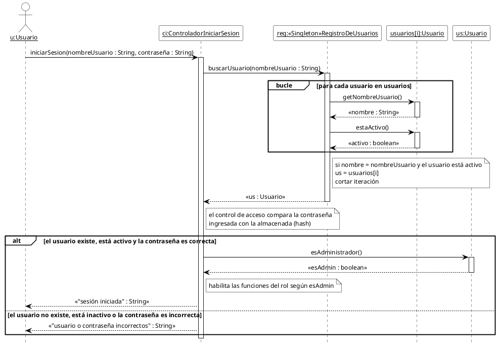
```plantuml
@startuml DSD_CU-01_iniciarSesion
' Diagrama de Secuencia de Diseño (DSD) - CU-01 Iniciar sesión - iniciarSesion
' Estilo de los ejemplos de la teoría (introducirArticulo / crearNuevaVenta).
hide footbox
skinparam shadowing false
skinparam defaultFontName Arial
skinparam defaultFontSize 12
skinparam sequenceMessageAlign center
skinparam ArrowColor black
skinparam ParticipantBackgroundColor white
skinparam ParticipantBorderColor black
skinparam CollectionsBackgroundColor white
skinparam CollectionsBorderColor black
skinparam ActorBackgroundColor white
skinparam ActorBorderColor black
skinparam LifeLineBorderColor black
skinparam LifeLineBackgroundColor white
skinparam SequenceGroupBackgroundColor white
skinparam SequenceGroupBorderColor black
skinparam SequenceGroupHeaderFontColor black
skinparam NoteBackgroundColor white
skinparam NoteBorderColor black

actor "<u>u:Usuario</u>" as u
participant "<u>ci:ControladorIniciarSesion</u>" as ci
participant "<u>reg:«Singleton»RegistroDeUsuarios</u>" as reg
participant "<u>usuarios[i]:Usuario</u>" as ui
participant "<u>us:Usuario</u>" as us

u -> ci ++ : iniciarSesion(nombreUsuario : String, contraseña : String)
ci -> reg ++ : buscarUsuario(nombreUsuario : String)
group bucle [para cada usuario en usuarios]
  reg -> ui ++ : getNombreUsuario()
  ui --> reg -- : «nombre : String»
  reg -> ui ++ : estaActivo()
  ui --> reg -- : «activo : boolean»
end
note right of reg
  si nombre = nombreUsuario y el usuario está activo
  us = usuarios[i]
  cortar iteración
end note
reg --> ci -- : «us : Usuario»
note right of ci : el control de acceso compara la contraseña\ningresada con la almacenada (hash)
alt el usuario existe, está activo y la contraseña es correcta
  ci -> us ++ : esAdministrador()
  us --> ci -- : «esAdmin : boolean»
  note right of ci : habilita las funciones del rol según esAdmin
  ci --> u : «"sesión iniciada" : String»
else el usuario no existe, está inactivo o la contraseña es incorrecta
  ci --> u : «"usuario o contraseña incorrectos" : String»
end
deactivate ci

@enduml
```

---

## CU-02 - Gestionar usuario

### `altaUsuario`

Código PlantUML

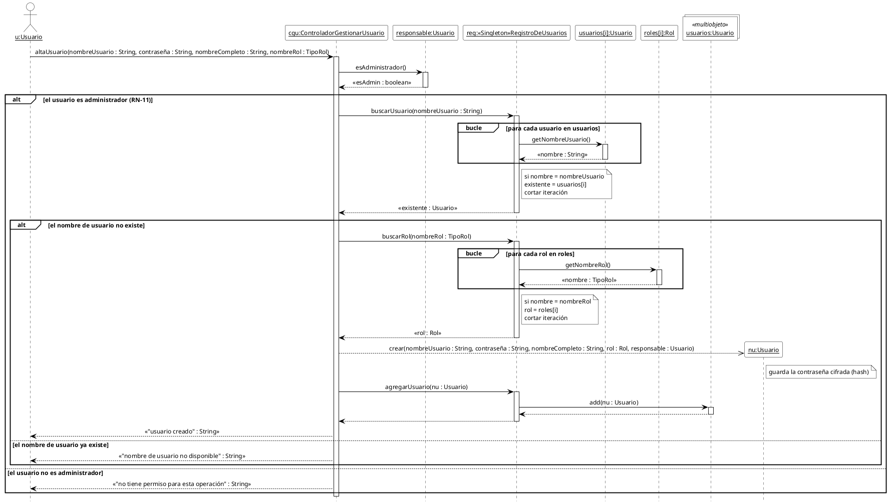
```plantuml
@startuml DSD_CU-02_altaUsuario
' Diagrama de Secuencia de Diseño (DSD) - CU-02 Gestionar usuario - altaUsuario
' Estilo de los ejemplos de la teoría (introducirArticulo / crearNuevaVenta).
hide footbox
skinparam shadowing false
skinparam defaultFontName Arial
skinparam defaultFontSize 12
skinparam sequenceMessageAlign center
skinparam ArrowColor black
skinparam ParticipantBackgroundColor white
skinparam ParticipantBorderColor black
skinparam CollectionsBackgroundColor white
skinparam CollectionsBorderColor black
skinparam ActorBackgroundColor white
skinparam ActorBorderColor black
skinparam LifeLineBorderColor black
skinparam LifeLineBackgroundColor white
skinparam SequenceGroupBackgroundColor white
skinparam SequenceGroupBorderColor black
skinparam SequenceGroupHeaderFontColor black
skinparam NoteBackgroundColor white
skinparam NoteBorderColor black

actor "<u>u:Usuario</u>" as u
participant "<u>cgu:ControladorGestionarUsuario</u>" as cgu
participant "<u>responsable:Usuario</u>" as resp
participant "<u>reg:«Singleton»RegistroDeUsuarios</u>" as reg
participant "<u>usuarios[i]:Usuario</u>" as ui
participant "<u>roles[i]:Rol</u>" as ri
collections "<u>usuarios:Usuario</u>" as mu <<multiobjeto>>

u -> cgu ++ : altaUsuario(nombreUsuario : String, contraseña : String, nombreCompleto : String, nombreRol : TipoRol)
cgu -> resp ++ : esAdministrador()
resp --> cgu -- : «esAdmin : boolean»
alt el usuario es administrador (RN-11)
  cgu -> reg ++ : buscarUsuario(nombreUsuario : String)
  group bucle [para cada usuario en usuarios]
    reg -> ui ++ : getNombreUsuario()
    ui --> reg -- : «nombre : String»
  end
  note right of reg
    si nombre = nombreUsuario
    existente = usuarios[i]
    cortar iteración
  end note
  reg --> cgu -- : «existente : Usuario»
  alt el nombre de usuario no existe
    cgu -> reg ++ : buscarRol(nombreRol : TipoRol)
    group bucle [para cada rol en roles]
      reg -> ri ++ : getNombreRol()
      ri --> reg -- : «nombre : TipoRol»
    end
    note right of reg
      si nombre = nombreRol
      rol = roles[i]
      cortar iteración
    end note
    reg --> cgu -- : «rol : Rol»
    create participant "<u>nu:Usuario</u>" as nu
    cgu -->> nu : crear(nombreUsuario : String, contraseña : String, nombreCompleto : String, rol : Rol, responsable : Usuario)
    note right of nu : guarda la contraseña cifrada (hash)
    cgu -> reg ++ : agregarUsuario(nu : Usuario)
    reg -> mu ++ : add(nu : Usuario)
    mu --> reg --
    reg --> cgu --
    cgu --> u : «"usuario creado" : String»
  else el nombre de usuario ya existe
    cgu --> u : «"nombre de usuario no disponible" : String»
  end
else el usuario no es administrador
  cgu --> u : «"no tiene permiso para esta operación" : String»
end
deactivate cgu

@enduml
```

### `modificarUsuario`

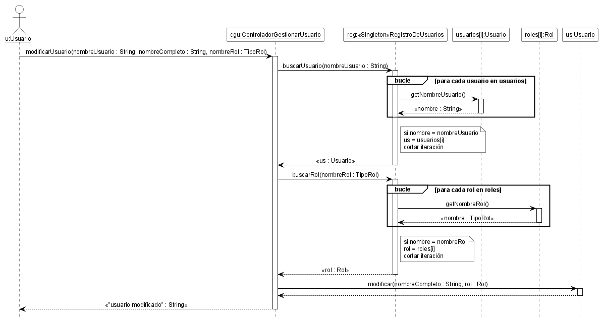

Código PlantUML

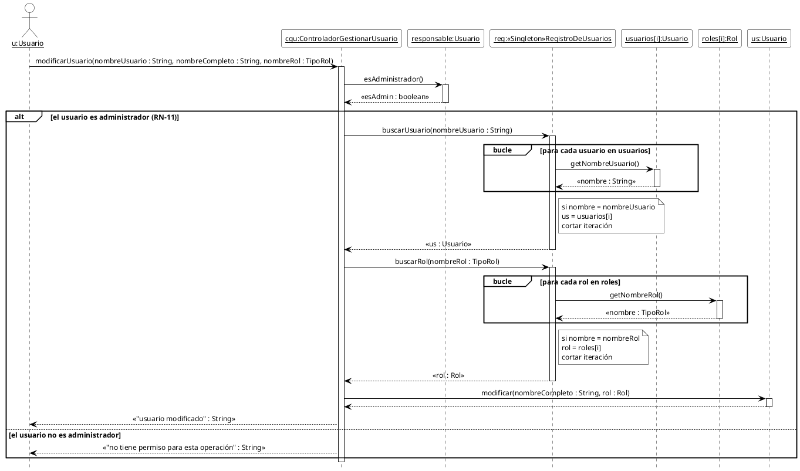
```plantuml
@startuml DSD_CU-02_modificarUsuario
' Diagrama de Secuencia de Diseño (DSD) - CU-02 Gestionar usuario - modificarUsuario
' Estilo de los ejemplos de la teoría (introducirArticulo / crearNuevaVenta).
hide footbox
skinparam shadowing false
skinparam defaultFontName Arial
skinparam defaultFontSize 12
skinparam sequenceMessageAlign center
skinparam ArrowColor black
skinparam ParticipantBackgroundColor white
skinparam ParticipantBorderColor black
skinparam CollectionsBackgroundColor white
skinparam CollectionsBorderColor black
skinparam ActorBackgroundColor white
skinparam ActorBorderColor black
skinparam LifeLineBorderColor black
skinparam LifeLineBackgroundColor white
skinparam SequenceGroupBackgroundColor white
skinparam SequenceGroupBorderColor black
skinparam SequenceGroupHeaderFontColor black
skinparam NoteBackgroundColor white
skinparam NoteBorderColor black

actor "<u>u:Usuario</u>" as u
participant "<u>cgu:ControladorGestionarUsuario</u>" as cgu
participant "<u>responsable:Usuario</u>" as resp
participant "<u>reg:«Singleton»RegistroDeUsuarios</u>" as reg
participant "<u>usuarios[i]:Usuario</u>" as ui
participant "<u>roles[i]:Rol</u>" as ri
participant "<u>us:Usuario</u>" as us

u -> cgu ++ : modificarUsuario(nombreUsuario : String, nombreCompleto : String, nombreRol : TipoRol)
cgu -> resp ++ : esAdministrador()
resp --> cgu -- : «esAdmin : boolean»
alt el usuario es administrador (RN-11)
  cgu -> reg ++ : buscarUsuario(nombreUsuario : String)
  group bucle [para cada usuario en usuarios]
    reg -> ui ++ : getNombreUsuario()
    ui --> reg -- : «nombre : String»
  end
  note right of reg
    si nombre = nombreUsuario
    us = usuarios[i]
    cortar iteración
  end note
  reg --> cgu -- : «us : Usuario»
  cgu -> reg ++ : buscarRol(nombreRol : TipoRol)
  group bucle [para cada rol en roles]
    reg -> ri ++ : getNombreRol()
    ri --> reg -- : «nombre : TipoRol»
  end
  note right of reg
    si nombre = nombreRol
    rol = roles[i]
    cortar iteración
  end note
  reg --> cgu -- : «rol : Rol»
  cgu -> us ++ : modificar(nombreCompleto : String, rol : Rol)
  us --> cgu --
  cgu --> u : «"usuario modificado" : String»
else el usuario no es administrador
  cgu --> u : «"no tiene permiso para esta operación" : String»
end
deactivate cgu

@enduml
```

### `darBajaUsuario`

Código PlantUML

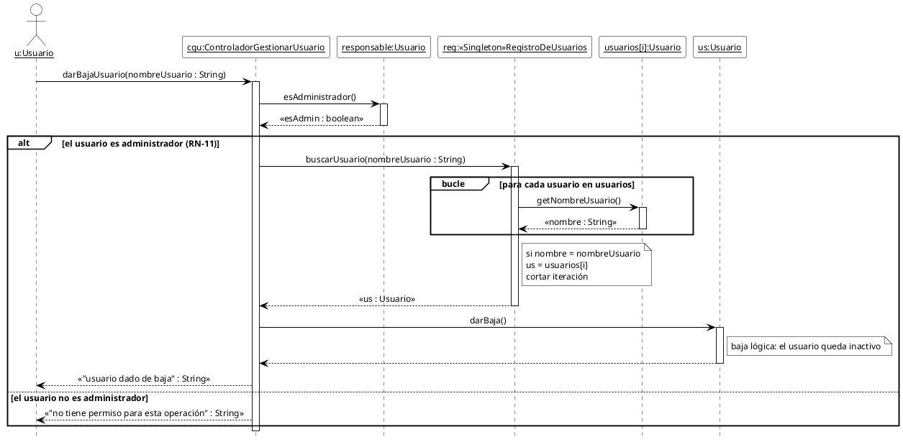
```plantuml
@startuml DSD_CU-02_darBajaUsuario
' Diagrama de Secuencia de Diseño (DSD) - CU-02 Gestionar usuario - darBajaUsuario
' Estilo de los ejemplos de la teoría (introducirArticulo / crearNuevaVenta).
hide footbox
skinparam shadowing false
skinparam defaultFontName Arial
skinparam defaultFontSize 12
skinparam sequenceMessageAlign center
skinparam ArrowColor black
skinparam ParticipantBackgroundColor white
skinparam ParticipantBorderColor black
skinparam CollectionsBackgroundColor white
skinparam CollectionsBorderColor black
skinparam ActorBackgroundColor white
skinparam ActorBorderColor black
skinparam LifeLineBorderColor black
skinparam LifeLineBackgroundColor white
skinparam SequenceGroupBackgroundColor white
skinparam SequenceGroupBorderColor black
skinparam SequenceGroupHeaderFontColor black
skinparam NoteBackgroundColor white
skinparam NoteBorderColor black

actor "<u>u:Usuario</u>" as u
participant "<u>cgu:ControladorGestionarUsuario</u>" as cgu
participant "<u>responsable:Usuario</u>" as resp
participant "<u>reg:«Singleton»RegistroDeUsuarios</u>" as reg
participant "<u>usuarios[i]:Usuario</u>" as ui
participant "<u>us:Usuario</u>" as us

u -> cgu ++ : darBajaUsuario(nombreUsuario : String)
cgu -> resp ++ : esAdministrador()
resp --> cgu -- : «esAdmin : boolean»
alt el usuario es administrador (RN-11)
  cgu -> reg ++ : buscarUsuario(nombreUsuario : String)
  group bucle [para cada usuario en usuarios]
    reg -> ui ++ : getNombreUsuario()
    ui --> reg -- : «nombre : String»
  end
  note right of reg
    si nombre = nombreUsuario
    us = usuarios[i]
    cortar iteración
  end note
  reg --> cgu -- : «us : Usuario»
  cgu -> us ++ : darBaja()
  note right of us : baja lógica: el usuario queda inactivo
  us --> cgu --
  cgu --> u : «"usuario dado de baja" : String»
else el usuario no es administrador
  cgu --> u : «"no tiene permiso para esta operación" : String»
end
deactivate cgu

@enduml
```

---

## CU-03 - Gestionar categoría

### `altaCategoria`

Código PlantUML

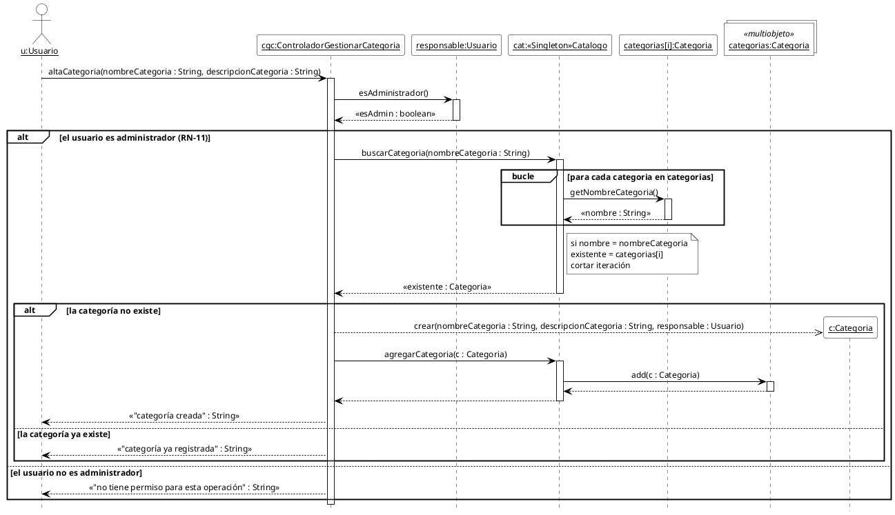
```plantuml
@startuml DSD_CU-03_altaCategoria
' Diagrama de Secuencia de Diseño (DSD) - CU-03 Gestionar categoría - altaCategoria
' Estilo de los ejemplos de la teoría (introducirArticulo / crearNuevaVenta).
hide footbox
skinparam shadowing false
skinparam defaultFontName Arial
skinparam defaultFontSize 12
skinparam sequenceMessageAlign center
skinparam ArrowColor black
skinparam ParticipantBackgroundColor white
skinparam ParticipantBorderColor black
skinparam CollectionsBackgroundColor white
skinparam CollectionsBorderColor black
skinparam ActorBackgroundColor white
skinparam ActorBorderColor black
skinparam LifeLineBorderColor black
skinparam LifeLineBackgroundColor white
skinparam SequenceGroupBackgroundColor white
skinparam SequenceGroupBorderColor black
skinparam SequenceGroupHeaderFontColor black
skinparam NoteBackgroundColor white
skinparam NoteBorderColor black

actor "<u>u:Usuario</u>" as u
participant "<u>cgc:ControladorGestionarCategoria</u>" as cgc
participant "<u>responsable:Usuario</u>" as resp
participant "<u>cat:«Singleton»Catalogo</u>" as cat
participant "<u>categorias[i]:Categoria</u>" as ki
collections "<u>categorias:Categoria</u>" as mc <<multiobjeto>>

u -> cgc ++ : altaCategoria(nombreCategoria : String, descripcionCategoria : String)
cgc -> resp ++ : esAdministrador()
resp --> cgc -- : «esAdmin : boolean»
alt el usuario es administrador (RN-11)
  cgc -> cat ++ : buscarCategoria(nombreCategoria : String)
  group bucle [para cada categoria en categorias]
    cat -> ki ++ : getNombreCategoria()
    ki --> cat -- : «nombre : String»
  end
  note right of cat
    si nombre = nombreCategoria
    existente = categorias[i]
    cortar iteración
  end note
  cat --> cgc -- : «existente : Categoria»
  alt la categoría no existe
    create participant "<u>c:Categoria</u>" as c
    cgc -->> c : crear(nombreCategoria : String, descripcionCategoria : String, responsable : Usuario)
    cgc -> cat ++ : agregarCategoria(c : Categoria)
    cat -> mc ++ : add(c : Categoria)
    mc --> cat --
    cat --> cgc --
    cgc --> u : «"categoría creada" : String»
  else la categoría ya existe
    cgc --> u : «"categoría ya registrada" : String»
  end
else el usuario no es administrador
  cgc --> u : «"no tiene permiso para esta operación" : String»
end
deactivate cgc

@enduml
```

### `modificarCategoria`

Código PlantUML

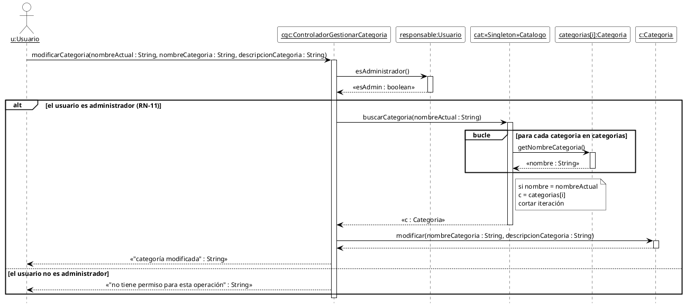
```plantuml
@startuml DSD_CU-03_modificarCategoria
' Diagrama de Secuencia de Diseño (DSD) - CU-03 Gestionar categoría - modificarCategoria
' Estilo de los ejemplos de la teoría (introducirArticulo / crearNuevaVenta).
hide footbox
skinparam shadowing false
skinparam defaultFontName Arial
skinparam defaultFontSize 12
skinparam sequenceMessageAlign center
skinparam ArrowColor black
skinparam ParticipantBackgroundColor white
skinparam ParticipantBorderColor black
skinparam CollectionsBackgroundColor white
skinparam CollectionsBorderColor black
skinparam ActorBackgroundColor white
skinparam ActorBorderColor black
skinparam LifeLineBorderColor black
skinparam LifeLineBackgroundColor white
skinparam SequenceGroupBackgroundColor white
skinparam SequenceGroupBorderColor black
skinparam SequenceGroupHeaderFontColor black
skinparam NoteBackgroundColor white
skinparam NoteBorderColor black

actor "<u>u:Usuario</u>" as u
participant "<u>cgc:ControladorGestionarCategoria</u>" as cgc
participant "<u>responsable:Usuario</u>" as resp
participant "<u>cat:«Singleton»Catalogo</u>" as cat
participant "<u>categorias[i]:Categoria</u>" as ki
participant "<u>c:Categoria</u>" as c

u -> cgc ++ : modificarCategoria(nombreActual : String, nombreCategoria : String, descripcionCategoria : String)
cgc -> resp ++ : esAdministrador()
resp --> cgc -- : «esAdmin : boolean»
alt el usuario es administrador (RN-11)
  cgc -> cat ++ : buscarCategoria(nombreActual : String)
  group bucle [para cada categoria en categorias]
    cat -> ki ++ : getNombreCategoria()
    ki --> cat -- : «nombre : String»
  end
  note right of cat
    si nombre = nombreActual
    c = categorias[i]
    cortar iteración
  end note
  cat --> cgc -- : «c : Categoria»
  cgc -> c ++ : modificar(nombreCategoria : String, descripcionCategoria : String)
  c --> cgc --
  cgc --> u : «"categoría modificada" : String»
else el usuario no es administrador
  cgc --> u : «"no tiene permiso para esta operación" : String»
end
deactivate cgc

@enduml
```

---

## CU-04 - Gestionar producto

### `altaProducto`

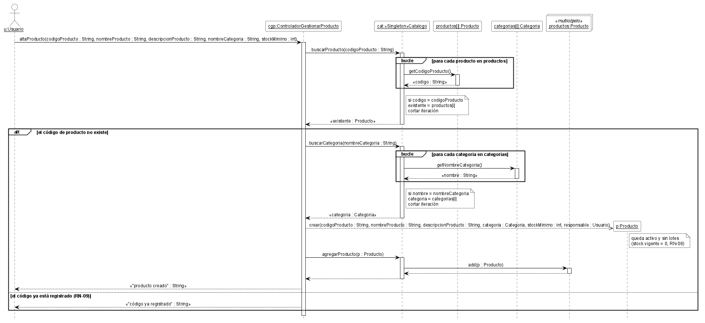

Código PlantUML

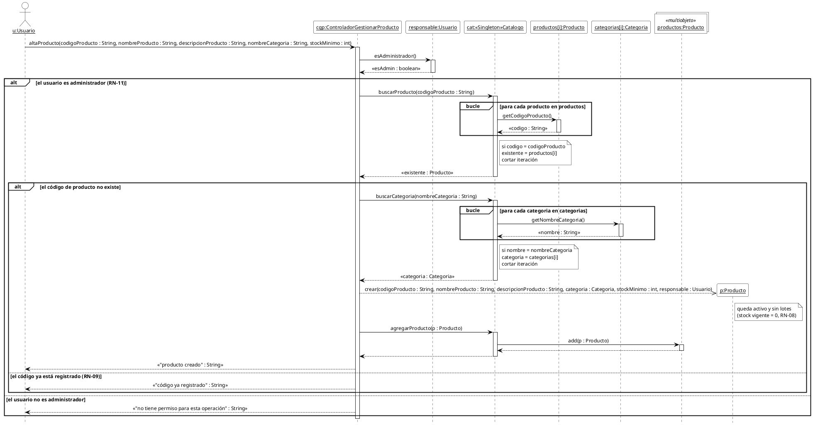
```plantuml
@startuml DSD_CU-04_altaProducto
' Diagrama de Secuencia de Diseño (DSD) - CU-04 Gestionar producto - altaProducto
' Estilo de los ejemplos de la teoría (introducirArticulo / crearNuevaVenta).
hide footbox
skinparam shadowing false
skinparam defaultFontName Arial
skinparam defaultFontSize 12
skinparam sequenceMessageAlign center
skinparam ArrowColor black
skinparam ParticipantBackgroundColor white
skinparam ParticipantBorderColor black
skinparam CollectionsBackgroundColor white
skinparam CollectionsBorderColor black
skinparam ActorBackgroundColor white
skinparam ActorBorderColor black
skinparam LifeLineBorderColor black
skinparam LifeLineBackgroundColor white
skinparam SequenceGroupBackgroundColor white
skinparam SequenceGroupBorderColor black
skinparam SequenceGroupHeaderFontColor black
skinparam NoteBackgroundColor white
skinparam NoteBorderColor black

actor "<u>u:Usuario</u>" as u
participant "<u>cgp:ControladorGestionarProducto</u>" as cgp
participant "<u>responsable:Usuario</u>" as resp
participant "<u>cat:«Singleton»Catalogo</u>" as cat
participant "<u>productos[i]:Producto</u>" as pi
participant "<u>categorias[i]:Categoria</u>" as ki
collections "<u>productos:Producto</u>" as mp <<multiobjeto>>

u -> cgp ++ : altaProducto(codigoProducto : String, nombreProducto : String, descripcionProducto : String, nombreCategoria : String, stockMinimo : int)
cgp -> resp ++ : esAdministrador()
resp --> cgp -- : «esAdmin : boolean»
alt el usuario es administrador (RN-11)
  cgp -> cat ++ : buscarProducto(codigoProducto : String)
  group bucle [para cada producto en productos]
    cat -> pi ++ : getCodigoProducto()
    pi --> cat -- : «codigo : String»
  end
  note right of cat
    si codigo = codigoProducto
    existente = productos[i]
    cortar iteración
  end note
  cat --> cgp -- : «existente : Producto»
  alt el código de producto no existe
    cgp -> cat ++ : buscarCategoria(nombreCategoria : String)
    group bucle [para cada categoria en categorias]
      cat -> ki ++ : getNombreCategoria()
      ki --> cat -- : «nombre : String»
    end
    note right of cat
      si nombre = nombreCategoria
      categoria = categorias[i]
      cortar iteración
    end note
    cat --> cgp -- : «categoria : Categoria»
    create participant "<u>p:Producto</u>" as p
    cgp -->> p : crear(codigoProducto : String, nombreProducto : String, descripcionProducto : String, categoria : Categoria, stockMinimo : int, responsable : Usuario)
    note right of p : queda activo y sin lotes\n(stock vigente = 0, RN-08)
    cgp -> cat ++ : agregarProducto(p : Producto)
    cat -> mp ++ : add(p : Producto)
    mp --> cat --
    cat --> cgp --
    cgp --> u : «"producto creado" : String»
  else el código ya está registrado (RN-09)
    cgp --> u : «"código ya registrado" : String»
  end
else el usuario no es administrador
  cgp --> u : «"no tiene permiso para esta operación" : String»
end
deactivate cgp

@enduml
```

### `modificarProducto`

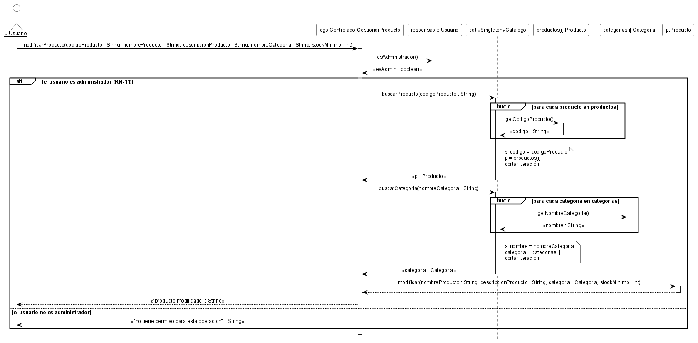

Código PlantUML

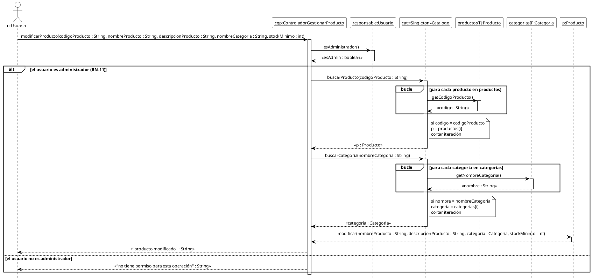
```plantuml
@startuml DSD_CU-04_modificarProducto
' Diagrama de Secuencia de Diseño (DSD) - CU-04 Gestionar producto - modificarProducto
' Estilo de los ejemplos de la teoría (introducirArticulo / crearNuevaVenta).
hide footbox
skinparam shadowing false
skinparam defaultFontName Arial
skinparam defaultFontSize 12
skinparam sequenceMessageAlign center
skinparam ArrowColor black
skinparam ParticipantBackgroundColor white
skinparam ParticipantBorderColor black
skinparam CollectionsBackgroundColor white
skinparam CollectionsBorderColor black
skinparam ActorBackgroundColor white
skinparam ActorBorderColor black
skinparam LifeLineBorderColor black
skinparam LifeLineBackgroundColor white
skinparam SequenceGroupBackgroundColor white
skinparam SequenceGroupBorderColor black
skinparam SequenceGroupHeaderFontColor black
skinparam NoteBackgroundColor white
skinparam NoteBorderColor black

actor "<u>u:Usuario</u>" as u
participant "<u>cgp:ControladorGestionarProducto</u>" as cgp
participant "<u>responsable:Usuario</u>" as resp
participant "<u>cat:«Singleton»Catalogo</u>" as cat
participant "<u>productos[i]:Producto</u>" as pi
participant "<u>categorias[i]:Categoria</u>" as ki
participant "<u>p:Producto</u>" as p

u -> cgp ++ : modificarProducto(codigoProducto : String, nombreProducto : String, descripcionProducto : String, nombreCategoria : String, stockMinimo : int)
cgp -> resp ++ : esAdministrador()
resp --> cgp -- : «esAdmin : boolean»
alt el usuario es administrador (RN-11)
  cgp -> cat ++ : buscarProducto(codigoProducto : String)
  group bucle [para cada producto en productos]
    cat -> pi ++ : getCodigoProducto()
    pi --> cat -- : «codigo : String»
  end
  note right of cat
    si codigo = codigoProducto
    p = productos[i]
    cortar iteración
  end note
  cat --> cgp -- : «p : Producto»
  cgp -> cat ++ : buscarCategoria(nombreCategoria : String)
  group bucle [para cada categoria en categorias]
    cat -> ki ++ : getNombreCategoria()
    ki --> cat -- : «nombre : String»
  end
  note right of cat
    si nombre = nombreCategoria
    categoria = categorias[i]
    cortar iteración
  end note
  cat --> cgp -- : «categoria : Categoria»
  cgp -> p ++ : modificar(nombreProducto : String, descripcionProducto : String, categoria : Categoria, stockMinimo : int)
  p --> cgp --
  cgp --> u : «"producto modificado" : String»
else el usuario no es administrador
  cgp --> u : «"no tiene permiso para esta operación" : String»
end
deactivate cgp

@enduml
```

### `darBajaProducto`

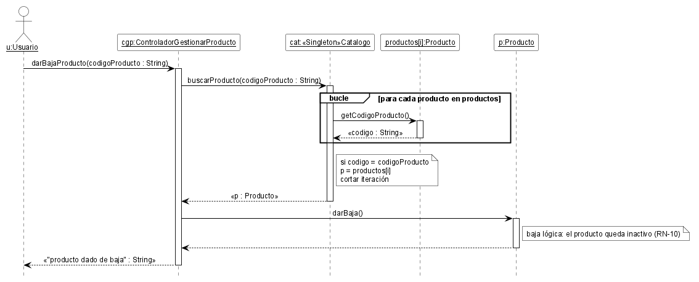

Código PlantUML

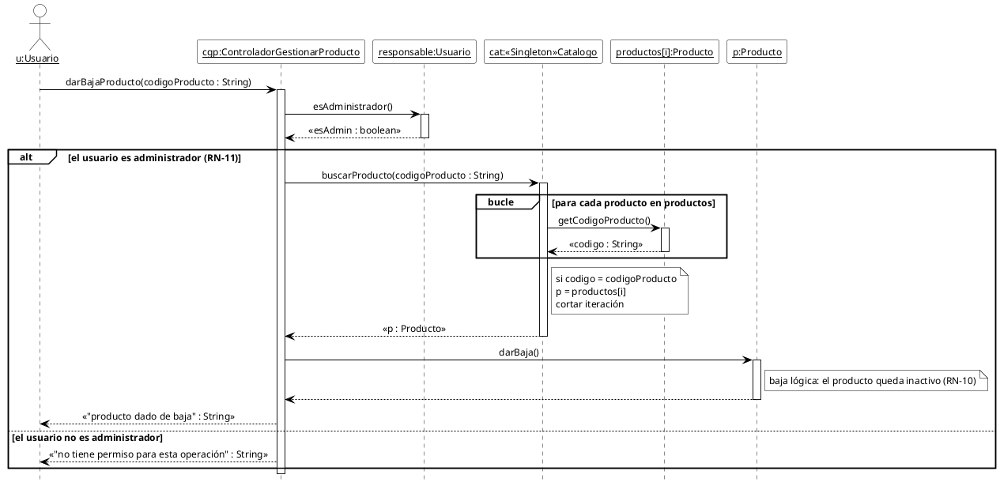
```plantuml
@startuml DSD_CU-04_darBajaProducto
' Diagrama de Secuencia de Diseño (DSD) - CU-04 Gestionar producto - darBajaProducto
' Estilo de los ejemplos de la teoría (introducirArticulo / crearNuevaVenta).
hide footbox
skinparam shadowing false
skinparam defaultFontName Arial
skinparam defaultFontSize 12
skinparam sequenceMessageAlign center
skinparam ArrowColor black
skinparam ParticipantBackgroundColor white
skinparam ParticipantBorderColor black
skinparam CollectionsBackgroundColor white
skinparam CollectionsBorderColor black
skinparam ActorBackgroundColor white
skinparam ActorBorderColor black
skinparam LifeLineBorderColor black
skinparam LifeLineBackgroundColor white
skinparam SequenceGroupBackgroundColor white
skinparam SequenceGroupBorderColor black
skinparam SequenceGroupHeaderFontColor black
skinparam NoteBackgroundColor white
skinparam NoteBorderColor black

actor "<u>u:Usuario</u>" as u
participant "<u>cgp:ControladorGestionarProducto</u>" as cgp
participant "<u>responsable:Usuario</u>" as resp
participant "<u>cat:«Singleton»Catalogo</u>" as cat
participant "<u>productos[i]:Producto</u>" as pi
participant "<u>p:Producto</u>" as p

u -> cgp ++ : darBajaProducto(codigoProducto : String)
cgp -> resp ++ : esAdministrador()
resp --> cgp -- : «esAdmin : boolean»
alt el usuario es administrador (RN-11)
  cgp -> cat ++ : buscarProducto(codigoProducto : String)
  group bucle [para cada producto en productos]
    cat -> pi ++ : getCodigoProducto()
    pi --> cat -- : «codigo : String»
  end
  note right of cat
    si codigo = codigoProducto
    p = productos[i]
    cortar iteración
  end note
  cat --> cgp -- : «p : Producto»
  cgp -> p ++ : darBaja()
  note right of p : baja lógica: el producto queda inactivo (RN-10)
  p --> cgp --
  cgp --> u : «"producto dado de baja" : String»
else el usuario no es administrador
  cgp --> u : «"no tiene permiso para esta operación" : String»
end
deactivate cgp

@enduml
```

---

## CU-05 - Registrar ingreso de mercadería

### `registrarIngreso`

El usuario hace dos operaciones: primero carga los datos y el sistema le responde con un texto que dice si es un lote nuevo o existente y si la mercadería ya está vencida; después confirma con `confirmarIngreso`, indicando el depósito donde la guarda (si está vencida puede ir al de vencidos, RN-25). No se puede sumar a un lote vencido (RN-26). Si quiere corregir el número de lote (3.b del CU), vuelve a enviar `registrarIngreso`.

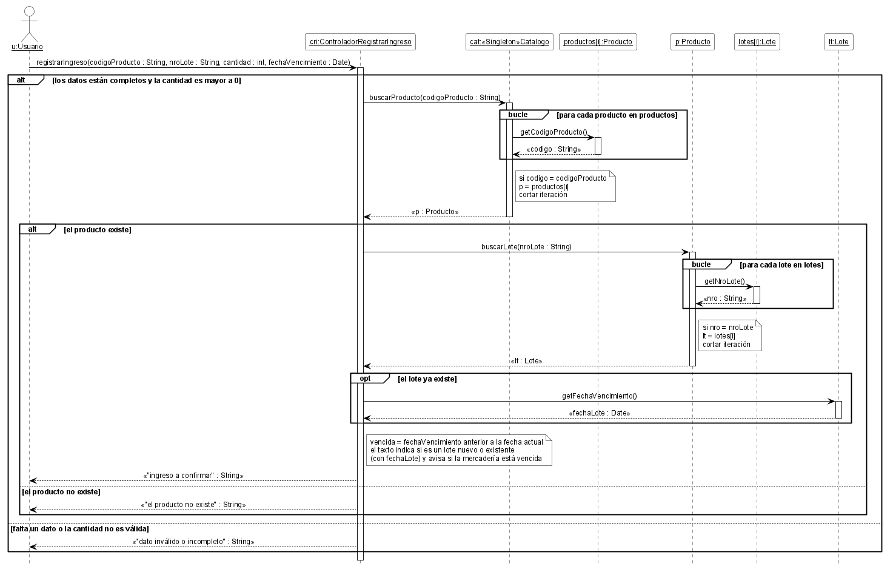

Código PlantUML

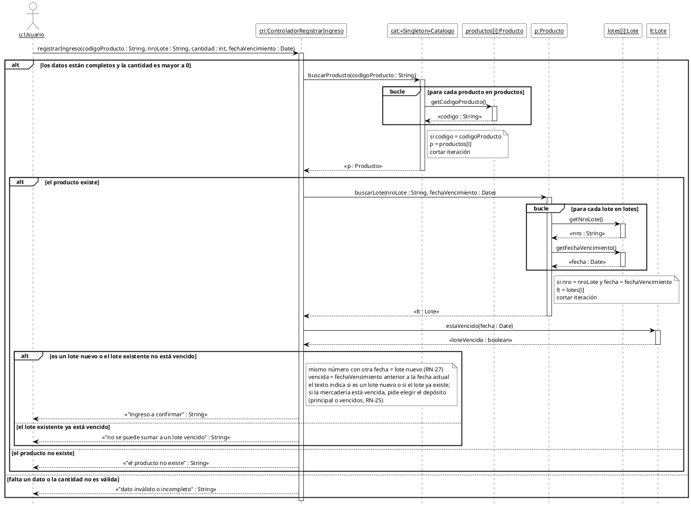
```plantuml
@startuml DSD_CU-05_registrarIngreso
' Diagrama de Secuencia de Diseño (DSD) - CU-05 Registrar ingreso de mercadería - registrarIngreso
' Estilo de los ejemplos de la teoría (introducirArticulo / crearNuevaVenta).
hide footbox
skinparam shadowing false
skinparam defaultFontName Arial
skinparam defaultFontSize 12
skinparam sequenceMessageAlign center
skinparam ArrowColor black
skinparam ParticipantBackgroundColor white
skinparam ParticipantBorderColor black
skinparam CollectionsBackgroundColor white
skinparam CollectionsBorderColor black
skinparam ActorBackgroundColor white
skinparam ActorBorderColor black
skinparam LifeLineBorderColor black
skinparam LifeLineBackgroundColor white
skinparam SequenceGroupBackgroundColor white
skinparam SequenceGroupBorderColor black
skinparam SequenceGroupHeaderFontColor black
skinparam NoteBackgroundColor white
skinparam NoteBorderColor black

actor "<u>u:Usuario</u>" as u
participant "<u>cri:ControladorRegistrarIngreso</u>" as cri
participant "<u>cat:«Singleton»Catalogo</u>" as cat
participant "<u>productos[i]:Producto</u>" as pi
participant "<u>p:Producto</u>" as p
participant "<u>lotes[i]:Lote</u>" as li
participant "<u>lt:Lote</u>" as lt

u -> cri ++ : registrarIngreso(codigoProducto : String, nroLote : String, cantidad : int, fechaVencimiento : Date)
alt los datos están completos y la cantidad es mayor a 0
  cri -> cat ++ : buscarProducto(codigoProducto : String)
  group bucle [para cada producto en productos]
    cat -> pi ++ : getCodigoProducto()
    pi --> cat -- : «codigo : String»
  end
  note right of cat
    si codigo = codigoProducto
    p = productos[i]
    cortar iteración
  end note
  cat --> cri -- : «p : Producto»
  alt el producto existe
    cri -> p ++ : buscarLote(nroLote : String, fechaVencimiento : Date)
    group bucle [para cada lote en lotes]
      p -> li ++ : getNroLote()
      li --> p -- : «nro : String»
      p -> li ++ : getFechaVencimiento()
      li --> p -- : «fecha : Date»
    end
    note right of p
      si nro = nroLote y fecha = fechaVencimiento
      lt = lotes[i]
      cortar iteración
    end note
    p --> cri -- : «lt : Lote»
    cri -> lt ++ : estaVencido(fecha : Date)
    lt --> cri -- : «loteVencido : boolean»
    alt es un lote nuevo o el lote existente no está vencido
      note right of cri
        mismo número con otra fecha = lote nuevo (RN-27)
        vencida = fechaVencimiento anterior a la fecha actual
        el texto indica si es un lote nuevo o si el lote ya existe;
        si la mercadería está vencida, pide elegir el depósito
        (principal o vencidos, RN-25)
      end note
      cri --> u : «"ingreso a confirmar" : String»
    else el lote existente ya está vencido
      cri --> u : «"no se puede sumar a un lote vencido" : String»
    end
  else el producto no existe
    cri --> u : «"el producto no existe" : String»
  end
else falta un dato o la cantidad no es válida
  cri --> u : «"dato inválido o incompleto" : String»
end
deactivate cri

@enduml
```

### `confirmarIngreso`

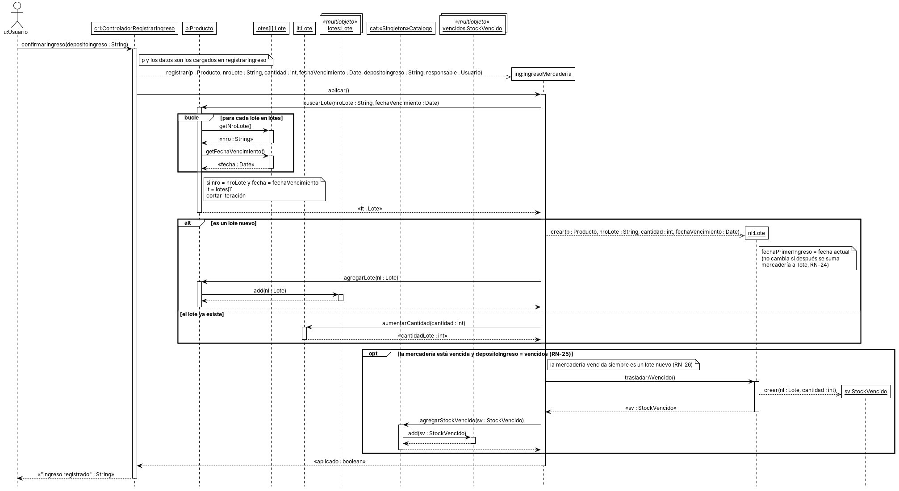

Código PlantUML

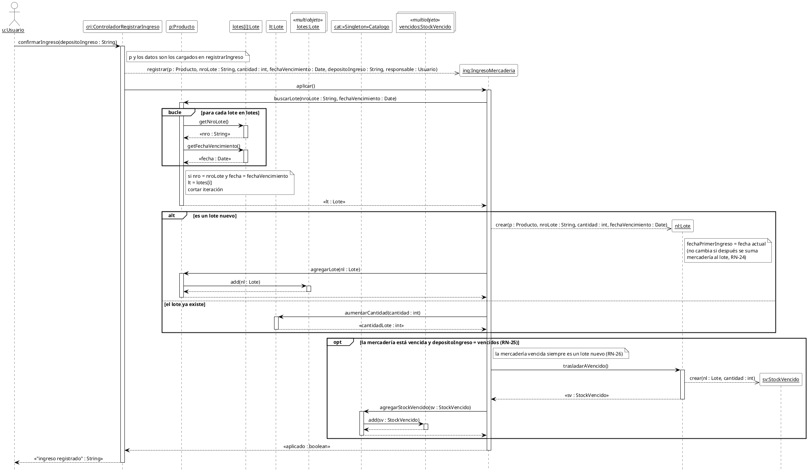
```plantuml
@startuml DSD_CU-05_confirmarIngreso
' Diagrama de Secuencia de Diseño (DSD) - CU-05 Registrar ingreso de mercadería - confirmarIngreso
' Estilo de los ejemplos de la teoría (introducirArticulo / crearNuevaVenta).
hide footbox
skinparam shadowing false
skinparam defaultFontName Arial
skinparam defaultFontSize 12
skinparam sequenceMessageAlign center
skinparam ArrowColor black
skinparam ParticipantBackgroundColor white
skinparam ParticipantBorderColor black
skinparam CollectionsBackgroundColor white
skinparam CollectionsBorderColor black
skinparam ActorBackgroundColor white
skinparam ActorBorderColor black
skinparam LifeLineBorderColor black
skinparam LifeLineBackgroundColor white
skinparam SequenceGroupBackgroundColor white
skinparam SequenceGroupBorderColor black
skinparam SequenceGroupHeaderFontColor black
skinparam NoteBackgroundColor white
skinparam NoteBorderColor black

actor "<u>u:Usuario</u>" as u
participant "<u>cri:ControladorRegistrarIngreso</u>" as cri
participant "<u>p:Producto</u>" as p
participant "<u>lotes[i]:Lote</u>" as li
participant "<u>lt:Lote</u>" as lt
collections "<u>lotes:Lote</u>" as ml <<multiobjeto>>
participant "<u>cat:«Singleton»Catalogo</u>" as cat
collections "<u>vencidos:StockVencido</u>" as mv <<multiobjeto>>

u -> cri ++ : confirmarIngreso(depositoIngreso : String)
note right of cri : p y los datos son los cargados en registrarIngreso
create participant "<u>ing:IngresoMercaderia</u>" as ing
cri -->> ing : registrar(p : Producto, nroLote : String, cantidad : int, fechaVencimiento : Date, depositoIngreso : String, responsable : Usuario)
cri -> ing ++ : aplicar()
ing -> p ++ : buscarLote(nroLote : String, fechaVencimiento : Date)
group bucle [para cada lote en lotes]
  p -> li ++ : getNroLote()
  li --> p -- : «nro : String»
  p -> li ++ : getFechaVencimiento()
  li --> p -- : «fecha : Date»
end
note right of p
  si nro = nroLote y fecha = fechaVencimiento
  lt = lotes[i]
  cortar iteración
end note
p --> ing -- : «lt : Lote»
alt es un lote nuevo
  create participant "<u>nl:Lote</u>" as nl
  ing -->> nl : crear(p : Producto, nroLote : String, cantidad : int, fechaVencimiento : Date)
  note right of nl : fechaPrimerIngreso = fecha actual\n(no cambia si después se suma\nmercadería al lote, RN-24)
  ing -> p ++ : agregarLote(nl : Lote)
  p -> ml ++ : add(nl : Lote)
  ml --> p --
  p --> ing --
else el lote ya existe
  ing -> lt ++ : aumentarCantidad(cantidad : int)
  lt --> ing -- : «cantidadLote : int»
end
opt la mercadería está vencida y depositoIngreso = vencidos (RN-25)
  note right of ing : la mercadería vencida siempre es un lote nuevo (RN-26)
  ing -> nl ++ : trasladarAVencido()
  create participant "<u>sv:StockVencido</u>" as sv
  nl -->> sv : crear(nl : Lote, cantidad : int)
  nl --> ing -- : «sv : StockVencido»
  ing -> cat ++ : agregarStockVencido(sv : StockVencido)
  cat -> mv ++ : add(sv : StockVencido)
  mv --> cat --
  cat --> ing --
end
ing --> cri -- : «aplicado : boolean»
cri --> u -- : «"ingreso registrado" : String»

@enduml
```

> El movimiento queda asentado con el usuario y la fecha (RN-07): `registrar(...)` recibe al `responsable`.

---

## CU-06 - Ajustar stock

### `seleccionarProducto`

Código PlantUML

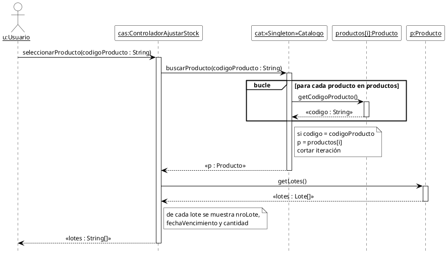
```plantuml
@startuml DSD_CU-06_seleccionarProducto
' Diagrama de Secuencia de Diseño (DSD) - CU-06 Ajustar stock - seleccionarProducto
' Estilo de los ejemplos de la teoría (introducirArticulo / crearNuevaVenta).
hide footbox
skinparam shadowing false
skinparam defaultFontName Arial
skinparam defaultFontSize 12
skinparam sequenceMessageAlign center
skinparam ArrowColor black
skinparam ParticipantBackgroundColor white
skinparam ParticipantBorderColor black
skinparam CollectionsBackgroundColor white
skinparam CollectionsBorderColor black
skinparam ActorBackgroundColor white
skinparam ActorBorderColor black
skinparam LifeLineBorderColor black
skinparam LifeLineBackgroundColor white
skinparam SequenceGroupBackgroundColor white
skinparam SequenceGroupBorderColor black
skinparam SequenceGroupHeaderFontColor black
skinparam NoteBackgroundColor white
skinparam NoteBorderColor black

actor "<u>u:Usuario</u>" as u
participant "<u>cas:ControladorAjustarStock</u>" as cas
participant "<u>cat:«Singleton»Catalogo</u>" as cat
participant "<u>productos[i]:Producto</u>" as pi
participant "<u>p:Producto</u>" as p

u -> cas ++ : seleccionarProducto(codigoProducto : String)
cas -> cat ++ : buscarProducto(codigoProducto : String)
group bucle [para cada producto en productos]
  cat -> pi ++ : getCodigoProducto()
  pi --> cat -- : «codigo : String»
end
note right of cat
  si codigo = codigoProducto
  p = productos[i]
  cortar iteración
end note
cat --> cas -- : «p : Producto»
cas -> p ++ : getLotes()
p --> cas -- : «lotes : Lote[]»
note right of cas : de cada lote se muestra nroLote,\nfechaVencimiento y cantidad
cas --> u -- : «lotes : String[]»

@enduml
```

### `ajustarStock`

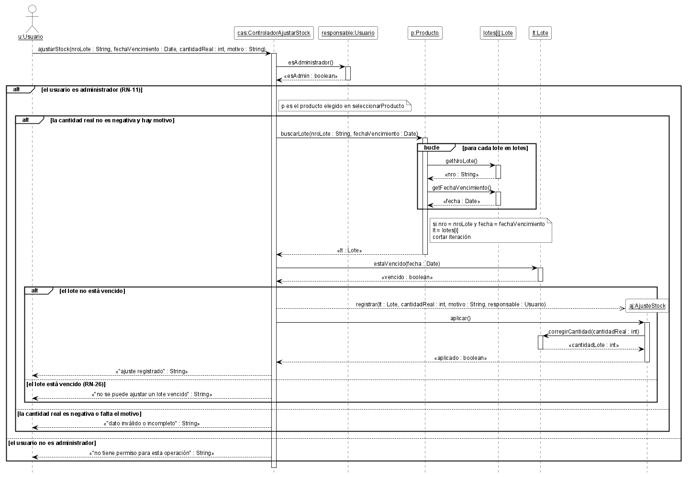

Código PlantUML

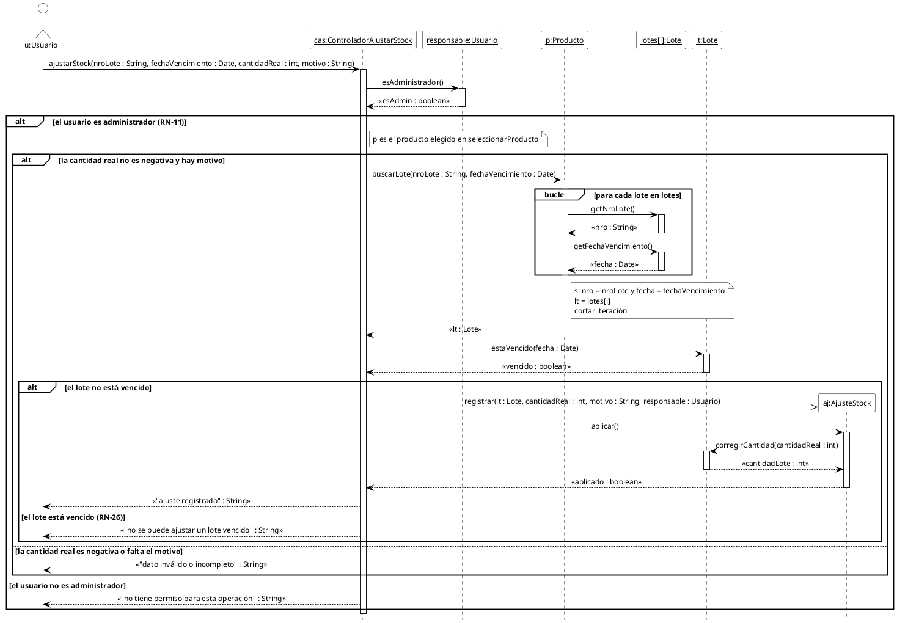
```plantuml
@startuml DSD_CU-06_ajustarStock
' Diagrama de Secuencia de Diseño (DSD) - CU-06 Ajustar stock - ajustarStock
' Estilo de los ejemplos de la teoría (introducirArticulo / crearNuevaVenta).
hide footbox
skinparam shadowing false
skinparam defaultFontName Arial
skinparam defaultFontSize 12
skinparam sequenceMessageAlign center
skinparam ArrowColor black
skinparam ParticipantBackgroundColor white
skinparam ParticipantBorderColor black
skinparam CollectionsBackgroundColor white
skinparam CollectionsBorderColor black
skinparam ActorBackgroundColor white
skinparam ActorBorderColor black
skinparam LifeLineBorderColor black
skinparam LifeLineBackgroundColor white
skinparam SequenceGroupBackgroundColor white
skinparam SequenceGroupBorderColor black
skinparam SequenceGroupHeaderFontColor black
skinparam NoteBackgroundColor white
skinparam NoteBorderColor black

actor "<u>u:Usuario</u>" as u
participant "<u>cas:ControladorAjustarStock</u>" as cas
participant "<u>responsable:Usuario</u>" as resp
participant "<u>p:Producto</u>" as p
participant "<u>lotes[i]:Lote</u>" as li
participant "<u>lt:Lote</u>" as lt

u -> cas ++ : ajustarStock(nroLote : String, fechaVencimiento : Date, cantidadReal : int, motivo : String)
cas -> resp ++ : esAdministrador()
resp --> cas -- : «esAdmin : boolean»
alt el usuario es administrador (RN-11)
  note right of cas : p es el producto elegido en seleccionarProducto
  alt la cantidad real no es negativa y hay motivo
    cas -> p ++ : buscarLote(nroLote : String, fechaVencimiento : Date)
    group bucle [para cada lote en lotes]
      p -> li ++ : getNroLote()
      li --> p -- : «nro : String»
      p -> li ++ : getFechaVencimiento()
      li --> p -- : «fecha : Date»
    end
    note right of p
      si nro = nroLote y fecha = fechaVencimiento
      lt = lotes[i]
      cortar iteración
    end note
    p --> cas -- : «lt : Lote»
    cas -> lt ++ : estaVencido(fecha : Date)
    lt --> cas -- : «vencido : boolean»
    alt el lote no está vencido
      create participant "<u>aj:AjusteStock</u>" as aj
      cas -->> aj : registrar(lt : Lote, cantidadReal : int, motivo : String, responsable : Usuario)
      cas -> aj ++ : aplicar()
      aj -> lt ++ : corregirCantidad(cantidadReal : int)
      lt --> aj -- : «cantidadLote : int»
      aj --> cas -- : «aplicado : boolean»
      cas --> u : «"ajuste registrado" : String»
    else el lote está vencido (RN-26)
      cas --> u : «"no se puede ajustar un lote vencido" : String»
    end
  else la cantidad real es negativa o falta el motivo
    cas --> u : «"dato inválido o incompleto" : String»
  end
else el usuario no es administrador
  cas --> u : «"no tiene permiso para esta operación" : String»
end
deactivate cas

@enduml
```

---

## CU-07 - Registrar retiro de mercadería vencida

### `consultarProducto`

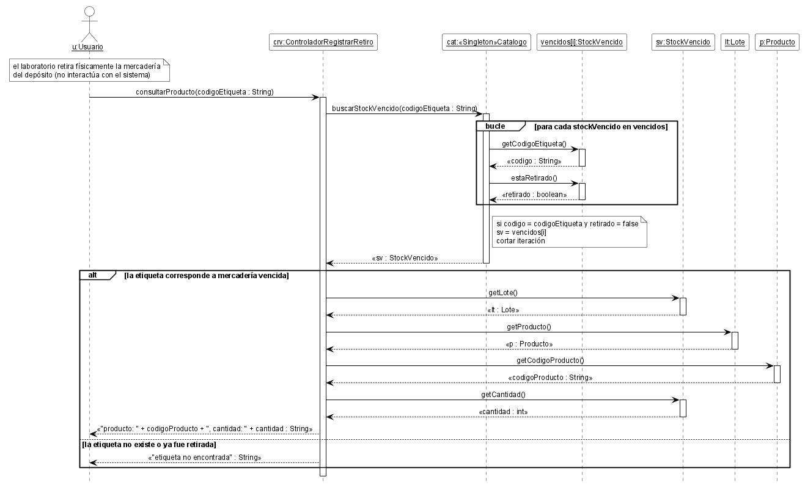

Código PlantUML

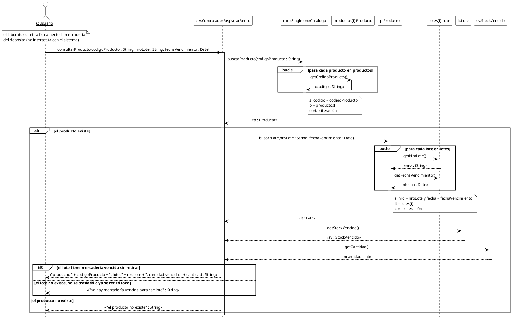
```plantuml
@startuml DSD_CU-07_consultarProducto
' Diagrama de Secuencia de Diseño (DSD) - CU-07 Registrar retiro de mercadería vencida - consultarProducto
' Estilo de los ejemplos de la teoría (introducirArticulo / crearNuevaVenta).
hide footbox
skinparam shadowing false
skinparam defaultFontName Arial
skinparam defaultFontSize 12
skinparam sequenceMessageAlign center
skinparam ArrowColor black
skinparam ParticipantBackgroundColor white
skinparam ParticipantBorderColor black
skinparam CollectionsBackgroundColor white
skinparam CollectionsBorderColor black
skinparam ActorBackgroundColor white
skinparam ActorBorderColor black
skinparam LifeLineBorderColor black
skinparam LifeLineBackgroundColor white
skinparam SequenceGroupBackgroundColor white
skinparam SequenceGroupBorderColor black
skinparam SequenceGroupHeaderFontColor black
skinparam NoteBackgroundColor white
skinparam NoteBorderColor black

actor "<u>u:Usuario</u>" as u
participant "<u>crv:ControladorRegistrarRetiro</u>" as crv
participant "<u>cat:«Singleton»Catalogo</u>" as cat
participant "<u>productos[i]:Producto</u>" as pi
participant "<u>p:Producto</u>" as p
participant "<u>lotes[i]:Lote</u>" as li
participant "<u>lt:Lote</u>" as lt
participant "<u>sv:StockVencido</u>" as sv

note over u : el laboratorio retira físicamente la mercadería\ndel depósito (no interactúa con el sistema)
u -> crv ++ : consultarProducto(codigoProducto : String, nroLote : String, fechaVencimiento : Date)
crv -> cat ++ : buscarProducto(codigoProducto : String)
group bucle [para cada producto en productos]
  cat -> pi ++ : getCodigoProducto()
  pi --> cat -- : «codigo : String»
end
note right of cat
  si codigo = codigoProducto
  p = productos[i]
  cortar iteración
end note
cat --> crv -- : «p : Producto»
alt el producto existe
  crv -> p ++ : buscarLote(nroLote : String, fechaVencimiento : Date)
  group bucle [para cada lote en lotes]
    p -> li ++ : getNroLote()
    li --> p -- : «nro : String»
    p -> li ++ : getFechaVencimiento()
    li --> p -- : «fecha : Date»
  end
  note right of p
    si nro = nroLote y fecha = fechaVencimiento
    lt = lotes[i]
    cortar iteración
  end note
  p --> crv -- : «lt : Lote»
  crv -> lt ++ : getStockVencido()
  lt --> crv -- : «sv : StockVencido»
  crv -> sv ++ : getCantidad()
  sv --> crv -- : «cantidad : int»
  alt el lote tiene mercadería vencida sin retirar
    crv --> u : «"producto: " + codigoProducto + ", lote: " + nroLote + ", cantidad vencida: " + cantidad : String»
  else el lote no existe, no se trasladó o ya se retiró todo
    crv --> u : «"no hay mercadería vencida para ese lote" : String»
  end
else el producto no existe
  crv --> u : «"el producto no existe" : String»
end
deactivate crv

@enduml
```

### `registrarRetiro`

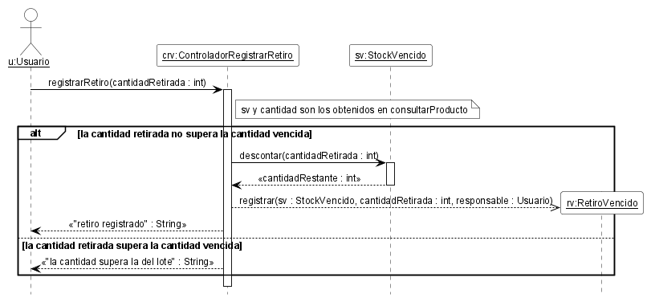

Código PlantUML

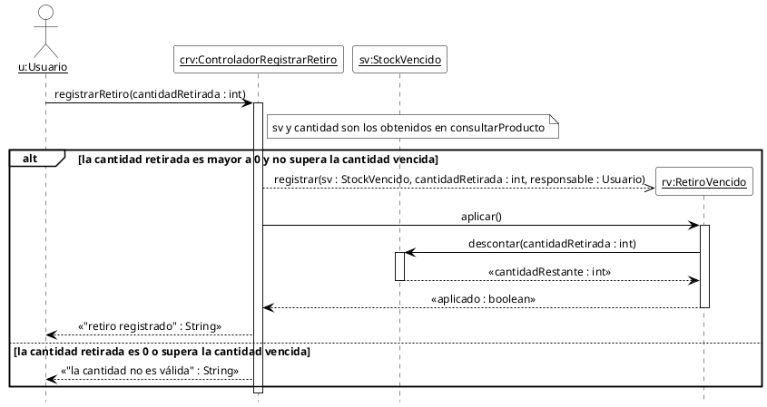
```plantuml
@startuml DSD_CU-07_registrarRetiro
' Diagrama de Secuencia de Diseño (DSD) - CU-07 Registrar retiro de mercadería vencida - registrarRetiro
' Estilo de los ejemplos de la teoría (introducirArticulo / crearNuevaVenta).
hide footbox
skinparam shadowing false
skinparam defaultFontName Arial
skinparam defaultFontSize 12
skinparam sequenceMessageAlign center
skinparam ArrowColor black
skinparam ParticipantBackgroundColor white
skinparam ParticipantBorderColor black
skinparam CollectionsBackgroundColor white
skinparam CollectionsBorderColor black
skinparam ActorBackgroundColor white
skinparam ActorBorderColor black
skinparam LifeLineBorderColor black
skinparam LifeLineBackgroundColor white
skinparam SequenceGroupBackgroundColor white
skinparam SequenceGroupBorderColor black
skinparam SequenceGroupHeaderFontColor black
skinparam NoteBackgroundColor white
skinparam NoteBorderColor black

actor "<u>u:Usuario</u>" as u
participant "<u>crv:ControladorRegistrarRetiro</u>" as crv
participant "<u>sv:StockVencido</u>" as sv

u -> crv ++ : registrarRetiro(cantidadRetirada : int)
note right of crv : sv y cantidad son los obtenidos en consultarProducto
alt la cantidad retirada es mayor a 0 y no supera la cantidad vencida
  create participant "<u>rv:RetiroVencido</u>" as rv
  crv -->> rv : registrar(sv : StockVencido, cantidadRetirada : int, responsable : Usuario)
  crv -> rv ++ : aplicar()
  rv -> sv ++ : descontar(cantidadRetirada : int)
  sv --> rv -- : «cantidadRestante : int»
  rv --> crv -- : «aplicado : boolean»
  crv --> u : «"retiro registrado" : String»
else la cantidad retirada es 0 o supera la cantidad vencida
  crv --> u : «"la cantidad no es válida" : String»
end
deactivate crv

@enduml
```

> Si el usuario cancela antes de confirmar (5.b del CU), no se envía `registrarRetiro` y no hay cambios.

---

## CU-08 - Consultar productos con stock bajo

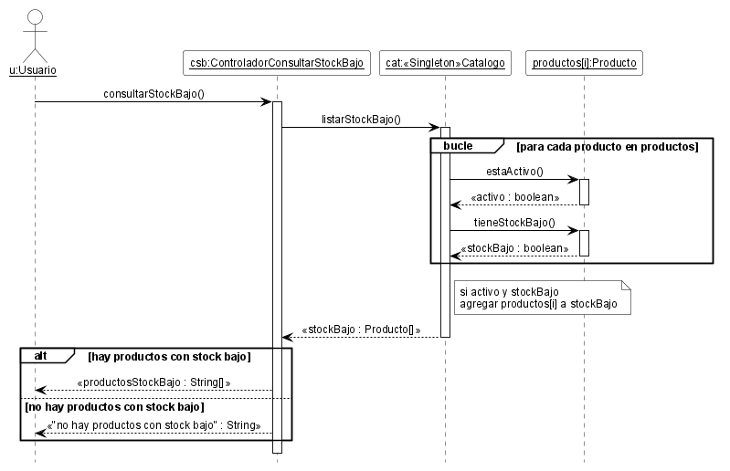

Código PlantUML

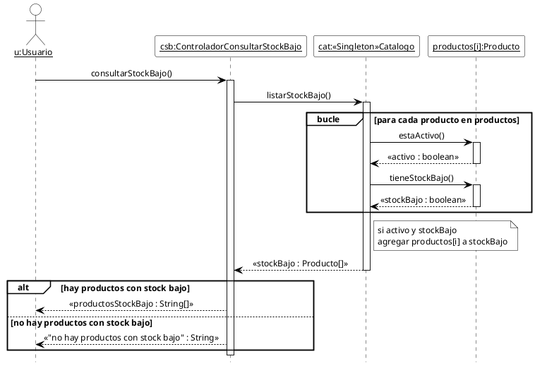
```plantuml
@startuml DSD_CU-08_consultarStockBajo
' Diagrama de Secuencia de Diseño (DSD) - CU-08 Consultar productos con stock bajo - consultarStockBajo
' Estilo de los ejemplos de la teoría (introducirArticulo / crearNuevaVenta).
hide footbox
skinparam shadowing false
skinparam defaultFontName Arial
skinparam defaultFontSize 12
skinparam sequenceMessageAlign center
skinparam ArrowColor black
skinparam ParticipantBackgroundColor white
skinparam ParticipantBorderColor black
skinparam CollectionsBackgroundColor white
skinparam CollectionsBorderColor black
skinparam ActorBackgroundColor white
skinparam ActorBorderColor black
skinparam LifeLineBorderColor black
skinparam LifeLineBackgroundColor white
skinparam SequenceGroupBackgroundColor white
skinparam SequenceGroupBorderColor black
skinparam SequenceGroupHeaderFontColor black
skinparam NoteBackgroundColor white
skinparam NoteBorderColor black

actor "<u>u:Usuario</u>" as u
participant "<u>csb:ControladorConsultarStockBajo</u>" as csb
participant "<u>cat:«Singleton»Catalogo</u>" as cat
participant "<u>productos[i]:Producto</u>" as pi

u -> csb ++ : consultarStockBajo()
csb -> cat ++ : listarStockBajo()
group bucle [para cada producto en productos]
  cat -> pi ++ : estaActivo()
  pi --> cat -- : «activo : boolean»
  cat -> pi ++ : tieneStockBajo()
  pi --> cat -- : «stockBajo : boolean»
end
note right of cat
  si activo y stockBajo
  agregar productos[i] a stockBajo
end note
cat --> csb -- : «stockBajo : Producto[]»
alt hay productos con stock bajo
  csb --> u : «productosStockBajo : String[]»
else no hay productos con stock bajo
  csb --> u : «"no hay productos con stock bajo" : String»
end
deactivate csb

@enduml
```

---

## CU-09 - Consultar próximos a vencer y stock

### `consultarProximosAVencer`

Código PlantUML

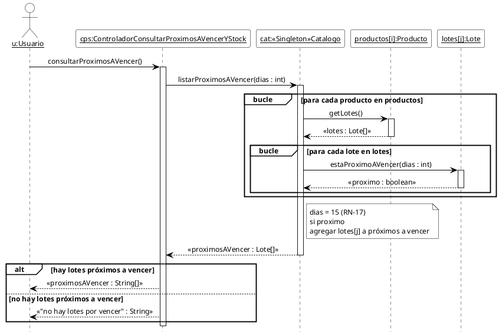
```plantuml
@startuml DSD_CU-09_consultarProximosAVencer
' Diagrama de Secuencia de Diseño (DSD) - CU-09 Consultar próximos a vencer y stock - consultarProximosAVencer
' Estilo de los ejemplos de la teoría (introducirArticulo / crearNuevaVenta).
hide footbox
skinparam shadowing false
skinparam defaultFontName Arial
skinparam defaultFontSize 12
skinparam sequenceMessageAlign center
skinparam ArrowColor black
skinparam ParticipantBackgroundColor white
skinparam ParticipantBorderColor black
skinparam CollectionsBackgroundColor white
skinparam CollectionsBorderColor black
skinparam ActorBackgroundColor white
skinparam ActorBorderColor black
skinparam LifeLineBorderColor black
skinparam LifeLineBackgroundColor white
skinparam SequenceGroupBackgroundColor white
skinparam SequenceGroupBorderColor black
skinparam SequenceGroupHeaderFontColor black
skinparam NoteBackgroundColor white
skinparam NoteBorderColor black

actor "<u>u:Usuario</u>" as u
participant "<u>cps:ControladorConsultarProximosAVencerYStock</u>" as cpv
participant "<u>cat:«Singleton»Catalogo</u>" as cat
participant "<u>productos[i]:Producto</u>" as pi
participant "<u>lotes[j]:Lote</u>" as li

u -> cpv ++ : consultarProximosAVencer()
cpv -> cat ++ : listarProximosAVencer(dias : int)
group bucle [para cada producto en productos]
  cat -> pi ++ : getLotes()
  pi --> cat -- : «lotes : Lote[]»
  group bucle [para cada lote en lotes]
    cat -> li ++ : estaProximoAVencer(dias : int)
    li --> cat -- : «proximo : boolean»
  end
end
note right of cat
  dias = 15 (RN-17)
  si proximo
  agregar lotes[j] a próximos a vencer
end note
cat --> cpv -- : «proximosAVencer : Lote[]»
alt hay lotes próximos a vencer
  cpv --> u : «proximosAVencer : String[]»
else no hay lotes próximos a vencer
  cpv --> u : «"no hay lotes por vencer" : String»
end
deactivate cpv

@enduml
```

### `consultarStock`

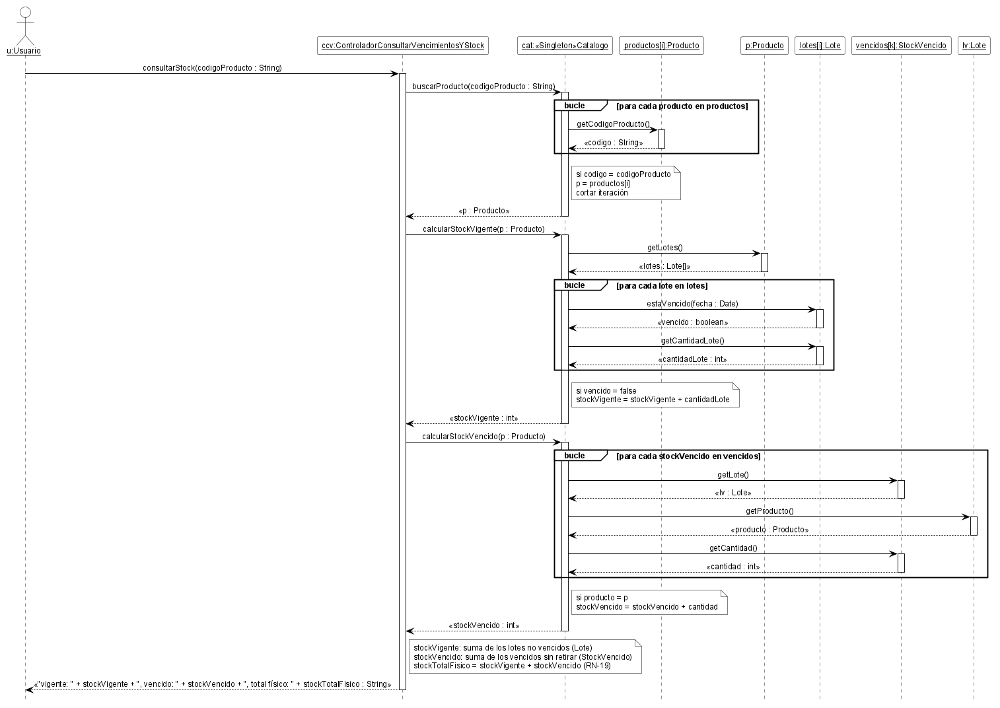

Código PlantUML

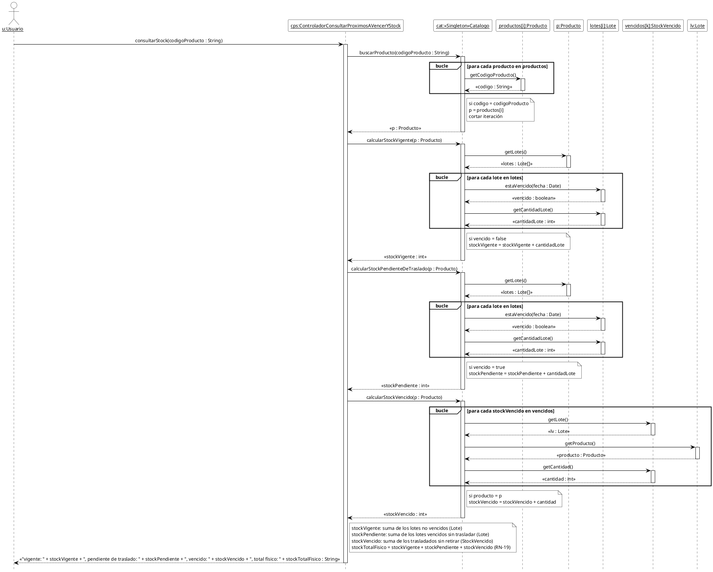
```plantuml
@startuml DSD_CU-09_consultarStock
' Diagrama de Secuencia de Diseño (DSD) - CU-09 Consultar próximos a vencer y stock - consultarStock
' Estilo de los ejemplos de la teoría (introducirArticulo / crearNuevaVenta).
hide footbox
skinparam shadowing false
skinparam defaultFontName Arial
skinparam defaultFontSize 12
skinparam sequenceMessageAlign center
skinparam ArrowColor black
skinparam ParticipantBackgroundColor white
skinparam ParticipantBorderColor black
skinparam CollectionsBackgroundColor white
skinparam CollectionsBorderColor black
skinparam ActorBackgroundColor white
skinparam ActorBorderColor black
skinparam LifeLineBorderColor black
skinparam LifeLineBackgroundColor white
skinparam SequenceGroupBackgroundColor white
skinparam SequenceGroupBorderColor black
skinparam SequenceGroupHeaderFontColor black
skinparam NoteBackgroundColor white
skinparam NoteBorderColor black

actor "<u>u:Usuario</u>" as u
participant "<u>cps:ControladorConsultarProximosAVencerYStock</u>" as cpv
participant "<u>cat:«Singleton»Catalogo</u>" as cat
participant "<u>productos[i]:Producto</u>" as pi
participant "<u>p:Producto</u>" as p
participant "<u>lotes[i]:Lote</u>" as li
participant "<u>vencidos[k]:StockVencido</u>" as vi
participant "<u>lv:Lote</u>" as lv

u -> cpv ++ : consultarStock(codigoProducto : String)
cpv -> cat ++ : buscarProducto(codigoProducto : String)
group bucle [para cada producto en productos]
  cat -> pi ++ : getCodigoProducto()
  pi --> cat -- : «codigo : String»
end
note right of cat
  si codigo = codigoProducto
  p = productos[i]
  cortar iteración
end note
cat --> cpv -- : «p : Producto»
cpv -> cat ++ : calcularStockVigente(p : Producto)
cat -> p ++ : getLotes()
p --> cat -- : «lotes : Lote[]»
group bucle [para cada lote en lotes]
  cat -> li ++ : estaVencido(fecha : Date)
  li --> cat -- : «vencido : boolean»
  cat -> li ++ : getCantidadLote()
  li --> cat -- : «cantidadLote : int»
end
note right of cat
  si vencido = false
  stockVigente = stockVigente + cantidadLote
end note
cat --> cpv -- : «stockVigente : int»
cpv -> cat ++ : calcularStockPendienteDeTraslado(p : Producto)
cat -> p ++ : getLotes()
p --> cat -- : «lotes : Lote[]»
group bucle [para cada lote en lotes]
  cat -> li ++ : estaVencido(fecha : Date)
  li --> cat -- : «vencido : boolean»
  cat -> li ++ : getCantidadLote()
  li --> cat -- : «cantidadLote : int»
end
note right of cat
  si vencido = true
  stockPendiente = stockPendiente + cantidadLote
end note
cat --> cpv -- : «stockPendiente : int»
cpv -> cat ++ : calcularStockVencido(p : Producto)
group bucle [para cada stockVencido en vencidos]
  cat -> vi ++ : getLote()
  vi --> cat -- : «lv : Lote»
  cat -> lv ++ : getProducto()
  lv --> cat -- : «producto : Producto»
  cat -> vi ++ : getCantidad()
  vi --> cat -- : «cantidad : int»
end
note right of cat
  si producto = p
  stockVencido = stockVencido + cantidad
end note
cat --> cpv -- : «stockVencido : int»
note right of cpv
  stockVigente: suma de los lotes no vencidos (Lote)
  stockPendiente: suma de los lotes vencidos sin trasladar (Lote)
  stockVencido: suma de los trasladados sin retirar (StockVencido)
  stockTotalFisico = stockVigente + stockPendiente + stockVencido (RN-19)
end note
cpv --> u -- : «"vigente: " + stockVigente + ", pendiente de traslado: " + stockPendiente + ", vencido: " + stockVencido + ", total físico: " + stockTotalFisico : String»

@enduml
```

> Los tipos de stock y de dónde sale cada uno: el **vigente** suma la cantidad de los lotes no vencidos (`Lote`), el **pendiente de traslado** suma la de los lotes vencidos que siguen en el depósito principal (`Lote`), el **vencido** suma la de la mercadería trasladada sin retirar (`StockVencido`) y el **total físico** es la suma de los tres (RN-19).

---

## CU-10 - Trasladar mercadería vencida

### `consultarPendientesDeTraslado`

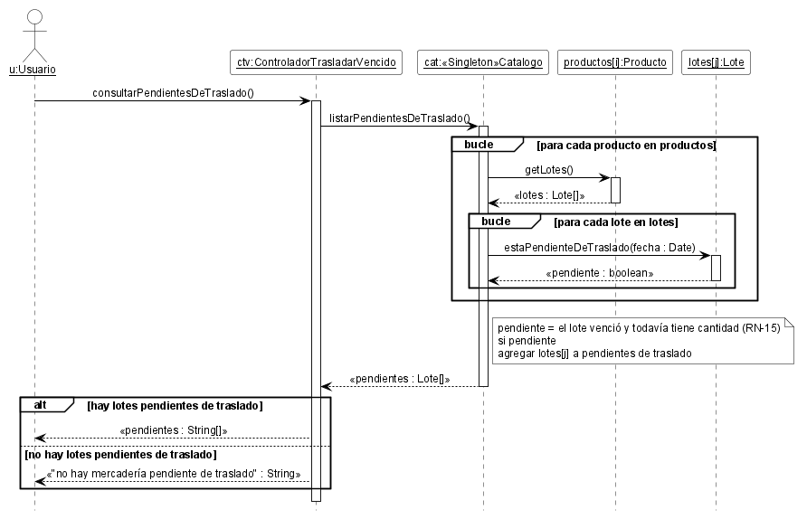

Código PlantUML

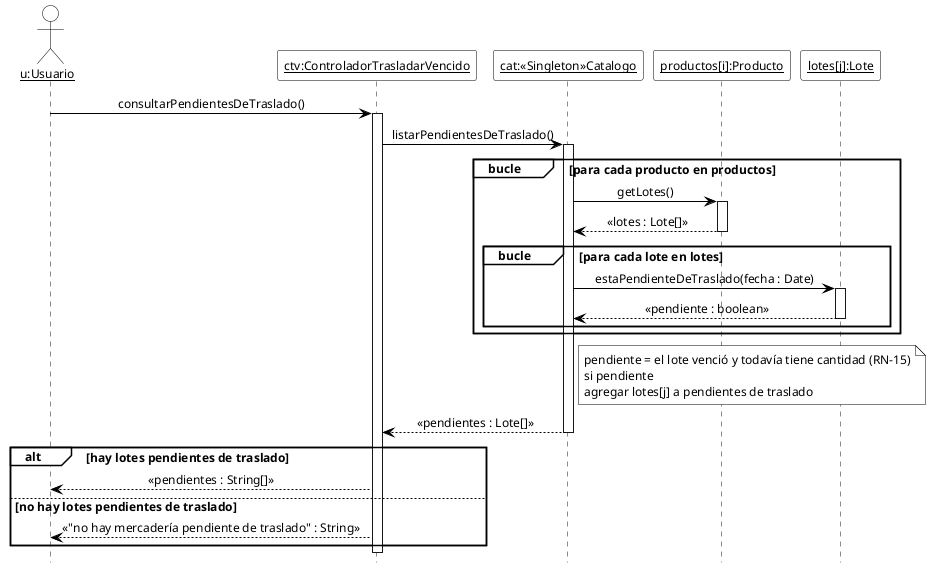
```plantuml
@startuml DSD_CU-10_consultarPendientesDeTraslado
' Diagrama de Secuencia de Diseño (DSD) - CU-10 Trasladar mercadería vencida - consultarPendientesDeTraslado
' Estilo de los ejemplos de la teoría (introducirArticulo / crearNuevaVenta).
hide footbox
skinparam shadowing false
skinparam defaultFontName Arial
skinparam defaultFontSize 12
skinparam sequenceMessageAlign center
skinparam ArrowColor black
skinparam ParticipantBackgroundColor white
skinparam ParticipantBorderColor black
skinparam CollectionsBackgroundColor white
skinparam CollectionsBorderColor black
skinparam ActorBackgroundColor white
skinparam ActorBorderColor black
skinparam LifeLineBorderColor black
skinparam LifeLineBackgroundColor white
skinparam SequenceGroupBackgroundColor white
skinparam SequenceGroupBorderColor black
skinparam SequenceGroupHeaderFontColor black
skinparam NoteBackgroundColor white
skinparam NoteBorderColor black

actor "<u>u:Usuario</u>" as u
participant "<u>ctv:ControladorTrasladarVencido</u>" as ctv
participant "<u>cat:«Singleton»Catalogo</u>" as cat
participant "<u>productos[i]:Producto</u>" as pi
participant "<u>lotes[j]:Lote</u>" as li

u -> ctv ++ : consultarPendientesDeTraslado()
ctv -> cat ++ : listarPendientesDeTraslado()
group bucle [para cada producto en productos]
  cat -> pi ++ : getLotes()
  pi --> cat -- : «lotes : Lote[]»
  group bucle [para cada lote en lotes]
    cat -> li ++ : estaPendienteDeTraslado(fecha : Date)
    li --> cat -- : «pendiente : boolean»
  end
end
note right of cat
  pendiente = el lote venció y todavía tiene cantidad (RN-15)
  si pendiente
  agregar lotes[j] a pendientes de traslado
end note
cat --> ctv -- : «pendientes : Lote[]»
alt hay lotes pendientes de traslado
  ctv --> u : «pendientes : String[]»
else no hay lotes pendientes de traslado
  ctv --> u : «"no hay mercadería pendiente de traslado" : String»
end
deactivate ctv

@enduml
```

### `registrarTraslado`

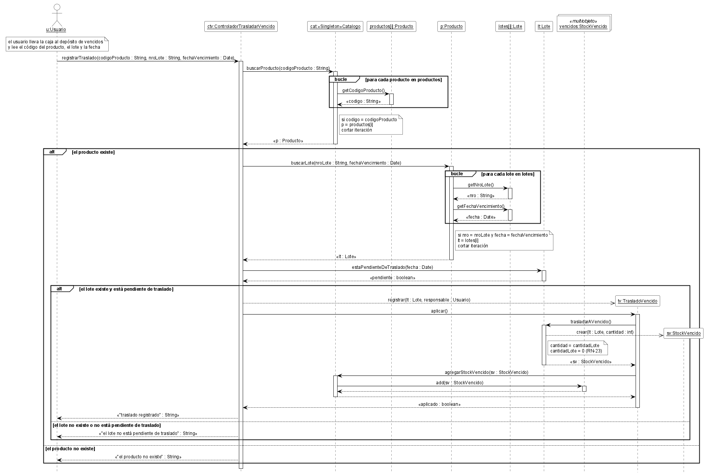

Código PlantUML

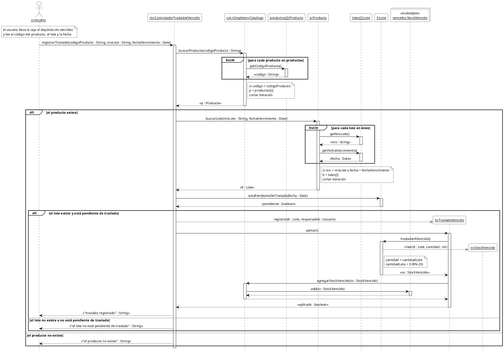
```plantuml
@startuml DSD_CU-10_registrarTraslado
' Diagrama de Secuencia de Diseño (DSD) - CU-10 Trasladar mercadería vencida - registrarTraslado
' Estilo de los ejemplos de la teoría (introducirArticulo / crearNuevaVenta).
hide footbox
skinparam shadowing false
skinparam defaultFontName Arial
skinparam defaultFontSize 12
skinparam sequenceMessageAlign center
skinparam ArrowColor black
skinparam ParticipantBackgroundColor white
skinparam ParticipantBorderColor black
skinparam CollectionsBackgroundColor white
skinparam CollectionsBorderColor black
skinparam ActorBackgroundColor white
skinparam ActorBorderColor black
skinparam LifeLineBorderColor black
skinparam LifeLineBackgroundColor white
skinparam SequenceGroupBackgroundColor white
skinparam SequenceGroupBorderColor black
skinparam SequenceGroupHeaderFontColor black
skinparam NoteBackgroundColor white
skinparam NoteBorderColor black

actor "<u>u:Usuario</u>" as u
participant "<u>ctv:ControladorTrasladarVencido</u>" as ctv
participant "<u>cat:«Singleton»Catalogo</u>" as cat
participant "<u>productos[i]:Producto</u>" as pi
participant "<u>p:Producto</u>" as p
participant "<u>lotes[i]:Lote</u>" as li
participant "<u>lt:Lote</u>" as lt
collections "<u>vencidos:StockVencido</u>" as mv <<multiobjeto>>

note over u : el usuario lleva la caja al depósito de vencidos\ny lee el código del producto, el lote y la fecha
u -> ctv ++ : registrarTraslado(codigoProducto : String, nroLote : String, fechaVencimiento : Date)
ctv -> cat ++ : buscarProducto(codigoProducto : String)
group bucle [para cada producto en productos]
  cat -> pi ++ : getCodigoProducto()
  pi --> cat -- : «codigo : String»
end
note right of cat
  si codigo = codigoProducto
  p = productos[i]
  cortar iteración
end note
cat --> ctv -- : «p : Producto»
alt el producto existe
  ctv -> p ++ : buscarLote(nroLote : String, fechaVencimiento : Date)
  group bucle [para cada lote en lotes]
    p -> li ++ : getNroLote()
    li --> p -- : «nro : String»
    p -> li ++ : getFechaVencimiento()
    li --> p -- : «fecha : Date»
  end
  note right of p
    si nro = nroLote y fecha = fechaVencimiento
    lt = lotes[i]
    cortar iteración
  end note
  p --> ctv -- : «lt : Lote»
  ctv -> lt ++ : estaPendienteDeTraslado(fecha : Date)
  lt --> ctv -- : «pendiente : boolean»
  alt el lote existe y está pendiente de traslado
    create participant "<u>tv:TrasladoVencido</u>" as tv
    ctv -->> tv : registrar(lt : Lote, responsable : Usuario)
    ctv -> tv ++ : aplicar()
    tv -> lt ++ : trasladarAVencido()
    create participant "<u>sv:StockVencido</u>" as sv
    lt -->> sv : crear(lt : Lote, cantidad : int)
    note right of lt : cantidad = cantidadLote\ncantidadLote = 0 (RN-23)
    lt --> tv -- : «sv : StockVencido»
    tv -> cat ++ : agregarStockVencido(sv : StockVencido)
    cat -> mv ++ : add(sv : StockVencido)
    mv --> cat --
    cat --> tv --
    tv --> ctv -- : «aplicado : boolean»
    ctv --> u : «"traslado registrado" : String»
  else el lote no existe o no está pendiente de traslado
    ctv --> u : «"el lote no está pendiente de traslado" : String»
  end
else el producto no existe
  ctv --> u : «"el producto no existe" : String»
end
deactivate ctv

@enduml
```

> Ningún proceso automático mueve stock: el lote vencido queda pendiente de traslado hasta que el usuario registra el traslado, que queda con su usuario y fecha (RN-07). Toda la cantidad del lote pasa a `StockVencido` y el lote queda en 0 (RN-23), así el total físico no cambia.

---

## CU-11 - Registrar egreso de mercadería

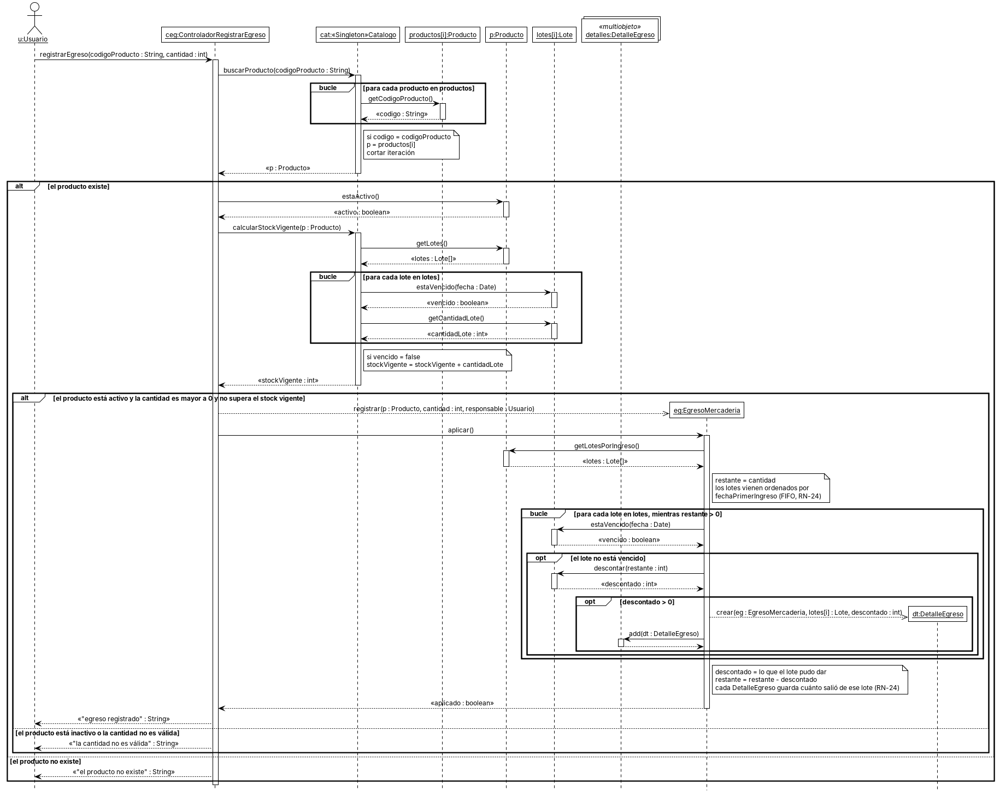

Código PlantUML

```plantuml
@startuml DSD_CU-11_registrarEgreso
' Diagrama de Secuencia de Diseño (DSD) - CU-11 Registrar egreso de mercadería - registrarEgreso
' Estilo de los ejemplos de la teoría (introducirArticulo / crearNuevaVenta).
hide footbox
skinparam shadowing false
skinparam defaultFontName Arial
skinparam defaultFontSize 12
skinparam sequenceMessageAlign center
skinparam ArrowColor black
skinparam ParticipantBackgroundColor white
skinparam ParticipantBorderColor black
skinparam CollectionsBackgroundColor white
skinparam CollectionsBorderColor black
skinparam ActorBackgroundColor white
skinparam ActorBorderColor black
skinparam LifeLineBorderColor black
skinparam LifeLineBackgroundColor white
skinparam SequenceGroupBackgroundColor white
skinparam SequenceGroupBorderColor black
skinparam SequenceGroupHeaderFontColor black
skinparam NoteBackgroundColor white
skinparam NoteBorderColor black

actor "<u>u:Usuario</u>" as u
participant "<u>ceg:ControladorRegistrarEgreso</u>" as ceg
participant "<u>cat:«Singleton»Catalogo</u>" as cat
participant "<u>productos[i]:Producto</u>" as pi
participant "<u>p:Producto</u>" as p
participant "<u>lotes[i]:Lote</u>" as li
collections "<u>detalles:DetalleEgreso</u>" as md <<multiobjeto>>

u -> ceg ++ : registrarEgreso(codigoProducto : String, cantidad : int)
ceg -> cat ++ : buscarProducto(codigoProducto : String)
group bucle [para cada producto en productos]
  cat -> pi ++ : getCodigoProducto()
  pi --> cat -- : «codigo : String»
end
note right of cat
  si codigo = codigoProducto
  p = productos[i]
  cortar iteración
end note
cat --> ceg -- : «p : Producto»
alt el producto existe
  ceg -> p ++ : estaActivo()
  p --> ceg -- : «activo : boolean»
  ceg -> cat ++ : calcularStockVigente(p : Producto)
  cat -> p ++ : getLotes()
  p --> cat -- : «lotes : Lote[]»
  group bucle [para cada lote en lotes]
    cat -> li ++ : estaVencido(fecha : Date)
    li --> cat -- : «vencido : boolean»
    cat -> li ++ : getCantidadLote()
    li --> cat -- : «cantidadLote : int»
  end
  note right of cat
    si vencido = false
    stockVigente = stockVigente + cantidadLote
  end note
  cat --> ceg -- : «stockVigente : int»
  alt el producto está activo y la cantidad es mayor a 0 y no supera el stock vigente
    create participant "<u>eg:EgresoMercaderia</u>" as eg
    ceg -->> eg : registrar(p : Producto, cantidad : int, responsable : Usuario)
    ceg -> eg ++ : aplicar()
    eg -> p ++ : getLotesPorIngreso()
    p --> eg -- : «lotes : Lote[]»
    note right of eg : restante = cantidad\nlos lotes vienen ordenados por\nfechaPrimerIngreso (FIFO, RN-24)
    group bucle [para cada lote en lotes, mientras restante > 0]
      eg -> li ++ : estaVencido(fecha : Date)
      li --> eg -- : «vencido : boolean»
      opt el lote no está vencido
        eg -> li ++ : descontar(restante : int)
        li --> eg -- : «descontado : int»
        opt descontado > 0
          create participant "<u>dt:DetalleEgreso</u>" as dt
          eg -->> dt : crear(eg : EgresoMercaderia, lotes[i] : Lote, descontado : int)
          eg -> md ++ : add(dt : DetalleEgreso)
          md --> eg --
        end
      end
    end
    note right of eg : descontado = lo que el lote pudo dar\nrestante = restante - descontado\ncada DetalleEgreso guarda cuánto salió de ese lote (RN-24)
    eg --> ceg -- : «aplicado : boolean»
    ceg --> u : «"egreso registrado" : String»
  else el producto está inactivo o la cantidad no es válida
    ceg --> u : «"la cantidad no es válida" : String»
  end
else el producto no existe
  ceg --> u : «"el producto no existe" : String»
end
deactivate ceg

@enduml
```

> El egreso registra solo la cantidad que sale, sin datos de venta (fuera de alcance). Descuenta de los lotes vigentes en el orden en que ingresaron (FIFO, entrevista 4) y saltea los vencidos. El ajuste (CU-06) queda solo para correcciones.
